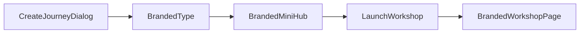

# Branded Workshop Journey Plan

## Key Constraint

Current journey typing is hardcoded as binary in both the type layer and the create UI:

```12:12:lib/terminology.ts
export type JourneyMode = "learn" | "create";
```

```680:704:components/dashboard/JourneyPanel.tsx
{(["create", "learn"] as const).map((t) => (
  <button
    key={t}
    type="button"
    onClick={() => setJourneyType(t)}
    // ...
  >
    <div>{t === "create" ? "Create" : "Learn"}</div>
    <div style={{ fontSize: "9px", color: "var(--dawn-40)", marginTop: 2 }}>
      {t === "create" ? "Direct image/video generation" : "Workshop with lessons"}
    </div>
  </button>
))}
```

Sigil already has a good seam for a workshop layer that is still portable to a future CMS/database-backed system:

```1:4:lib/learning/types.ts
/**
 * Content model for the Sigil learning layer.
 * UI-only for now — intentionally portable to a future DB/CMS backend.
 */
```

## Source Inputs

- Use the Poppins prototype at [C:/Users/buyss/Dropbox/03_Thoughtform/04_Arcs/02_Workshops/20260318_Poppins/04_Claude/workshop-repo/src/workshop-poppins-v2.html](C:/Users/buyss/Dropbox/03_Thoughtform/04_Arcs/02_Workshops/20260318_Poppins/04_Claude/workshop-repo/src/workshop-poppins-v2.html) as the visual and interaction source for v1. The implementation should port its layout logic, section rhythm, and key interactions into typed Sigil components rather than treating it as a loose inspiration board.
- Use the workshop method in [C:/Users/buyss/Dropbox/03_Thoughtform/04_Arcs/02_Workshops/20260318_Poppins/04_Claude/workshop-repo/docs/thoughtform-workshop-SKILL-UPDATED.md](C:/Users/buyss/Dropbox/03_Thoughtform/04_Arcs/02_Workshops/20260318_Poppins/04_Claude/workshop-repo/docs/thoughtform-workshop-SKILL-UPDATED.md) as the structural engine for the reusable workshop scaffold: universal flow stays in the skill, while client-specific values live in persisted journey settings.
- Promote that workshop method into a project-local Cursor skill at [C:/Users/buyss/Dropbox/03_Thoughtform/04_Arcs/02_Workshops/20260318_Poppins/04_Claude/workshop-repo/.cursor/skills/thoughtform-workshop/SKILL.md](C:/Users/buyss/Dropbox/03_Thoughtform/04_Arcs/02_Workshops/20260318_Poppins/04_Claude/workshop-repo/.cursor/skills/thoughtform-workshop/SKILL.md) with lightweight supporting references as needed, so the workshop repo itself becomes a reusable delivery system.

## Proposed Shape

Use a universal workshop scaffold plus client-specific settings.

- Extend `[lib/terminology.ts](lib/terminology.ts)`, `[app/api/admin/workspace-projects/route.ts](app/api/admin/workspace-projects/route.ts)`, `[app/api/admin/workspace-projects/[id]/route.ts](app/api/admin/workspace-projects/[id]/route.ts)`, `[components/dashboard/JourneyPanel.tsx](components/dashboard/JourneyPanel.tsx)`, `[components/ui/JourneyCardCompact.tsx](components/ui/JourneyCardCompact.tsx)`, `[components/journeys/JourneyCard.tsx](components/journeys/JourneyCard.tsx)`, and `[components/journeys/JourneyOverviewCard.tsx](components/journeys/JourneyOverviewCard.tsx)` so Sigil understands `branded` as a first-class journey type.
- Add a compact `settings Json?` field to `[prisma/schema.prisma](prisma/schema.prisma)` on `WorkspaceProject`, then define a Zod-backed `BrandedJourneySettings` schema in a new `[lib/workshops/types.ts](lib/workshops/types.ts)`.
- Keep the persisted payload narrow for v1: `templateId`, `branding`, `hub`, `agenda`, `resources`, and a few client-specific content overrides. This is enough to ship Poppins tomorrow without inventing a full CMS.
- Do not force the Poppins one-pager into `[lib/learning/types.ts](lib/learning/types.ts)` or the current lesson model. Instead, add a separate `[lib/workshops/templates/thoughtformWorkshop.ts](lib/workshops/templates/thoughtformWorkshop.ts)` plus `[components/workshops/](components/workshops/)` renderer layer.

## Entry Flow




- Keep `[app/journeys/[id]/page.tsx](app/journeys/[id]/page.tsx)` as the entry route, but branch branded journeys in `[components/journeys/JourneyDetailContent.tsx](components/journeys/JourneyDetailContent.tsx)` into a new `[components/workshops/BrandedJourneyHub.tsx](components/workshops/BrandedJourneyHub.tsx)`.
- The mini hub should be lightweight, not a new admin product: workshop summary, admin-only config form, logo/media controls, agenda preview, and a clear `Open workshop` launch action.
- Add a dedicated branded experience route such as `[app/journeys/[id]/workshop/page.tsx](app/journeys/[id]/workshop/page.tsx)` backed by `[components/workshops/BrandedWorkshopPage.tsx](components/workshops/BrandedWorkshopPage.tsx)`.
- Reuse `[components/hud/NavigationFrame.tsx](components/hud/NavigationFrame.tsx)`, `[context/NavSpineContext.tsx](context/NavSpineContext.tsx)`, and the portal pattern from `[components/learning/LessonProgressBranch.tsx](components/learning/LessonProgressBranch.tsx)` so the left spine tracks the active chapter and the main layout still feels natively Sigil.
- Build the right-side chapter overview as a sticky agenda/readout column visually aligned to the right rail, rather than inventing a second shell.

## Poppins Migration Strategy

- Convert the HTML prototype into typed React sections under a new `[components/workshops/sections/](components/workshops/sections/)` folder: hero, loop map, dimensional slider, semantic reveal, role/use-case cards, synthesis, closing.
- Seed a universal Thoughtform workshop scaffold from the external workshop skill: the structure stays universal, while client-specific values come from persisted settings. That makes future client launches mostly a data-entry and styling exercise rather than a fresh page build.
- Seed the first Poppins config from the current prototype with the fields you said matter tomorrow: client name, logos, colors/fonts, facilitator/date, hero copy, chapter labels, team cards, and resource links.
- Preserve the Thoughtform navigation grammar from `[components/hud/NavigationFrame.tsx](components/hud/NavigationFrame.tsx)` while letting the branded layer override typography, accent colors, and visual assets.

## Cursor Skill Rollout

- Create a project-local skill in the referenced workshop repo rather than leaving the method as a docs-only artifact.
- Keep the skill concise and Cursor-native: `SKILL.md` for the main workflow, optional one-level-deep references for timing, capability ladder, and client-customization details.
- Use trigger language around workshop prep, Claude training, client adaptation, Poppins, capability ladder design, and Claude OS generation so the agent can reliably discover and apply the skill in future engagements.
- Align the repo-local skill with the Sigil implementation: the same universal scaffold should drive both the reusable Cursor skill and the branded journey template system.

## Persistence And Media

- Extend `[lib/prefetch/journeys.ts](lib/prefetch/journeys.ts)` and `[app/api/journeys/[id]/route.ts](app/api/journeys/[id]/route.ts)` to include branded settings in the journey payload.
- Reuse `[app/api/upload/reference-image/route.ts](app/api/upload/reference-image/route.ts)` for logo/hero uploads so settings can persist media in Supabase without building a new storage flow.
- Keep v1 field-driven: text inputs, color/font controls, upload buttons, save. No WYSIWYG editor and no separate admin dashboard.

## Verification

- Validate the new create flow, branded settings persistence, upload flow, hub-to-workshop launch flow, chapter tracking, and mobile fallback when the nav spine collapses.
- Validate that the project-local Cursor skill in the workshop repo is discoverable, concise, and correctly points to any supporting reference files.
- Success criteria for tomorrow: create a branded journey in Sigil, enter Poppins-specific settings, open a mini hub, and launch a polished client-branded workshop page that still unmistakably feels like Sigil.

