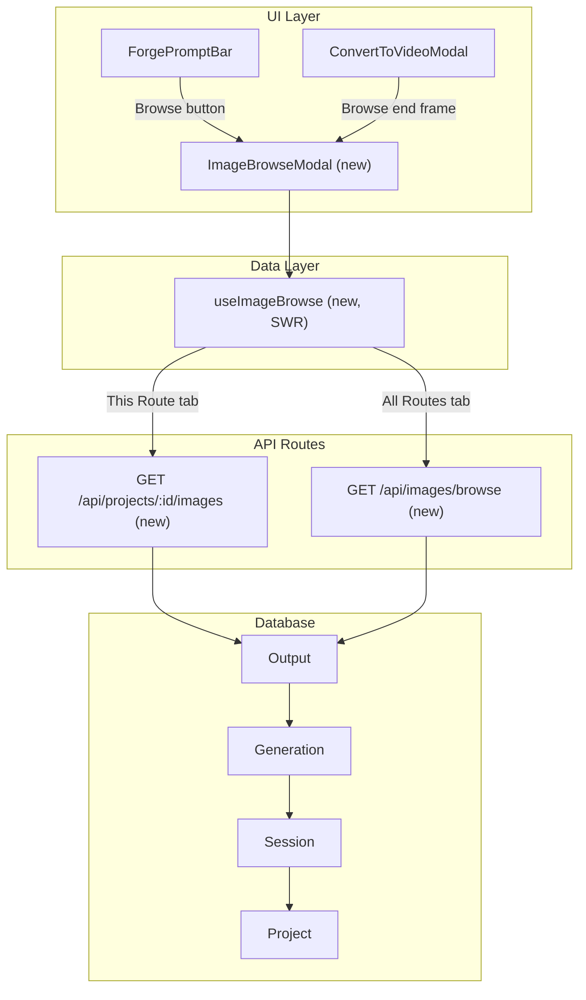

# Browse Generated Images Feature

## Context

Vesper has a fully working Browse Generated Images feature (`[ImageBrowseModal.tsx](c:\Users\buyss\Manifold Delta\Artifacts\07_vesper.loop\Loop-Vesper\src\components\generation\ImageBrowseModal.tsx)`, `[useImageBrowse.ts](c:\Users\buyss\Manifold Delta\Artifacts\07_vesper.loop\Loop-Vesper\src\hooks\useImageBrowse.ts)`, two API routes). We port the same architecture to Sigil, adapting to its stack differences:

- **SWR** instead of `@tanstack/react-query` for data fetching
- **CSS modules + Thoughtform design tokens** instead of Tailwind/shadcn
- `**getAuthedUser()` + `projectAccessFilter()`** from `[lib/auth/server.ts](lib/auth/server.ts)` and `[lib/auth/project-access.ts](lib/auth/project-access.ts)` instead of Supabase auth helpers
- **No schema changes** — the existing `Output -> Generation -> Session -> Project` hierarchy is identical

## Architecture

## New Files

### 1. API: Project images — `app/api/projects/[id]/images/route.ts`

Cursor-based paginated endpoint returning image outputs for a single project. Ported from Vesper's equivalent but using Sigil's auth:

- Auth via `getAuthedUser()` + `projectAccessFilter()` 
- Query `Output` where `fileType = 'image'` joined through `Generation -> Session` for the project
- Session privacy: project owner sees all; others see only non-private sessions
- Includes `isApproved` in the `Output` select to surface bookmark status
- Response shape: `{ data: BrowseImage[], nextCursor, hasMore }`

### 2. API: Cross-project images — `app/api/images/browse/route.ts`

Same pagination pattern but across all accessible projects:

- Uses `projectAccessFilter(userId)` to find all visible projects
- Adds `projects` array to response for filter chip rendering
- Optional `projectId` query param for single-project filtering within the cross-project endpoint

### 3. Hook — `hooks/useImageBrowse.ts`

SWR-based data fetching with cursor pagination (Sigil does not have react-query):

- `useProjectImages(projectId, enabled)` — fetches from `/api/projects/:id/images`
- `useCrossProjectImages(enabled, filterProjectId?)` — fetches from `/api/images/browse`
- `useLoadMoreObserver(...)` — IntersectionObserver for infinite scroll sentinel
- `BrowseImage` type: `{ id, url, prompt, generationId, sessionName?, projectId?, projectName?, width, height, isApproved, createdAt }`

SWR does not have `useInfiniteQuery` out of the box — we will use `useSWRInfinite` which provides equivalent cursor-based pagination with `getKey` / `fetcher` pattern.

### 4. Modal — `components/generation/ImageBrowseModal.tsx` + `.module.css`

Portal-based modal following the same pattern as Sigil's `[ConvertToVideoModal](components/generation/ConvertToVideoModal.tsx)`:

- Two tabs: "This Route" / "All Routes" (Sigil calls projects "routes")
- Search input filtering by prompt text (client-side)
- Image grid with loading skeletons, hover overlay showing prompt
- **Bookmark badge** — thumbnails with `isApproved === true` display a small filled bookmark icon in the top-right corner (always visible, not just on hover). Uses the same bookmark SVG path as `ForgeGenerationCard` (`M5 5a2 2 0 012-2h10a2 2 0 012 2v16l-7-3.5L5 21V5z`), rendered at ~16px in `--gold` color with a subtle dark backdrop for contrast. Styled via `.bookmarkBadge` in the CSS module.
- Infinite scroll via sentinel element
- Cross-project filter chips on the "All Routes" tab
- Image count display
- Empty state with Sigil's design language
- Styled entirely via CSS module using Thoughtform design tokens (`--void`, `--dawn`, `--surface-*`, `--gold`, etc.)

### 5. CSS — `components/generation/ImageBrowseModal.module.css`

Styled to match Sigil's existing modal patterns (telemetry bar header, `--surface-1` backgrounds, `--dawn` text, `--gold` accents, rounded-corner thumbnails with hover borders).

## Modified Files

### 6. `ForgePromptBar.tsx` — Add Upload/Browse popover

The current "add image" button (line ~337-348) directly opens the file picker. Replace with a popover offering two options:

- **Upload** — triggers existing `fileInputRef.current?.click()`
- **Browse** — opens `ImageBrowseModal`

The popover follows Sigil's existing dropdown pattern (like the model picker at line ~403). New state: `showAttachMenu`, `browseModalOpen`.

When an image is selected from browse, call the existing `onReferenceImageUrlChange(imageUrl)` with the Supabase storage URL directly (no re-upload needed since the image is already persisted).

### 7. `ConvertToVideoModal.tsx` — Add Browse for end frame

The end frame upload button (line ~401-409) currently only opens a file picker. Add the same Upload/Browse popover pattern. When browsing, the selected URL goes directly to `setEndFrameUrl(url)` (already a stable Supabase URL, no re-upload needed).

### 8. `ProjectWorkspace.tsx` — Pass `projectId` through and handle browse selection

The `handleUseAsReference` callback (line ~402) already handles setting `referenceImageUrl` from a URL and auto-detecting aspect ratio. The browse modal selection will flow through the same path. Minimal change — just ensure `projectId` is threaded to `ForgePromptBar` (it already is at line ~867).

## Key Design Decisions

- **No schema migration** — reuses existing `Output` / `Generation` / `Session` / `Project` tables
- **SWR `useSWRInfinite`** for pagination — matches Sigil's existing dependency
- **Direct URL usage** — browsed images are already in Supabase storage, so we pass the URL directly without re-uploading (unlike Vesper's ChatInput which re-fetches as File)
- **CSS modules** — no shadcn/Radix dependency; all styling uses Thoughtform tokens
- **"Routes" terminology** — Sigil calls projects "routes" in the UI, so tabs read "This Route" / "All Routes"
- **Bookmark visibility** — `Output.isApproved` (the existing bookmark field) is included in both API responses and surfaced as a persistent badge on browse thumbnails, giving users a quick visual cue of their curated images without requiring any schema changes

