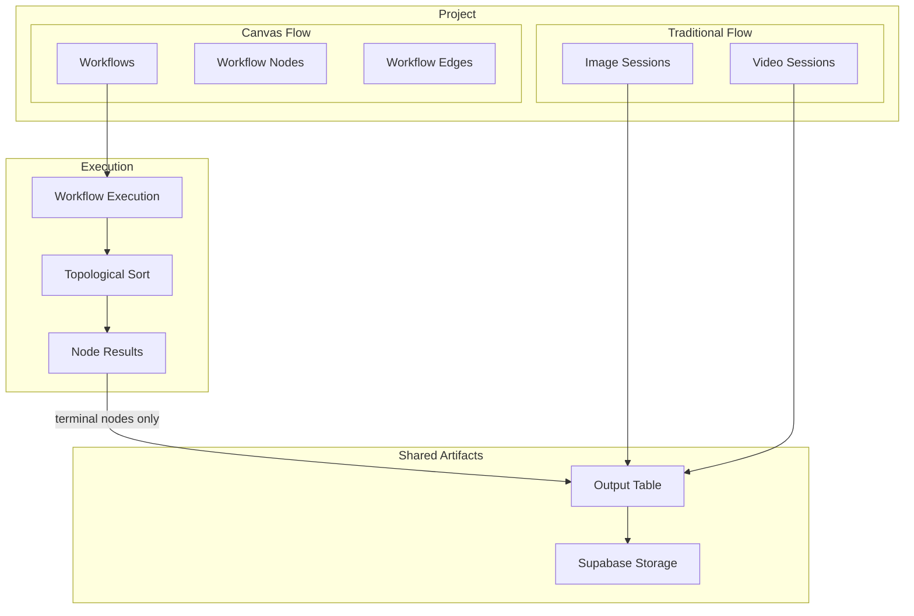
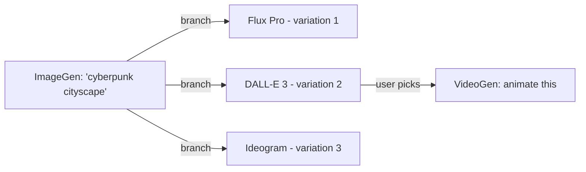

# Canvas Workflow Mode

## Architecture Overview

A new "Canvas" mode joins the existing Image / Video / Brainstorm modes inside a Project. Canvas workflows are node graphs where each node represents a model call or transformation. When a workflow executes, only the **terminal (leaf) node outputs** automatically appear in the traditional session view as Generations. Intermediate results stay canvas-only.




## Library Choice

`**@xyflow/react` (React Flow v12)** -- MIT license, 35k stars, native React 19 compatibility.

- Nodes are React components (embed image previews, video players, parameter controls, all styled with Tailwind)
- v12 has SSR support (Next.js friendly), dark mode via CSS variables, computing flow hooks
- Official AI Workflow Editor template uses the exact same stack (Next.js + shadcn + Tailwind + Zustand)
- State management with **Zustand** (lightweight, already common in React Flow ecosystem)

Install: `npm install @xyflow/react zustand`

## Data Model Changes

New tables in `[prisma/schema.prisma](prisma/schema.prisma)`:

```prisma
model Workflow {
  id          String   @id @default(uuid())
  projectId   String
  project     Project  @relation(fields: [projectId], references: [id], onDelete: Cascade)
  name        String
  description String?
  graphData   Json     // { nodes: [...], edges: [...], viewport: {...} }
  createdAt   DateTime @default(now())
  updatedAt   DateTime @updatedAt
  executions  WorkflowExecution[]
}

model WorkflowExecution {
  id          String   @id @default(uuid())
  workflowId  String
  workflow    Workflow  @relation(fields: [workflowId], references: [id], onDelete: Cascade)
  userId      String
  user        Profile  @relation(fields: [userId], references: [id])
  status      String   @default("pending") // pending, running, completed, failed
  results     Json?    // { nodeId: { status, outputIds, error } }
  startedAt   DateTime?
  completedAt DateTime?
  createdAt   DateTime @default(now())
}
```

**Key design decisions:**

- `**graphData` is a single JSON column** storing the React Flow serialized state (nodes, edges, viewport). This avoids needing separate WorkflowNode/WorkflowEdge tables and makes save/load trivial -- React Flow serializes to JSON natively.
- `**WorkflowExecution.results`** maps node IDs to their execution results (output IDs, errors). This keeps execution history without a separate table per node result.
- **Terminal node outputs** create real `Output` records (reusing the existing table) and auto-create a `Generation` record in a designated session, with a `source` field to indicate canvas origin.

Add a `source` field to the existing Generation model:

```prisma
model Generation {
  // ... existing fields ...
  source      String   @default("session") // "session" | "workflow"
  workflowExecutionId String?  // null for traditional, set for canvas-originated
}
```

This lets the traditional gallery display canvas outputs with a visual badge indicating their origin.

## Routing and Navigation

### New route

Add `/projects/[id]/canvas/page.tsx` following the same pattern as the existing image/video pages (`[app/projects/[id]/image/page.tsx](app/projects/[id]/image/page.tsx)`):

```
app/projects/[id]/canvas/page.tsx  -->  <ProjectWorkspace projectId={id} mode="canvas" />
```

### Mode bar update

In `[components/generation/ForgePromptBar.tsx](components/generation/ForgePromptBar.tsx)`, the `.sideStrip` currently has:

1. Image button (route link)
2. Video button (route link)
3. Brainstorm button (toggle, stretches to fill)

Add a **Canvas button** (route link) as the 3rd item, pushing Brainstorm to 4th. All four buttons now share height evenly. The brainstorm button loses its `flex: 1` stretch and becomes a uniform 36x36 button like the others:

```
.sideStrip
  .modeBar
    [Image]   -- Link to /projects/[id]/image
    [Video]   -- Link to /projects/[id]/video
    [Canvas]  -- Link to /projects/[id]/canvas  (new)
  [Brainstorm] -- toggle button (same size as mode buttons)
```

The canvas icon could be a node/graph icon (two circles connected by a line).

### Canvas layout

When `mode === "canvas"`, `ProjectWorkspace` keeps the same structural shell as Image/Video modes:

- **NavigationFrame HUD stays** -- the corner brackets, tick marks, and coordinate readouts are a natural fit for a spatial canvas. Pan/zoom coordinates map directly to the HUD readouts. The canvas *is* navigating through space.
- **Left sidebar stays** -- same `ForgeSidebar` pattern, but listing **Workflows** instead of Sessions. Create workflow button, workflow cards with thumbnails, active workflow indicator. Mirrors the session selection UX users already know.
- **No global prompt bar** -- prompts, model selectors, and parameters live inside individual nodes (following ComfyUI / Weavy conventions). The bottom prompt bar area is freed up entirely for the canvas.
- **Center area becomes the React Flow canvas** -- replaces the `ForgeGallery` scroll feed. Full-bleed within the NavigationFrame.
- **Canvas toolbar** -- minimal floating bar (top of canvas area) with: workflow name, run button, save indicator, add-node menu (right-click context menu also supported, per React Flow convention).

## Node Design Philosophy: Self-Contained "Fat" Nodes

**Key departure from Weavy/ComfyUI:** Weavy uses separate nodes for Prompt, Reference Image, and Model -- requiring the user to wire a Prompt node into every generation node. This is flexible but adds friction for the most common workflow. Our approach: **generation nodes are self-contained**, mirroring the traditional prompt bar experience.

Each ImageGen or VideoGen node embeds:
- **Prompt textarea** (built-in, not a separate node)
- **Reference image input** (built-in drop zone / picker, not a separate node)
- **Model selector** dropdown
- **Parameter controls** (aspect ratio, resolution, duration, etc.) -- model-aware, hiding params that don't apply to the selected model
- **Generate button** for single-node execution
- **Output preview** area showing results after execution

This means adding a generation to the canvas is **one action** (drop a node, type a prompt, hit generate), not three (create prompt node, create model node, wire them together). The separate-node approach is still available for advanced use via the **input port** -- you can wire one node's output image into another node's reference input, overriding the built-in reference field.

### Branching Exploration (Core Feature)

The canvas's killer differentiator from the traditional session view: **branching**.



**How it works:**
1. User has an ImageGen node with a prompt
2. User clicks a "Branch" action (or a keyboard shortcut)
3. The system fans out: creates N child nodes (one per selected model, or N variations of the same model)
4. Animated edges grow outward from the parent node -- a visual "branching" effect
5. Each branch generates independently. Results appear as output previews in each child node.
6. User reviews the branches, picks their preferred result
7. Right-clicking a completed output offers actions: "Generate Video from this", "Upscale", "Use as Reference" -- each creating a new downstream node, automatically wired

This turns the canvas into an **exploration tree** rather than a fixed pipeline. The visual metaphor of branches appearing, fanning out, and converging is central to the UX.

### Node Categories (Progressive Roadmap)

**Phase 1 -- Core Generation Nodes:**
- `ImageGenNode` -- self-contained image generation (prompt, ref image, model, params, output)
- `VideoGenNode` -- self-contained video generation (prompt, ref image/video, model, params, output)
- `ImageInputNode` -- pick from existing project outputs, upload, or paste URL

**Phase 2 -- Transformation Nodes:**
- `UpscaleNode` -- scale factor, model picker (Real-ESRGAN, etc.)
- `StyleTransferNode` -- apply style from one image to another
- `InpaintNode` -- mask region + prompt for inpainting

**Phase 3 -- Editing Nodes (Weavy-style):**
- `CropNode` -- crop / reframe
- `ColorAdjustNode` -- hue, saturation, brightness, contrast
- `ConcatenateNode` -- stitch videos together
- `OverlayNode` -- composite images/text layers
- `InvertNode`, `BlurNode`, `DepthMapNode`, etc.

Each phase adds nodes to the add-node palette. The palette is organized by category (Generate, Transform, Edit) with a search filter.

## Component Structure

```
components/canvas/
  CanvasWorkspace.tsx        -- Main canvas container (replaces ForgeGallery when mode="canvas")
  CanvasWorkspace.module.css -- Canvas-specific styles (dark background, floating toolbar)
  CanvasToolbar.tsx          -- Floating top bar: workflow name, run, save, add node palette
  CanvasNodePalette.tsx      -- Add-node menu (categorized: Generate, Transform, Edit)
  nodes/
    BaseNode.tsx             -- Shared node shell (header, ports, status, HUD border styling)
    BaseNode.module.css      -- Node styling consistent with Sigil design language
    ImageGenNode.tsx         -- Self-contained: prompt + ref image + model + params + output
    VideoGenNode.tsx         -- Self-contained: prompt + ref + model + duration + output
    ImageInputNode.tsx       -- Pick from existing outputs or upload
    UpscaleNode.tsx          -- Scale factor, model picker (Phase 2)
  edges/
    DataEdge.tsx             -- Custom edge with type indicator + animated "branch" effect
  stores/
    canvasStore.ts           -- Zustand store for canvas state (nodes, edges, viewport, execution)
  hooks/
    useWorkflowExecution.ts  -- Topological sort + sequential API execution
    useWorkflowPersistence.ts -- Save/load workflow to/from database
    useBranching.ts          -- Branch creation logic (fan-out nodes from a parent)
```

## Execution Flow

1. User builds a graph on the canvas (nodes + edges)
2. User clicks "Run Workflow"
3. `useWorkflowExecution` performs a topological sort on the graph
4. Nodes execute in dependency order, calling existing API routes (`/api/generate/process` or direct model adapters)
5. Each node's output is stored temporarily in the Zustand store (for canvas preview)
6. When a **terminal node** (no outgoing edges) completes:
  - Create an `Output` record in the database
  - Create a `Generation` record with `source: "workflow"` in a designated session (auto-created per workflow, e.g., "Canvas: Workflow Name")
7. Execution status updates propagate to node UI (processing spinner, completed preview, error state)

## Provenance in Traditional View

In `[components/generation/ForgeGenerationCard.tsx](components/generation/ForgeGenerationCard.tsx)`, when `generation.source === "workflow"`:

- Show a small "Canvas" badge/icon next to the generation metadata
- Optionally link back to the originating workflow
- The generation card otherwise looks identical -- same prompt panel, same media panel, same actions

## Phase Plan

This is a large feature. Suggested phasing:

### Phase 1: Foundation (Canvas shell + data model + first node)

- Install `@xyflow/react` and `zustand`
- Add Prisma schema changes (Workflow, WorkflowExecution, Generation.source)
- Add `/projects/[id]/canvas` route, Canvas button in mode bar
- `ProjectWorkspace` conditionally renders `CanvasWorkspace` (keeps NavigationFrame HUD + sidebar)
- Sidebar shows workflow list (create, select, rename, delete)
- React Flow canvas with dark background, minimap, controls
- Build `BaseNode` shell + `ImageGenNode` (self-contained: prompt, ref image, model, params, generate, output preview)
- Single-node execution wired to existing `/api/generate/process`

### Phase 2: Branching + Video + Persistence

- **Branching exploration**: fan-out from a node into N variations (different models or seeds), animated edge creation, branch comparison UX
- **Right-click output actions**: "Generate Video from this", "Upscale", "Use as Reference" -- each spawns a new downstream node, auto-wired
- Build `VideoGenNode` (self-contained, same pattern as ImageGen)
- Build `ImageInputNode` (pick from existing project outputs / upload)
- Canvas toolbar with add-node palette (categorized menu)
- Save/load workflow graph to database (auto-save on change)
- Workflow CRUD in sidebar

### Phase 3: Execution Engine + Transformation Nodes

- Full graph execution: topological sort, dependency-ordered execution
- Node status visualization (processing spinner, completed preview, error state)
- First transformation nodes: `UpscaleNode`, `StyleTransferNode`
- Model-aware parameter hiding (hide params not available for selected model)

### Phase 4: Output Sync + Provenance + Editing Nodes

- Terminal node outputs auto-create Generation + Output records in traditional view
- Provenance badge in ForgeGenerationCard, link back to workflow
- Progressive editing nodes: Crop, Color Adjust, Concatenate, Overlay, Invert, Blur, Depth Map
- Node palette grows with each new category

