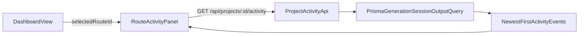

# Shared Context Anchor + Activity Timeline

## Goal

Align the interface with the navigation-instrument model by using one context-anchor grammar across hub/journeys/route surfaces, then fill dashboard right-side emptiness with a selected-route activity timeline.

## Current Baseline (what we are building on)

- Route context is currently custom-rendered inside `[components/hud/NavigationFrame.tsx](components/hud/NavigationFrame.tsx)` (journey card + route name).
- Hub/Journeys section labels are currently rendered via `[components/ui/SectionHeader.tsx](components/ui/SectionHeader.tsx)` + `[components/ui/SectionLabel.tsx](components/ui/SectionLabel.tsx)`.
- Dashboard layout is two columns in `[components/dashboard/DashboardView.tsx](components/dashboard/DashboardView.tsx)`.
- Route cards live in `[components/dashboard/RouteCardsPanel.tsx](components/dashboard/RouteCardsPanel.tsx)`, with selected route state already centralized in `DashboardView`.

```198:215:components/dashboard/DashboardView.tsx
const selectedJourney = data.journeys.find((j) => j.id === selectedJourneyId);
const routes = selectedJourney?.routes ?? [];

return (
  <section
    className="dashboard-two-panel w-full animate-fade-in-up"
    style={{
      ...
      display: "grid",
      gridTemplateColumns: "360px 1fr",
      gap: "var(--space-xl)",
    }}
  >
```

## Phase 1 — Shared Context Anchor Primitive

- Create a new primitive (for example `ContextAnchor`) that supports:
  - `inline` mode for section headers (e.g., JOURNEYS/ROUTES labels).
  - `spine` mode for route context (journey chip + route title stack).
- Wire `[components/ui/SectionHeader.tsx](components/ui/SectionHeader.tsx)` to use this primitive instead of directly composing `SectionLabel`.
- Wire the route breadcrumb block in `[components/hud/NavigationFrame.tsx](components/hud/NavigationFrame.tsx)` to the same primitive.
- Preserve the current connector behavior by keeping `data-journey-selected` on the active spine target.

## Phase 2 — Journey Card Parity (Hub vs Journeys Overview)

- Treat `[components/ui/JourneyCardCompact.tsx](components/ui/JourneyCardCompact.tsx)` as the canonical journey card primitive for both surfaces.
- Normalize composition and spacing between:
  - `[components/dashboard/JourneyPanel.tsx](components/dashboard/JourneyPanel.tsx)`
  - `[components/journeys/JourneysOverviewContent.tsx](components/journeys/JourneysOverviewContent.tsx)`
- Align the same card anatomy (title/action rhythm, divider spacing, telemetry readouts), while keeping page-specific interactions (selection in hub vs link navigation in overview).

## Phase 3 — Third Panel: Route Activity Timeline

- Add a third panel container in `[components/dashboard/DashboardView.tsx](components/dashboard/DashboardView.tsx)` using selected route state already available.
- Build a focused `RouteActivityPanel` component (new file under `components/dashboard/`) that shows newest-first events for the selected route.
- Add a dedicated endpoint (new route under `app/api/projects/[id]/`) that returns timeline-ready activity items (status, createdAt, session type/name, output count, prompt snippet) without changing existing workspace feed behavior.
- Keep fetch lazy: only request timeline data when `selectedRouteId` exists.




## Phase 4 — Layout/Responsive Safety + Visual Fit

- Update grid behavior in `[components/dashboard/DashboardView.tsx](components/dashboard/DashboardView.tsx)` and responsive rules in `[app/globals.css](app/globals.css)`:
  - desktop: 3 columns (journeys / routes / timeline)
  - medium: collapse to 2 columns
  - mobile: existing 1-column fallback
- Keep Thoughtform constraints: zero-radius geometry, course-line separators, gold only for active wayfinding, mono readouts for timeline metadata.

## Validation

- Manual checks:
  - `/dashboard`: context anchors consistent, no overlap, timeline reacts to route selection.
  - `/journeys`: card parity with dashboard journey cards.
  - `/routes/[id]/image` and `/routes/[id]/video`: spine context remains clear and non-redundant.
- Regression checks:
  - Nav spine connector alignment still tracks selected target.
  - Existing route workspace generation feed behavior remains unchanged.
  - Responsive breakpoints keep all panels scroll-safe inside `hud-shell--workspace`.

