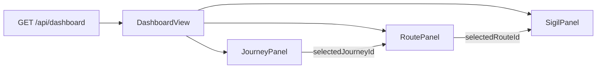

# Dashboard Three-Panel Restructure

## Reference

The NieR: Automata Skills screen provides the structural template: three clearly labeled panels, left-to-right drill-down (Pod > Program > Preview), clean separators, and section headers. We adapt this into Thoughtform's navigation grammar: gold-on-void, diamond waypoints, mono uppercase labels, course-line borders.

## Current State

`[DashboardView.tsx](components/dashboard/DashboardView.tsx)` uses a two-column grid (`1fr 220px`):

- Left: `ImageGallery` showing stacked cards in an auto-fill grid
- Right: `JourneyList` (expandable accordion) + `AdminStatsPanel`

No selection model exists -- everything is displayed at once. The page uses the default `hud-shell` scroll mode (whole page scrolls).

## Target Layout

```
+------------------+---------------------------+-------------------+
|   01 JOURNEYS    |     02 ROUTES             |   03 SIGILS       |
|--  --  --  --  --|--  --  --  --  --  --  -- |--  --  --  --  --|
|                  |                           |                   |
| > Journey A      |  > Route Alpha      4wp  |   +-----------+   |
|   Journey B      |    Route Beta       2wp  |   |           |<--+
|   Journey C      |    Route Gamma      7wp  |   |  stacked  |<--+ back layers
|                  |    Route Delta      1wp  |   |   card    |   |
|                  |                           |   |           |   |
|                  |                           |   +-----------+   |
|                  |                           |      2 / 8        |
|                  |                           |                   |
|                  |                           | "route desc text" |
|--  --  --  --  --|                           +-------------------+
| 3 journeys       |                           |                   |
| 142 generations  |                           |                   |
+------------------+---------------------------+-------------------+
  240px               1fr (~600px)               300px

  max-width: 1200px, centered in hud-shell
  gap: var(--space-xl) = 24px
  vertical course lines (1px solid dawn-08) between panels
```

## Viewport Math (validated)

Actual spacing tokens from `globals.css` (differ from design skill reference):

- `--space-xs: 8px`, `--space-sm: 12px`, `--space-md: 16px`, `--space-lg: 20px`, `--space-xl: 24px`, `--space-2xl: 32px`
- `--hud-padding: clamp(24px, 4vw, 56px)` (reduces at <=1280px to `clamp(16px, 2.5vw, 32px)`)

NavigationFrame `<main>` padding (inline styles):

- Left: `hud-padding + 48px (rail) + 8px` = hud-padding + 56px
- Right: `hud-padding + 20px`
- Top: `hud-padding + 56px` (nav bar)

**At 1440x900 (common laptop):**

- hud-padding = 56px
- Content width: 1440 - 112 - 76 = 1252px --> capped at 1200px
- Grid: 240 + 300 + 48 (two 24px gaps) = 588 fixed, middle gets 612px
- Height (workspace mode): 900 - 112 = 788px per panel

**At 1280x800:**

- hud-padding = 32px
- Content width: 1280 - 88 - 52 = 1140px
- Middle: 1140 - 588 = 552px -- comfortable

**At 1024x768 (responsive breakpoint needed):**

- Content width: ~897px
- Middle: 897 - 588 = 309px -- too tight, triggers responsive fallback

## Data Flow




Selecting a journey filters the middle panel to that journey's routes. Selecting a route filters the right panel to that route's thumbnails. Defaults: first journey, first route.

## Changes

### 1. Enhance Dashboard API with per-route thumbnails

**File:** `[app/api/dashboard/route.ts](app/api/dashboard/route.ts)`

Currently, routes return `{ id, name, updatedAt, waypointCount }`. Add:

- `thumbnails: { id, fileUrl, fileType, width, height }[]` -- last 8 outputs per route, queried via `generation.session.projectId`
- `generationCount: number` -- sum of generation counts across sessions
- `description: string | null` -- route description for the right panel

### 2. Switch to workspace layout mode

**File:** `[app/dashboard/page.tsx](app/dashboard/page.tsx)`

Add `workspaceLayout` prop to `NavigationFrame`:

```tsx
<NavigationFrame title="SIGIL" modeLabel="dashboard" workspaceLayout>
  <DashboardView />
</NavigationFrame>
```

This uses `hud-shell--workspace` (height: 100vh, overflow: hidden, paddingBottom: 0) so the three panels fill the viewport and each scrolls independently. Matches how the forge/workspace pages already work.

### 3. Restructure DashboardView into three-panel layout

**File:** `[components/dashboard/DashboardView.tsx](components/dashboard/DashboardView.tsx)`

Replace the two-column grid:

```tsx
<section style={{
  width: "100%",
  maxWidth: 1200,
  margin: "0 auto",
  height: "100%",
  display: "grid",
  gridTemplateColumns: "240px 1fr 300px",
  gap: "var(--space-xl)",   /* 24px */
}}>
  <JourneyPanel ... />
  <div style={{ borderLeft: "1px solid var(--dawn-08)", borderRight: "1px solid var(--dawn-08)", paddingInline: "var(--space-xl)" }}>
    <RoutePanel ... />
  </div>
  <SigilPanel ... />
</section>
```

Each panel column gets `overflow-y: auto` for independent scrolling. Middle panel is flanked by vertical course lines (dawn-08) for visual separation.

Selection state: `useState<string | null>` for both `selectedJourneyId` and `selectedRouteId`, auto-defaulting to the first journey/route when data loads.

### 4. Left Panel: Journey selector + stats footer

Rewrites `[JourneyList](components/dashboard/JourneyList.tsx)` using the **LabelNav** component pattern from the grammar:

- Each journey: `border-left: 2px solid transparent`, `padding: var(--space-xs) var(--space-md)`, `color: var(--dawn-50)`
- Hover: `color: var(--dawn)`, `background: var(--dawn-04)`
- Selected: `color: var(--gold)`, `border-left-color: var(--gold)`, `background: var(--gold-10)`
- Diamond marker (6px, gold/dawn-30) before name
- Right-aligned metadata: route count in dawn-30

**Footer** (pinned to bottom via `margin-top: auto`): Uses **StatusBar** pattern -- `border-top: 1px solid var(--dawn-08)`, mono xs readouts:

- "3 journeys" | "142 generations" -- horizontal spread
- Admin stats (if admin) below the status bar

### 5. Middle Panel: Route list

**New file:** `components/dashboard/RoutePanel.tsx`

Uses the **EventCard** component pattern:

- Each row: `padding: var(--space-sm) var(--space-md)` (12px 16px), `border-bottom: 1px solid var(--dawn-04)`
- Hover: `background: var(--dawn-04)`
- Selected: `background: var(--gold-10)`, `border-left: 2px solid var(--gold)`
- Content per row:
  - Route name: `font-size: var(--type-sm)`, `font-weight: 500`, `color: var(--dawn)`
  - Below: waypoint count + generation count as **DataReadout** (mono xs, dawn-30)
  - Right-aligned: last updated date (mono xs, dawn-30)
- Empty state: centered HUD label "No routes in this journey"

### 6. Right Panel: Perspective stacked card

**New file:** `components/dashboard/SigilPanel.tsx`

Wraps the existing `[ImageDiskStack](components/journeys/ImageDiskStack.tsx)` with a 3D perspective container:

```css
.perspectiveWrap {
  perspective: 900px;
  display: flex;
  justify-content: center;
  padding-top: var(--space-2xl);  /* 32px -- room for back layers to peek above */
}
.perspectiveStack {
  transform: rotateX(8deg);
  transform-origin: center bottom;
}
```

Changes to ImageDiskStack:

- Add a `perspective` boolean prop that, when true, increases back-layer `translateY` from 6px to 10px per layer (more visible depth through the tilt)
- The card's `max-width: 220px` (md size) centers naturally in the 300px panel with ~40px margins each side

Below the card:

- Route description text (if available): body font, type-sm, dawn-70, max 3 lines
- Position indicator already exists on ImageDiskStack

### 7. Section headers with bearing numbers

Each panel header:

```tsx
<div style={{ paddingBottom: "var(--space-sm)", borderBottom: "1px solid var(--dawn-08)", marginBottom: "var(--space-md)" }}>
  <h2 className="sigil-section-label">
    <span style={{ color: "var(--dawn-30)", marginRight: "var(--space-xs)" }}>01</span>
    JOURNEYS
  </h2>
</div>
```

Uses `sigil-section-label` (mono, 11px, 0.12em tracking, uppercase, gold) with a muted dawn-30 bearing number prefix. Course-line divider below with `--space-sm` (12px) padding, then `--space-md` (16px) gap before list content.

### 8. Responsive fallback

At `<1100px` content width (roughly `<1280px` viewport when hud-padding contracts):

```css
@media (max-width: 1280px) {
  /* Collapse to two panels: journey+routes stacked left, sigils right */
  gridTemplateColumns: 1fr 300px;
}
@media (max-width: 900px) {
  /* Single column: journey > routes > sigils stacked vertically */
  gridTemplateColumns: 1fr;
}
```

At the narrower breakpoints, the journey list collapses into a dropdown or compact selector above the route list.

## Design Pattern Compliance (audit results)

- **LabelNav** pattern for journey list: gold left-border active, dawn-50 default, dawn hover -- matches grammar primitive #5 (Heading Indicator)
- **EventCard** pattern for route list: dawn-04 hover, gold-10 selected, gold left-border -- matches primitives #5 + #9
- **DataReadout** pattern for stats: mono xs, dawn-30 labels, dawn-70 values -- matches primitive #6
- **StatusBar** pattern for footer stats: border-top dawn-08, space-between -- matches primitive #5 from components
- **Course Lines** between panels: 1px solid dawn-08 vertical borders -- matches primitive #7
- **Bearing Labels** on section headers: 01/02/03 prefix in dawn-30 -- matches primitive #10
- **Depth Layers**: panels stay transparent on void (no surface-0 background needed) -- matches primitive #8
- **Perspective tilt** on right card: novel extension of Depth Layers into 3D; no existing precedent but consistent with the grammar

## Files Touched

- `app/dashboard/page.tsx` -- add `workspaceLayout` prop
- `app/api/dashboard/route.ts` -- add per-route thumbnails, generationCount, description
- `components/dashboard/DashboardView.tsx` -- full restructure to three-panel grid layout
- `components/dashboard/JourneyList.tsx` -- rewrite as LabelNav-pattern selectable list with stats footer
- `components/journeys/ImageDiskStack.tsx` -- add `perspective` prop for increased back-layer offset
- `components/journeys/ImageDiskStack.module.css` -- perspective wrapper styles
- **New:** `components/dashboard/RoutePanel.tsx` -- middle panel route list
- **New:** `components/dashboard/SigilPanel.tsx` -- right panel with perspective card

