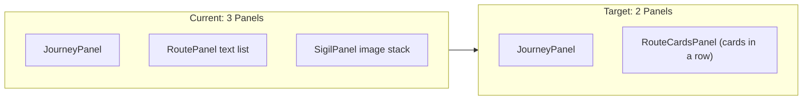

# Dashboard Two-Panel Route Card Redesign

## Current State

The dashboard in `[components/dashboard/DashboardView.tsx](components/dashboard/DashboardView.tsx)` uses a 3-column CSS grid (`260px 1fr 320px`):

- **Left (260px):** `JourneyPanel` -- selectable journey list with diamond indicators
- **Middle (1fr):** `RoutePanel` -- text-only list of routes (name, waypoint count, gen count)
- **Right (320px):** `SigilPanel` -- perspective ImageDiskStack of the selected route's thumbnails

## Target State

Two-panel layout (`260px 1fr`):

- **Left (260px):** `JourneyPanel` -- unchanged, keeps journey navigation
- **Right (1fr):** New `RouteCardsPanel` -- displays all routes for the selected journey as stylized visual cards in a horizontal row




## New RouteCard Design (Cyberpunk / Atlas HUD)

The route cards will operate on a "Scanner Focus" model, drawing heavily from the attached cyberpunk store reference and Thoughtform's navigation grammar.

### Layout & States

- **Row Layout:** Horizontal flex row (`gap: var(--space-xl)`), centered vertically.
- **Scanner Focus (Active):** The currently selected route card scales up to a larger width (e.g., `width: 320px`), becoming fully opaque and revealing extended telemetry data.
- **Peripheral (Inactive):** Unselected cards remain compact (`width: 220px`) and slightly dimmed (`opacity: 0.5`). 
- **Video Autoplay:** The active card automatically crossfades its thumbnail to playing the background video on a loop (if available). Inactive cards remain static thumbnails.

### Visual Grammar (HUD Aesthetics)

- **Geometry (Chamfered Corners):** Strict zero border radius. We will use CSS `clip-path: polygon(...)` to create chamfered (angled/cut) corners (e.g., top-right and bottom-left) to match the cyberpunk reference.
- **Viewport Frames:** 14px corner bracket accents (`var(--dawn-15)`) framing the card bounds.
- **Background:** Full-bleed image/video from the route's first thumbnail.
- **Gradient Overlay:** Bottom-heavy gradient for text readability (`linear-gradient(to bottom, rgba(5,4,3,0.1) 0%, transparent 30%, transparent 50%, rgba(5,4,3,0.4) 80%, rgba(5,4,3,0.85) 100%)`).
- **Scanlines:** An animated, translucent repeating linear gradient (`repeating-linear-gradient`) that appears behind the text panel on the active card.

### Instrument Panel Overlay (Glassmorphism)

The bottom overlay (`rgba(10,9,8,0.4)` + `backdrop-filter: blur(16px)` + `border-top: 1px solid rgba(236,227,214,0.1)`) contains:

- **Route Name:** `var(--font-mono)`, 10px, uppercase, wide letter-spacing (`0.1em`), color: `var(--dawn)`.
- **Description:** Truncated, 2 lines, `var(--font-sans)`, 12px, color: `var(--dawn-70)`.
- **Data Readouts (Telemetry):** Formatted like a machine readout using strict monospace columns:

```text
  WPT    GEN    UPDT
  012    045    10/05
  

```

- **Telemetry Rails & Sockets:** Subtle tick marks (like a ruler) along the left edge of the active card, and a tiny grid of diamond hollows (`◇ ◇ ◇`) representing capacity or recent waypoint activity.

## Multi-Route Layout

- The "Create Route" (+) button from the old RoutePanel will be preserved as a compact ghost card at the end of the row.
- The route cards will act as both selection targets (single click = focus) and navigation triggers (double click or click-when-focused = navigate to `/routes/:id/image`).

## Files to Change

1. `**[components/dashboard/DashboardView.tsx](components/dashboard/DashboardView.tsx)`** -- Change grid to 2 columns (`260px 1fr`), remove `RoutePanel` and `SigilPanel` imports, add new `RouteCardsPanel`, remove `selectedRouteId` state (no longer needed since all routes shown as cards)
2. **New: `components/dashboard/RouteCardsPanel.tsx`** -- The merged panel: section header "02 ROUTES", horizontal flex row of `RouteCard` components, "create route" dialog logic (migrated from RoutePanel)
3. **New: `components/dashboard/RouteCard.tsx`** -- Individual route card component with atlas-inspired styling (full-bleed media, glassmorphism overlay, corner brackets, hover effects)
4. `**[components/dashboard/RoutePanel.tsx](components/dashboard/RoutePanel.tsx)**` -- Will be removed (logic migrated to RouteCardsPanel)
5. `**[components/dashboard/SigilPanel.tsx](components/dashboard/SigilPanel.tsx)**` -- Will be removed (visual replaced by RouteCard media)

## Key Design Tokens (already available in globals.css)

- Backgrounds: `--void`, `--surface-0`, `--surface-1`
- Text: `--dawn`, `--dawn-70`, `--dawn-50`, `--dawn-30`, `--dawn-08`
- Accent: `--gold`, `--gold-10`, `--gold-30`
- Fonts: `--font-mono`, `--font-sans`
- Easing: `--ease-out` (cubic-bezier 0.19,1,0.22,1)
- Durations: `--duration-fast` (150ms), `--duration-base` (300ms)

