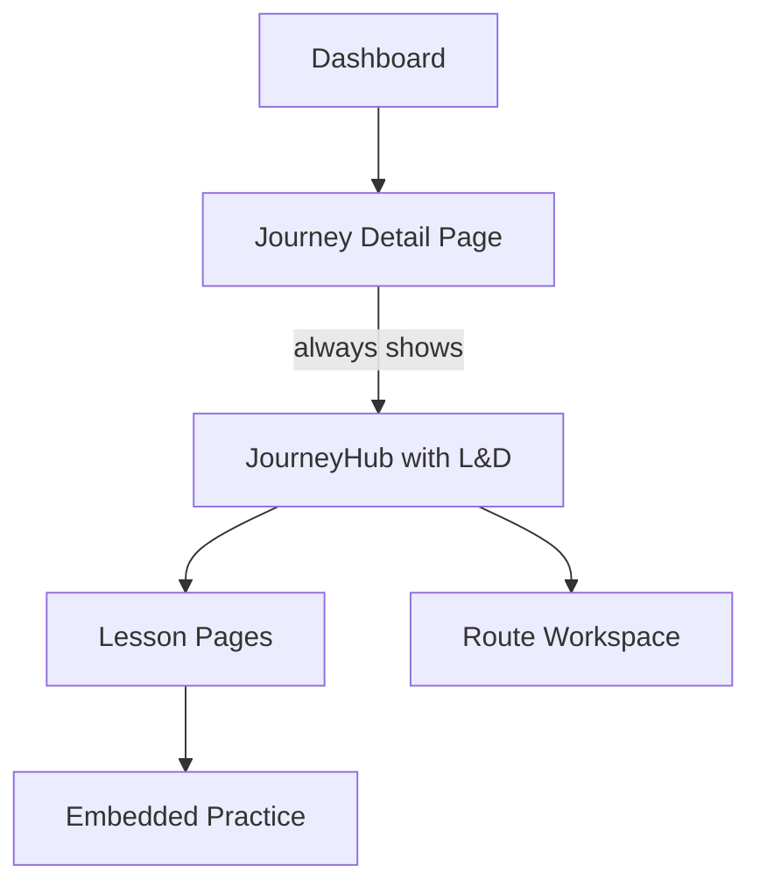
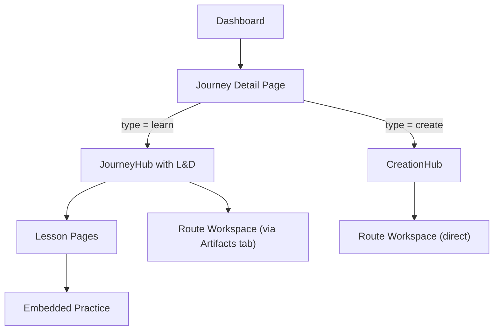

# Dual-Mode Journey System and Next Steps

## Problem

Right now `getLearningContent()` in [app/journeys/[id]/page.tsx](app/journeys/[id]/page.tsx) unconditionally returns the INKROOT mock data for every journey. There is no way to distinguish between a journey that should show the full L&D hub (lessons, curriculum, exercises) and one where you just want to go straight to the creation suite to generate images and videos for a client project. Both use cases are valid and need to coexist cleanly.

## Current Architecture

## Target Architecture

The journey detail page checks the journey type and renders the appropriate experience. Both still live inside the Thoughtform HUD grammar and share the same `NavigationFrame`.

---

## Phase A -- Dual-Mode Journey Type (this iteration)

### A1. Add `type` field to `WorkspaceProject`

- Add a `type` column to the `WorkspaceProject` model in [prisma/schema.prisma](prisma/schema.prisma): `type String @default("create")` (values: `"learn"` or `"create"`).
- Run a Prisma migration. Existing journeys default to `"create"`.
- Expose `type` in the journey API responses from [app/api/journeys/route.ts](app/api/journeys/route.ts) and [app/api/journeys/[id]/route.ts](app/api/journeys/[id]/route.ts).
- Add `type` to the admin journey creation flow in [components/dashboard/JourneyPanel.tsx](components/dashboard/JourneyPanel.tsx) so you can choose "Learn" or "Create" when making a new journey.

### A2. Conditional rendering in journey detail page

- In [app/journeys/[id]/page.tsx](app/journeys/[id]/page.tsx), replace the current `getLearningContent()` stub with logic that checks the journey's `type` field from the API response.
  - If `type === "learn"` and mock learning content exists: render `JourneyHub` (the L&D experience built in Phase 1).
  - If `type === "create"` (or no learning content): render the **creation-focused layout** -- a clean route grid with direct access to the creation workspace, as close to the original journey detail page as possible but with a better visual treatment.
- The creation layout keeps the existing route cards, create-route dialog, and direct links to `/routes/[id]/image`.

### A3. Creation-focused journey layout

- Build a `CreationHub` component (lighter than `JourneyHub`) that shows:
  - Journey name and description at the top.
  - Route cards grid (reusing existing `RouteCard` component from [components/journeys/RouteCard.tsx](components/journeys/RouteCard.tsx)).
  - Quick-create route button.
  - Optional: recent generations preview strip (latest outputs across all routes in this journey).
- This replaces the old `HudPanel`-wrapped route grid with a more intentional layout that still uses the Thoughtform grammar.

### A4. Dashboard indicators

- In the dashboard [components/dashboard/JourneyPanel.tsx](components/dashboard/JourneyPanel.tsx), show a small type badge on each journey card (e.g., a diamond marker: gold for "learn", dawn for "create") so it's visually clear which journeys are workshops vs. pure creation workspaces.
- Journey list in [app/journeys/page.tsx](app/journeys/page.tsx) also shows the type indicator.

---

## Phase B -- Terminology and Navigation Clarity (this iteration)

### B1. Update `lib/terminology.ts`

- Add a `creationSuite` term alongside the existing journey/route/waypoint terms.
- This doesn't rename anything yet -- it adds the vocabulary needed for the UI to distinguish "open the creation suite" from "continue the lesson."

### B2. Navigation affordances

- In the top nav ([components/hud/NavigationFrame.tsx](components/hud/NavigationFrame.tsx)), the "journeys" link stays as-is (it lists both types).
- Inside a learn-type journey, the tabs (Overview, Curriculum, Resources, Artifacts) remain.
- Inside a create-type journey, the creation hub is the default and only view -- no tabs needed, just the route grid.
- Both modes have breadcrumbs back to the journeys list.

---

## Phase C -- Deferred Next Steps (documented, not built)

These are the items from the previous plan's "Deferred" section, now organized as concrete future phases:

### C1. Admin Authoring Interface

- WYSIWYG-lite editor for building lesson content (narrative blocks, practice blocks, quiz blocks).
- Drag-and-drop chapter/lesson ordering.
- Resource upload to Supabase Storage.
- Journey theming configuration (hero image, accent color).

### C2. DB-Backed Content Model

- Migrate the current `lib/learning/types.ts` interfaces to Prisma models (Chapter, Lesson, ContentBlock, Resource tables).
- API routes for CRUD on lesson content.
- Replace `mockJourneyContent.ts` with database queries.

### C3. Creation Suite Rename

- Choose a Thoughtform-native name for the route workspace (candidates: Forge, Foundry, Crucible, Cartograph).
- Update `lib/terminology.ts`, all UI labels, navigation, and documentation.
- Consider whether routes/waypoints also get renamed in this pass.

### C4. Persistent Progress and Annotations

- Move lesson completion state from localStorage to a server-side model (e.g., `LessonProgress` table linked to user + lesson).
- Persist annotations/notes to database.
- Add progress summary to the dashboard (e.g., "3/5 lessons explored").

### C5. Real File Upload

- Supabase Storage integration for resource/documentation uploads.
- Replace the current upload placeholder in the Resources tab with a functional drag-and-drop uploader.

---

## Files Changed (Phase A + B)

- [prisma/schema.prisma](prisma/schema.prisma) -- add `type` field to `WorkspaceProject`
- [app/api/journeys/route.ts](app/api/journeys/route.ts) -- expose `type` in list response
- [app/api/journeys/[id]/route.ts](app/api/journeys/[id]/route.ts) -- expose `type` in detail response
- [app/journeys/[id]/page.tsx](app/journeys/[id]/page.tsx) -- conditional rendering based on journey type
- New: `components/learning/CreationHub.tsx` -- creation-focused journey layout
- [components/dashboard/JourneyPanel.tsx](components/dashboard/JourneyPanel.tsx) -- type selector on create, type badge on list
- [components/journeys/JourneyCard.tsx](components/journeys/JourneyCard.tsx) -- type indicator
- [app/journeys/page.tsx](app/journeys/page.tsx) -- type indicator on journey cards
- [lib/terminology.ts](lib/terminology.ts) -- add `creationSuite` term

