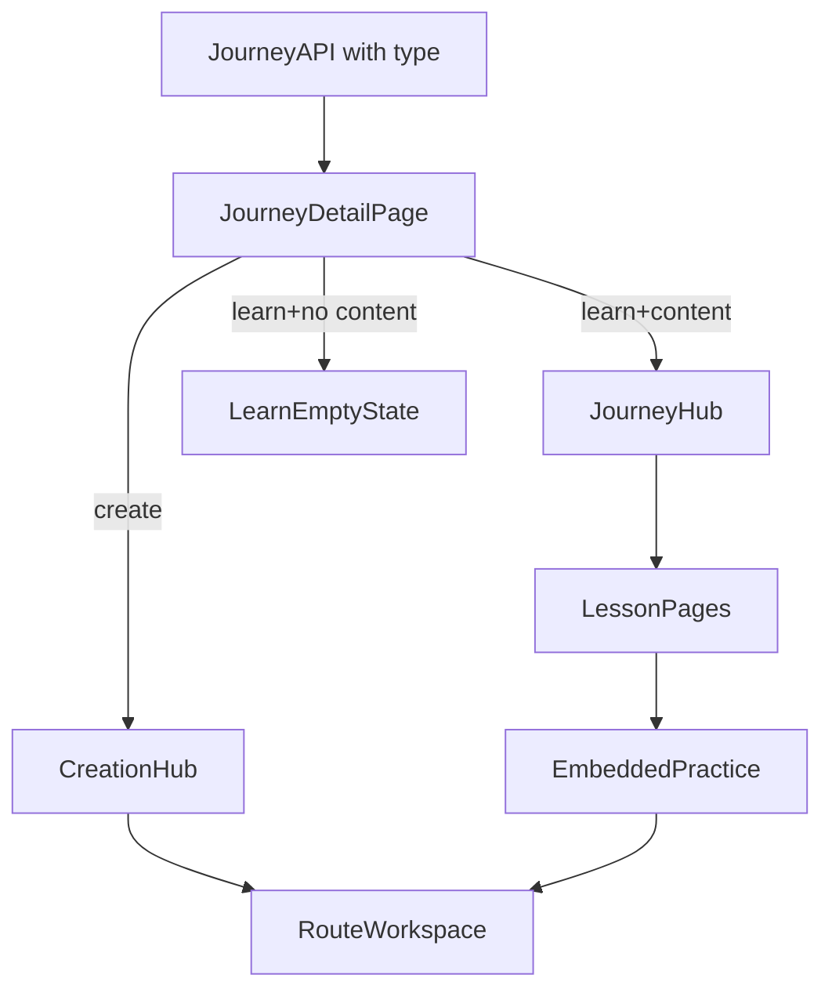

# Dual-Mode Journey V1 (Lean but Robust)

## What Was Missing (Now Added)

- Explicit fallback when `type=learn` but no curriculum is mapped yet.
- Migration/backfill behavior for existing journeys (default to `create`).
- Rollout safety: feature flag and reversible switch at page-render level.
- Clear anti-overengineering guardrails (what we will *not* build this pass).

## Scope Locked (from your choices)

- Keep Prisma migration now (`WorkspaceProject.type`).
- Build a dedicated `CreationHub` now.

## V1 Implementation Plan

### 1) Data and API contract

- Add `type` field to [prisma/schema.prisma](prisma/schema.prisma) on `WorkspaceProject` with default `"create"`.
- Backfill existing rows implicitly via default; no manual data migration logic beyond Prisma migration.
- Expose `type` in [app/api/journeys/route.ts](app/api/journeys/route.ts) and [app/api/journeys/[id]/route.ts](app/api/journeys/[id]/route.ts).

### 2) Journey mode routing with safe fallback

- Update [app/journeys/[id]/page.tsx](app/journeys/[id]/page.tsx):
  - `type=learn` + curriculum found => render `JourneyHub`.
  - `type=learn` + no curriculum => show lightweight empty-learning state with CTA to open creation suite.
  - `type=create` => render new `CreationHub`.
- Keep existing route creation dialog and `/routes/[id]/image` links unchanged.

### 3) Create-only experience

- Add `components/learning/CreationHub.tsx`:
  - Journey context header.
  - Route grid (reuse [components/journeys/RouteCard.tsx](components/journeys/RouteCard.tsx)).
  - Fast create-route CTA.
  - Optional recent output strip only if easy using existing output query shape; otherwise defer.

### 4) Admin and dashboard clarity

- Update [components/dashboard/JourneyPanel.tsx](components/dashboard/JourneyPanel.tsx): choose `Learn` vs `Create` when creating journey.
- Show type badge in journey lists/cards:
  - [components/dashboard/JourneyPanel.tsx](components/dashboard/JourneyPanel.tsx)
  - [components/journeys/JourneyCard.tsx](components/journeys/JourneyCard.tsx)
  - [app/journeys/page.tsx](app/journeys/page.tsx)

### 5) QA + rollout

- Verify both paths end-to-end:
  - Learn journey -> JourneyHub + lessons + embedded practice.
  - Create journey -> CreationHub -> route workspace directly.
- Regression checks: dashboard loading, route creation, access control, journey list rendering.
- Feature-flag the dual-mode rendering branch to allow quick rollback.

## Architecture (V1)

## Guardrails (avoid over-engineering)

- No admin authoring builder yet.
- No DB lesson/chapter models yet.
- No terminology rename pass yet.
- No persistent notes/progress yet.
- No full resource uploader yet (placeholder stays).

## Acceptance Criteria

- New journeys can be created as either `Learn` or `Create`.
- Existing journeys still work and default to `Create` after migration.
- Learn and Create journeys are visually distinct and behaviorally correct.
- If learning content is missing, users still have a usable path to creation suite.
- No regressions in existing route workspace and dashboard flows.

