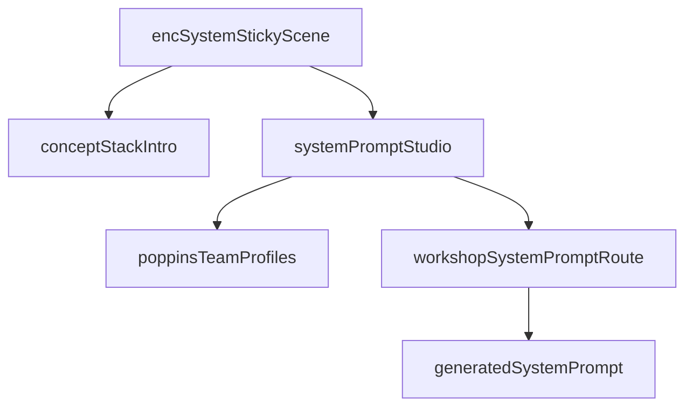

# Encode Scaffolding Refresh

## Existing Anchors

The current Encode chapter is fully hardcoded in [components/workshops/BrandedWorkshopPage.tsx](components/workshops/BrandedWorkshopPage.tsx), and the reusable prompt-shell we want to borrow lives in [components/workshops/sections/PromptPlayground.tsx](components/workshops/sections/PromptPlayground.tsx).

```169:180:components/workshops/BrandedWorkshopPage.tsx
<Slide id="enc-system" reg={reg} tint="#fcf0f5">
  <Tag bg="rgba(254,179,210,0.2)">First layer</Tag>
  <h2 style={h2Style}>System <span style={caveatSpan}>Prompts</span></h2>
  <Lead style={{ textAlign: "center", marginBottom: 32 }}>The simplest form of encoding. Your baseline. The instruction set that travels with every conversation.</Lead>
  <ConceptStack items={[
    { title: "What is it?", body: "A persistent instruction that defines how AI should behave in conversations with you. It's the foundation for everything that follows." },
    { title: "Build one for your role", body: "Don't overthink it. What do you need AI to understand before every conversation? Write that down. Start there." },
    { title: "It travels with you", body: "In Claude Projects, your system prompt stays active across conversations. Consistency without repetition." },
  ]} />
  <Exercise title="Draft Your System Prompt" tag="Individual" tagBg="rgba(254,179,210,0.2)">
```

```92:139:components/workshops/sections/PromptPlayground.tsx
<div className={s.promptRow}>
  {mode === "semantic" ? (
    <>
      <span>{`“Rewrite this ${clientName} social post from the perspective of`}</span>
      <select className={s.select} value={selectedPerspective} onChange={(e) => onPerspectiveChange(e.target.value)}>
```

## Implementation

- Update [components/workshops/BrandedWorkshopPage.tsx](components/workshops/BrandedWorkshopPage.tsx) so `ContextIcons` reads larger and more airy: larger icon box, stronger label sizing, and wider gaps.
- Generalize the current `Exercise` framing in [components/workshops/BrandedWorkshopPage.tsx](components/workshops/BrandedWorkshopPage.tsx) into two visual variants:
  - true `Exercise` blocks keep the dashed workshop treatment
  - `Question for the room` blocks restyle `Context Audit` and `Project Mapping` with a distinct Poppins-accent frame using the existing palette from [scripts/seed-poppins.mjs](scripts/seed-poppins.mjs)
- Replace the static `enc-system` slide in [components/workshops/BrandedWorkshopPage.tsx](components/workshops/BrandedWorkshopPage.tsx) with a sticky staged scene, mirroring the scroll grammar of [components/workshops/sections/NavigateStory.tsx](components/workshops/sections/NavigateStory.tsx): the concept stack is visible first, then scrolls away as the new drafting component enters and locks focus.
- Add a new section component under [components/workshops/sections/](components/workshops/sections/) for the system-prompt studio. Reuse the IA and visual language of [components/workshops/sections/PromptPlayground.tsx](components/workshops/sections/PromptPlayground.tsx) / [components/workshops/sections/PromptPlayground.module.css](components/workshops/sections/PromptPlayground.module.css), but adapt it to this flow:
  - person dropdown
  - role dropdown that auto-matches the selected person by default but remains editable
  - prefilled context/background field
  - `Navigate` CTA
  - generated system-prompt output panel
- Materialize the researched Poppins roster into a typed in-repo helper, likely [lib/workshops/poppinsTeamProfiles.ts](lib/workshops/poppinsTeamProfiles.ts), sourced from [poppins-team-use-cases.md](C:/Users/buyss/Dropbox/03_Thoughtform/04_Arcs/02_Workshops/20260318_Poppins/04_Claude/poppins-team-use-cases.md). Use that helper for full name, default title, and role-specific context seeds instead of relying on the current six simplified `settings.team` cards.
- Add a dedicated Claude-backed route, likely [app/api/workshops/system-prompt/route.ts](app/api/workshops/system-prompt/route.ts), following the auth + Anthropic pattern in [app/api/workshops/prompt-playground/route.ts](app/api/workshops/prompt-playground/route.ts) but generating concise system prompts using Anthropic-style best practices: role, persistent context, behavior instructions, and output constraints.
- Tune section height and spacing so the sticky `enc-system` reveal ends cleanly before later Encode sections enter, and `enc-skills` does not peek into view early.

## Data Flow




## Validation

- Confirm `ContextIcons` feels visibly larger and more separated without breaking wrap behavior.
- Confirm `Context Audit` and `Project Mapping` no longer read as exercises and use a distinct Poppins-branded question treatment.
- Confirm `enc-system` now reveals in stages: explanation first, drafting studio second.
- Confirm name and role dropdowns default intelligently, but the role can be changed independently.
- Confirm `Navigate` produces a system prompt rather than the old social-post rewrite output.
- Confirm the right-rail TOC still lands on sensible section starts and that `enc-skills` stays out of view until reached.

