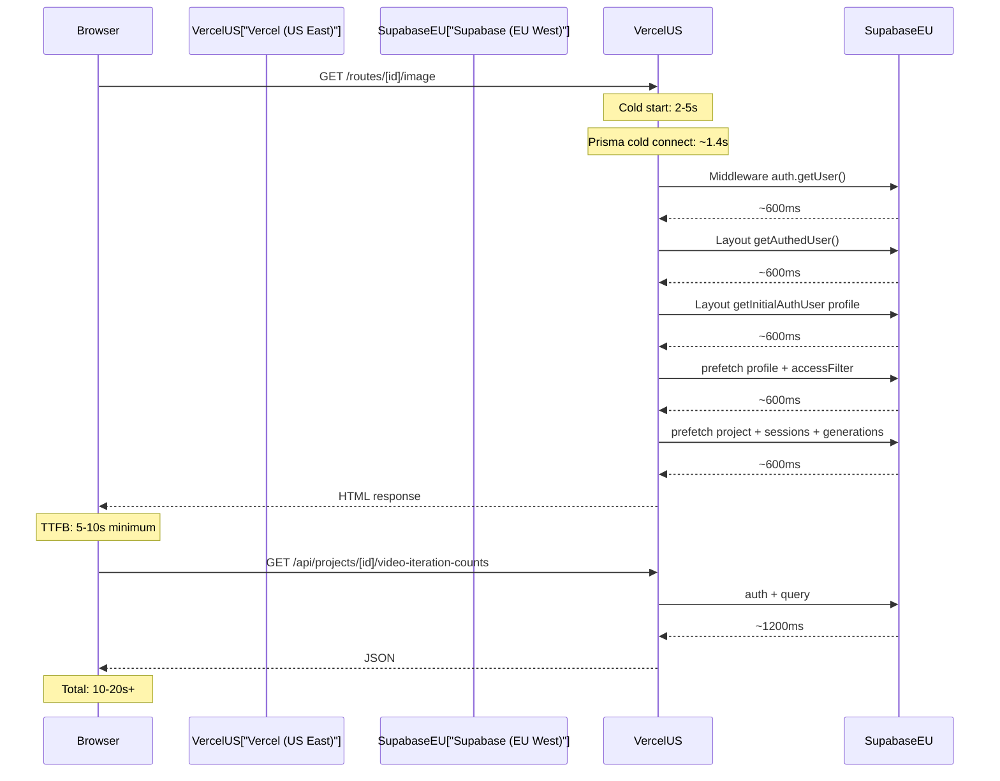

# Fix Production Load Times (20-30s to under 2s)

## Root Cause

The production site at sigil.thoughtform.co is deployed on Vercel with **no region configuration**. Vercel defaults to `iad1` (Washington D.C., US East). The Supabase database is in `eu-west-1` (Ireland). Every database query crosses the Atlantic Ocean and back, adding **~600ms of pure network latency per round trip**.

The PERFORMANCE_PLAN.md benchmarks confirm this:

- 5 consecutive DB pings: 597ms, 598ms, 597ms, 598ms, 597ms (avg 597ms)
- Cold connect: 1389ms
- SQL execution for the heaviest query: 0.127ms

The database is literally idle. The network does all the work.

## Why This Causes 20-30 Second Loads

For `/routes/[id]/image`, the production request chain looks like this:




That is 5 serial network round trips at ~600ms each, plus cold start overhead, plus client-side API calls. With cold starts (Vercel function not recently invoked), this easily hits 20-30 seconds.

## The Fix: One Config File

Create [vercel.json](vercel.json) to move functions to `eu-west-1` (same region as Supabase):

```json
{
  "regions": ["cdg1"]
}
```

`cdg1` is Vercel's Paris region, geographically closest to Supabase's `eu-west-1` (Ireland). This drops every DB round trip from ~600ms to ~5-10ms.

The same request chain after co-location:

- 5 serial DB round trips: 5 x 5ms = 25ms (vs 5 x 600ms = 3000ms)
- Cold connect: ~50ms (vs 1389ms)
- Total server render: under 500ms (vs 5-10 seconds)
- Full page load: under 2 seconds (vs 20-30 seconds)

## What About the Code Changes We Just Pushed?

The structural cleanup we committed (parallelization, SWR for journeys, `/api/me` elimination, shared query logic) removes ~2-3 unnecessary round trips per page. That helps, but each removed round trip only saves ~600ms when the baseline is 600ms/query. The real multiplier is making each query 5ms instead of 600ms -- that makes ALL queries fast, not just the ones we removed.

Both changes are needed. The code changes prevent the architecture from wasting round trips. The co-location makes each remaining round trip nearly free.

## Additional Mitigation: Deduplicate Auth in Middleware + Layout

Right now, middleware calls `supabase.auth.getUser()` and then the server layout calls `getAuthedUser()` which calls `supabase.auth.getUser()` again. These are in different execution contexts (middleware vs RSC), so React.cache does NOT deduplicate them. That is two transatlantic round trips just for auth.

With `SIGIL_PUBLIC_DEMO=true` on production (which appears to be the case based on the login page shown), middleware already skips auth. But if/when real auth is enabled, the middleware auth call should be made lighter (use `getSession()` instead of `getUser()`, or skip the Supabase call entirely and just check cookies).

## Verification

After deploying with co-location:

```bash
curl -s -o /dev/null -w "TTFB: %{time_starttransfer}s | Total: %{time_total}s\n" \
  https://sigil.thoughtform.co/dashboard

curl -s -o /dev/null -w "TTFB: %{time_starttransfer}s | Total: %{time_total}s\n" \
  https://sigil.thoughtform.co/routes/2c9df50c-80cc-401d-9c17-2fe392b0b798/image
```

Target: TTFB under 1s, total under 2s.