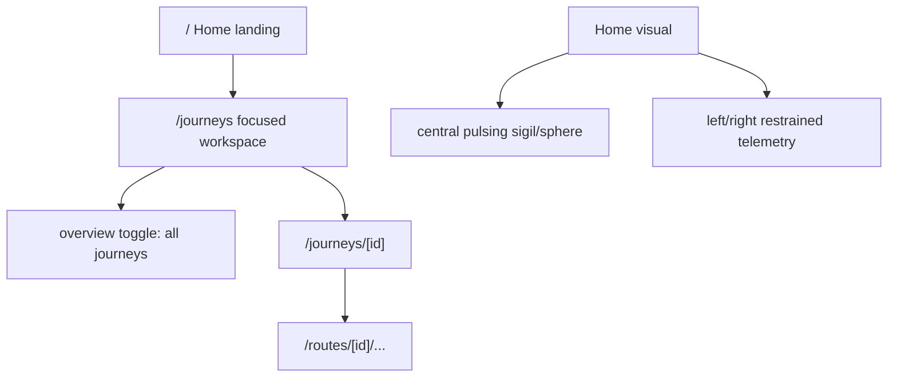

# Home / Journeys IA Swap

## Direction

- **Home** becomes the new landing surface at `/`.
- **Journeys** becomes the primary working surface at `/journeys`, reusing the current dashboard-style `journey -> routes -> activity` architecture.
- The old journeys overview does **not** stay as a separate first-class page shape; it becomes a **browse mode** toggle inside `/journeys`.
- Non-admins can still land on Home, but only admins see the richer side telemetry / control affordances.

## Current Seams To Reuse

- Root currently redirects to dashboard: [app/page.tsx](app/page.tsx)
- Current workspace hub lives in [app/dashboard/page.tsx](app/dashboard/page.tsx) and [components/dashboard/DashboardView.tsx](components/dashboard/DashboardView.tsx)
- Current journeys browse surface lives in [app/journeys/page.tsx](app/journeys/page.tsx) and [components/journeys/JourneysOverviewContent.tsx](components/journeys/JourneysOverviewContent.tsx)
- Logo currently links to `/dashboard`: [components/hud/SigilParticleLogo.tsx](components/hud/SigilParticleLogo.tsx)
- Top nav still includes `dashboard`: [components/hud/NavigationFrame.tsx](components/hud/NavigationFrame.tsx)
- Admin-only redirect helper still pushes non-admins to `/dashboard`: [components/auth/RequireAdmin.tsx](components/auth/RequireAdmin.tsx)

```43:49:components/hud/NavigationFrame.tsx
const LEFT_NAV = [
  { href: "/dashboard", label: "dashboard" },
  { href: "/journeys", label: "journeys" },
];
```

## IA Model




## Phase 1 — Route Swap

- Change [app/page.tsx](app/page.tsx) from redirect to a real `Home` page.
- Turn [app/dashboard/page.tsx](app/dashboard/page.tsx) into a legacy redirect to `/`.
- Repoint [app/journeys/page.tsx](app/journeys/page.tsx) to the current workspace composition by reusing [components/dashboard/DashboardView.tsx](components/dashboard/DashboardView.tsx).
- Update [components/hud/SigilParticleLogo.tsx](components/hud/SigilParticleLogo.tsx) to link to `/`.
- Remove the visible `dashboard` text link from [components/hud/NavigationFrame.tsx](components/hud/NavigationFrame.tsx).

## Phase 2 — Journeys Workspace Toggle

- Extend [components/dashboard/DashboardView.tsx](components/dashboard/DashboardView.tsx) with a local view-mode toggle:
  - `focused` (default): current dashboard behavior
  - `overview`: hide `RouteCardsPanel` and `RouteActivityPanel`, show all journey cards
- Reuse the browse cards from [components/journeys/JourneysOverviewContent.tsx](components/journeys/JourneysOverviewContent.tsx) / [components/journeys/JourneyOverviewCard.tsx](components/journeys/JourneyOverviewCard.tsx) inside the overview mode rather than keeping two divergent implementations.
- Keep `JourneyPanel` selection logic for `focused` mode unchanged.

```203:219:components/dashboard/DashboardView.tsx
const selectedJourney = data.journeys.find((j) => j.id === selectedJourneyId);
const routes = selectedJourney?.routes ?? [];

return (
  <section
    className="dashboard-two-panel w-full animate-fade-in-up"
    style={{
      ...
      display: "grid",
      gridTemplateColumns: "360px 1fr 280px",
```

## Phase 3 — New Home Landing

- Create a new admin-aware landing component (for example `components/home/HomeLanding.tsx`).
- Visual direction: calm / premium, inspired by the `01_thoughtform` admin-home composition, not the busier Ledger topology canvas.
- Composition:
  - one central pulsing sigil / sphere focal object
  - restrained mono telemetry left and right
  - no route/journey operations here
- Admins see the richer telemetry panels; non-admins see the same scene in a quieter form.
- Keep the page intentionally spare so it can evolve later.

## Phase 4 — Auth / Navigation Cleanup

- Update [components/auth/RequireAdmin.tsx](components/auth/RequireAdmin.tsx) so non-admin admin redirects go to `/journeys`, not `/dashboard`.
- Audit any remaining hardcoded `/dashboard` references and either redirect or rename them.
- Keep `analytics` and `documentation` in the top nav; do not surface phantom destinations.

## Success Criteria

- Clicking the Sigil logo always takes the user to `Home` (`/`).
- `/journeys` becomes the main operational surface, with a clean toggle between focused workspace and all-journeys overview.
- The old duplication between dashboard and journeys disappears.
- Home feels like a calm, premium navigation instrument rather than another CRUD page.
- Non-admins are not blocked from the home route, but admins get the richer “command” version.

