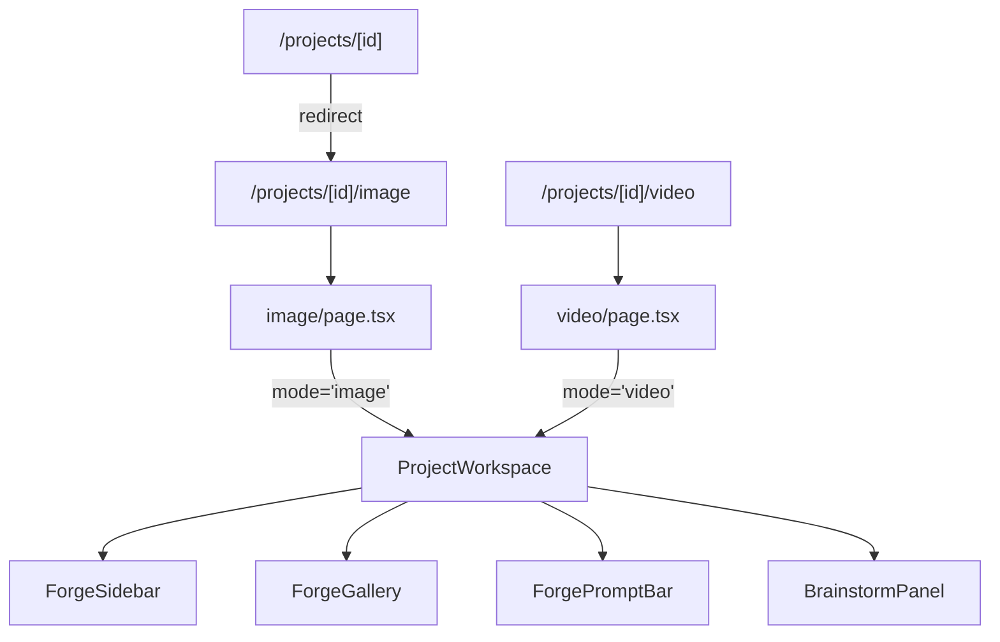

# Image/Video Route Split

## Architecture

## 1. New route files

Create two new pages that render `ProjectWorkspace` with a fixed `mode` prop:

- `**app/projects/[id]/image/page.tsx**` -- wraps `ProjectWorkspace` with `mode="image"`, inside `RequireAuth` + `NavigationFrame`
- `**app/projects/[id]/video/page.tsx**` -- same but `mode="video"`
- `**app/projects/[id]/page.tsx**` -- change to a server-side redirect to `./image` (using `redirect()` from `next/navigation`)

## 2. ProjectWorkspace accepts `mode` prop

In [ProjectWorkspace.tsx](components/generation/ProjectWorkspace.tsx):

- Add `mode: GenerationType` to props (alongside `projectId`)
- **Remove** `generationType` state (line 16) and `setGenerationType` -- replace every reference with the `mode` prop
- **Remove** `lastActiveSessionByType` ref -- no longer needed since each page has one type
- Filter sessions: `sessions.filter(s => s.type === mode)` (line 70)
- Filter models: always `models.filter(m => m.type === mode)` (line 162-164, replacing the `activeSession` fallback bug)
- Fetch models from `GET /api/models?type=${mode}` (not `/api/models`) so mixed models never reach client state
- Default model on load: pick first model matching `mode` (line 62)
- `createSession` always uses `mode` as the type (line 183), remove the `setGenerationType` call (line 190)
- **Convert to video**: `handleConvertToVideo` navigates to `/projects/${projectId}/video?ref=${encodeURIComponent(imageUrl)}` using `useRouter().push()` instead of changing state

## 3. Read `ref` query param on video page

In the video page (or in `ProjectWorkspace` when `mode === "video"`), check for a `ref` query parameter on mount. If present, pre-populate `referenceImageUrl` with that value. This replaces the old in-memory `handleConvertToVideo` flow.

## 3b. Canonical route compatibility

- Preserve backwards compatibility for `/projects/[id]` via redirect to `/projects/[id]/image`
- Define query forwarding behavior for compatibility URLs:
  - `/projects/[id]?ref=...` should forward to `/projects/[id]/image?ref=...`
  - convert-to-video should continue to target `/projects/[id]/video?ref=...`

## 4. Remove IMAGE/VIDEO toggle from ForgePromptBar

In [ForgePromptBar.tsx](components/generation/ForgePromptBar.tsx):

- Remove `onGenerationTypeChange` prop (line 9)
- Remove the IMAGE/VIDEO `modeButton` toggle from the side strip (lines 350-380)
- Keep the `generationType` prop (read-only, for conditional UI like duration controls)
- Remove corresponding CSS: `.modeButton`, `.modeButtonActive` from [ForgePromptBar.module.css](components/generation/ForgePromptBar.module.css)

## 5. Add Image/Video page tabs in workspace header

Add a simple tab bar at the top of the workspace (inside `ProjectWorkspace`) that shows two links:

- **IMAGE** -- links to `/projects/${projectId}/image`
- **VIDEO** -- links to `/projects/${projectId}/video`
- Active tab highlighted with gold, inactive with `dawn-30`
- Styled as minimal HUD-style tabs (mono font, uppercase, no borders) sitting just below the project name in the sidebar or above the gallery area

## 6. ForgeSidebar cleanup

In [ForgeSidebar.tsx](components/generation/ForgeSidebar.tsx):

- Rename `generationType` prop to `mode` for clarity
- The "+" button always creates a session of type `mode`
- No other logic changes needed (sessions are already pre-filtered by the parent)

## 7. Backend type compatibility guard

Verify and enforce server-side compatibility checks in generation submission path:

- In [app/api/generate/route.ts](app/api/generate/route.ts), ensure requested `modelId` resolves to type that matches target session type.
- Reject mismatches with controlled 4xx response and message.
- Keep existing request/processing flow unchanged otherwise.

This prevents crafted requests from bypassing frontend route/type constraints.

## 8. Entry-point navigation updates

Update project entry links/buttons to canonical image route:

- Projects list/open-project action should route to `/projects/[id]/image`
- Any in-app links still pointing to `/projects/[id]` should be updated or intentionally rely on redirect

## 9. Mode-specific state restoration

When switching between `/image` and `/video` routes, preserve each mode's last context:

- Last active session ID by mode
- Last selected model ID by mode

Use route-aware restoration to avoid resetting user context when toggling modes.

## 10. Regression matrix for route split

Manual validation checklist:

1. `/projects/[id]/image` shows only image models and image sessions.
2. `/projects/[id]/video` shows only video models and video sessions.
3. Creating a session on each route uses correct type.
4. Convert image -> video opens `/video?ref=...` and pre-fills reference image.
5. Retry/realtime/delete/approve flows still work in both routes.
6. Direct visits to `/projects/[id]` and `/projects/[id]?ref=...` resolve predictably to canonical route.

## Files changed

- `**app/projects/[id]/page.tsx`** -- redirect to `./image`
- `**app/projects/[id]/image/page.tsx`** (new) -- image page
- `**app/projects/[id]/video/page.tsx`** (new) -- video page
- `**components/generation/ProjectWorkspace.tsx`** -- accept `mode` prop, remove `generationType` state, fix model filtering, add router navigation for convert-to-video, add tab bar
- `**components/generation/ForgePromptBar.tsx**` -- remove `onGenerationTypeChange` and mode toggle buttons
- `**components/generation/ForgePromptBar.module.css**` -- remove unused `.modeButton` styles
- `**components/generation/ForgeSidebar.tsx**` -- rename prop
- `**components/generation/ProjectWorkspace.module.css**` -- add tab bar styles
- `**app/api/generate/route.ts**` -- model/session type compatibility guard (if missing)
- `**components/projects/ProjectsView.tsx**` (or equivalent entry point) -- canonical project route links

