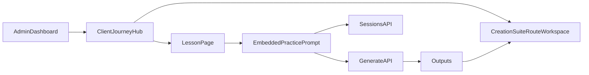

# Client Journey Learning UX Plan

## Goals

- Reframe Journey pages as client/project learning hubs (not just route launchers).
- Add immersive lesson pages with embedded practice generation.
- Keep current admin dashboard and current Route/Waypoint data contracts intact for this phase.
- Defer global terminology rename and admin authoring UI (documented as follow-up).

## Ground Truth in Current Code

- User-facing terminology mapping is centralized in [lib/terminology.ts](lib/terminology.ts) and currently uses Journey/Route/Waypoint labels.
- Journey detail UI is currently route-grid oriented in [app/journeys/[id]/page.tsx](app/journeys/[id]/page.tsx) and creates routes via `/api/projects`.
- Creation workspace is already robust in [components/generation/ProjectWorkspace.tsx](components/generation/ProjectWorkspace.tsx), mounted from [app/routes/[id]/image/page.tsx](app/routes/[id]/image/page.tsx).
- Data hierarchy already matches your concept in [prisma/schema.prisma](prisma/schema.prisma): `WorkspaceProject -> Project -> Session`.

## Experience Architecture (UI-first)

## Phase 1 — Client Journey Hub (Priority 1)

- Refactor [app/journeys/[id]/page.tsx](app/journeys/[id]/page.tsx) into a **mini client dashboard**:
  - Left column: project context (purpose, what you'll learn, facilitator notes, docs/resources list).
  - Right column: chapter/lesson progression rail (ordered curriculum blocks with lightweight completion states).
  - Top tabs: `Overview`, `Curriculum`, `Resources`, `Artifacts`.
- **Per-client visual theming layer**: each journey can define a hero/cover image, an optional brand accent color, and a gradient mask that blends the image into the Thoughtform background. This gives each client (e.g. INKROOT) a sense of being in their own branded space while staying inside the HUD grammar. Implemented as fields in the mock content model; CSS-variable overrides scoped to the journey page.
- Preserve existing HUD grammar via [components/hud/NavigationFrame.tsx](components/hud/NavigationFrame.tsx) and existing `HudPanel` primitives.
- Add atmospheric background treatment (hero image with radial/linear gradient fade to `--void`/`--surface-0`, optional restrained particle overlay) using existing token system in [app/globals.css](app/globals.css).
- Keep direct access CTA to existing creation suite (`Open route workspace`) for flow-state creation.
- **Client customization scope (prototype)**: clients can reorder pinned lessons in their sidebar and add personal bookmarks/notes on the Overview tab. Admin controls overall curriculum structure and content.

## Phase 2 — Lesson Experience (Priority 2)

- Add a new lesson route, e.g. `[app/journeys/[id]/lessons/[lessonId]/page.tsx](app/journeys/[id]/lessons/[lessonId]/page.tsx)` (UI-only content source).
- Build a storytelling layout optimized for prompting workshops (narrative + examples + exercises):
  - Vertical scroll narrative sections with progressive text reveal (IntersectionObserver-driven opacity/translate transitions).
  - **Sticky wheel/diamond progression sidebar**: a new component that maps lesson sections to waypoint diamonds along a vertical rail. Active section highlighted in gold; completed sections filled. Uses existing diamond motif and telemetry rail language. Scrolls with the user and doubles as quick-jump navigation.
  - Lightweight parallax image layers (opacity + translateY only; images blended into background via radial gradient masks, inspired by David Whyte's watercolor-to-background technique). No z-axis depth scrolling.
- Lesson content blocks (kept lightweight for prompting workshops):
  - **Narrative text**: editorial prose sections with progressive reveal.
  - **Example showcases**: full-bleed or inset images/videos with captions (e.g. "I created this with the following prompt...").
  - **Practice exercises**: embedded prompt blocks (Phase 3) with brief instructions.
  - **Checkpoint quizzes**: simple single-choice or reflection prompts, not graded -- just to pause and consolidate.
  - **Annotations sidebar**: learners can highlight text passages and attach personal notes (stored client-side for prototype; placeholder for future persistence).
- **Particle concept visualization**: one proof-of-concept interactive canvas scene per journey (e.g. "What is latent space?") that uses particle systems pedagogically -- not just as atmosphere. Reuses patterns from [components/ui/RunicRain.tsx](components/ui/RunicRain.tsx) but with interactive parameters the learner can manipulate (e.g. a slider that morphs particle clusters to illustrate how prompts navigate semantic neighborhoods).

## Phase 3 — Embedded Practice (Bridge Learning to Creation)

- Create a compact prompt component wrapper (new learning component) that reuses logic and styling from [components/generation/ForgePromptBar.tsx](components/generation/ForgePromptBar.tsx).
- Submit practice generations via existing APIs (no schema changes this phase):
  - [app/api/generate/route.ts](app/api/generate/route.ts)
  - [app/api/sessions/route.ts](app/api/sessions/route.ts)
- For prototype behavior, map each lesson practice block to a selected existing route/session target and surface where outputs are stored.
- Add “View in Creation Suite” affordance after generation to prevent artifact loss.

## Phase 4 — Content & Customization Model (Prototype-safe)

- Introduce UI-only seed data for one client journey (e.g., INKROOT) in a new local content file (e.g., `lib/learning/mockJourneyContent.ts`).
- Define typed interfaces for:
  - **Journey profile metadata**: name, client name, description, hero image URL, optional brand accent hex, facilitator name.
  - **Curriculum chapters/lessons**: ordered chapters, each with ordered lessons. Lesson has title, subtitle, estimated duration, content blocks array.
  - **Content blocks**: discriminated union -- `narrative | example | practice | quiz | particle-scene`.
  - **Resource/document links**: title, description, file URL, file type. Upload UI placeholder (drag-drop zone that shows the interaction but stores to a mock list for now; future: Supabase Storage).
  - **Practice blocks and artifact targets**: linked route ID + session type so generated outputs have a home.
- Keep this layer intentionally portable to future DB-backed authoring.

### L&D design principles adopted (lightweight)

Drawn from Masterclass, Coursera, SanaLabs, and Learn Squared -- but scoped to prompting workshops, not enterprise LMS:

- **Progression visibility**: always show where you are in the curriculum (wheel sidebar, chapter completion diamonds).
- **Show before tell**: lead sections with visual examples, then explain the technique.
- **Interleave practice**: never go more than ~2 narrative sections without an exercise or reflection.
- **Low-friction completion**: no heavy grading or certification machinery. A simple "mark as explored" toggle per lesson. Completion state stored client-side for prototype.

## Design Direction Anchors

- Use Thoughtform Navigation UI Grammar primitives: viewport frame, telemetry rails, waypoints, heading indicators, bearing labels.
- Apply reference patterns as inspiration (not direct mimicry):
  - **David Whyte Experience**: soft watercolor-to-background blending, progressive text reveal on scroll, editorial pacing with generous whitespace. Adopt the gradient mask technique for lesson hero images; adopt the unhurried reveal rhythm for narrative sections.
  - **Star Atlas**: atmospheric particle worldbuilding on warm parchment-like backgrounds, restrained color palette (blue/red particles on beige). Adopt the particle-as-content approach for concept visualizations; use vertical scroll (not z-axis depth) to keep learning flow focused.
  - **Masterclass / Learn Squared**: chapter rail with thumbnails, progress indicators, estimated durations. Adopt the structural clarity of a visible curriculum outline alongside immersive content -- but keep Thoughtform's instrument aesthetic instead of their consumer polish.
  - **SanaLabs / Coursera**: interleaved practice, reflection prompts, low-friction completion. Adopt the principle of regular practice checkpoints without heavy assessment infrastructure.

## Deferred (Documented, Not Built in This Phase)

- Admin authoring interface for building courses/lessons/resources.
- Global naming migration for Route/Waypoint/Project/Session across API and schema.
- DB schema + CMS model for lessons/chapters/resources.
- Creation suite rename (the current Route workspace needs a distinct name in the Thoughtform lexicon -- e.g. Forge, Foundry, Crucible -- to clearly separate "learn" from "create" in navigation).
- Persistent annotation/notes storage (currently client-side localStorage).
- Real file upload to Supabase Storage for resources/documentation.
- Server-side lesson completion/progress tracking.

## Acceptance Criteria for This Iteration

- A Journey page feels client-specific and learning-oriented while still inside Thoughtform/Sigil brand language.
- Per-client theming (hero image + gradient blend) makes each journey feel like the client's own space.
- A Lesson page exists with immersive scroll storytelling, wheel progression sidebar, and embedded prompt practice.
- At least one particle-based concept visualization exists as a pedagogical element (not just decoration).
- Resource tab has a visible upload placeholder (functional upload deferred).
- Generated lesson artifacts are discoverable and linked to existing route workspace.
- No breaking changes to current dashboard, route workspace, or existing API contracts.

