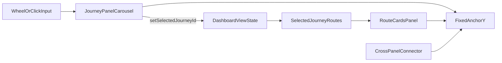

# Journey Card Carousel + Fixed Connector

## Scope

Implement two coordinated UI changes on the dashboard:

- Remove the dark/black-looking hover border from Journey cards while preserving subtle hover background/gradient feedback.
- Convert Journey selection into a fixed-slot carousel interaction (terminal/jukebox style) so the selected Journey is always the top slot, and the Journey→Route connector line always originates/lands at a stable point.

Assumptions (because behavior questions were skipped):

- Scrolling is **bounded** (no wrap-around loop).
- Clicking a Journey card still selects it (in addition to wheel-scroll interaction).

## Current Implementation Anchors

- Hover border override currently comes from [components/dashboard/JourneyPanel.tsx](components/dashboard/JourneyPanel.tsx):

```tsx
style={isHovered && !isSelected ? { background: "var(--dawn-04)", borderColor: "var(--dawn-15)" } : undefined}
```

- Inter-panel connector is hardcoded in [components/dashboard/DashboardView.tsx](components/dashboard/DashboardView.tsx):

```tsx
style={{ position: "absolute", left: 140, top: 14 }}
```

- Route panel ingress elbow is also fixed in [components/dashboard/RouteCardsPanel.tsx](components/dashboard/RouteCardsPanel.tsx):

```tsx
style={{ position: "absolute", left: 0, top: 56 }}
```

## Implementation Plan

### 1) Remove unwanted hover border on Journey cards

- Update [components/dashboard/JourneyPanel.tsx](components/dashboard/JourneyPanel.tsx) hover style application for non-selected cards:
  - Keep subtle background tint/gradient shift.
  - Do **not** override border color on hover.
- Preserve selected-state border behavior from [components/ui/JourneyCardCompact.tsx](components/ui/JourneyCardCompact.tsx) (`gold` selection styling) so only active cards get emphasized border treatment.

### 2) Refactor Journey list into fixed-slot carousel/jukebox interaction

- Rework the journey list region in [components/dashboard/JourneyPanel.tsx](components/dashboard/JourneyPanel.tsx):
  - Introduce a fixed “selection slot” at the top of the stack viewport.
  - Render Journey cards in a vertically stepped stack where only the card occupying slot 0 is selected.
  - Handle wheel input over the Journey stack to move selection index up/down by one step (bounded).
  - Keep click-to-select behavior, but selecting a lower card promotes it into the top slot.
- Keep existing admin actions (rename/delete/open), but anchor interaction focus around the selected/top card so card controls remain predictable.

### 3) Stabilize Journey→Route connector geometry with a shared anchor

- Define a shared connector anchor (single source of truth) in [components/dashboard/DashboardView.tsx](components/dashboard/DashboardView.tsx) and propagate/use it for both panels (via prop or CSS variable).
- Align these elements to the same anchor:
  - Cross-panel horizontal connector in [components/dashboard/DashboardView.tsx](components/dashboard/DashboardView.tsx).
  - Journey-side outgoing connector/slot marker in [components/dashboard/JourneyPanel.tsx](components/dashboard/JourneyPanel.tsx).
  - Route-panel ingress elbow and rail start in [components/dashboard/RouteCardsPanel.tsx](components/dashboard/RouteCardsPanel.tsx).
- Result: connector always exits/enters at a fixed top position, independent of which Journey is selected.

### 4) Keep data flow intact while changing interaction model

- Keep selection source-of-truth in [components/dashboard/DashboardView.tsx](components/dashboard/DashboardView.tsx) (`selectedJourneyId`).
- Carousel movement in Journey panel only updates selected id through existing callback.
- Route preview derivation (`selectedJourney?.routes`) remains unchanged, but now naturally tied to the fixed top-slot selection.

### 5) Validation pass

- Interaction checks:
  - Hover on non-selected Journey card no longer shows dark border.
  - Wheel-scroll changes selected Journey one step at a time.
  - Selected Journey is always visually in top slot.
  - Connector line remains locked to fixed anchor while switching Journeys.
- State checks:
  - Route panel updates to selected Journey routes correctly.
  - Existing create/rename/delete flows still work.
- Run diagnostics on edited files with `ReadLints` and resolve any newly introduced issues.

## Interaction Model Diagram




