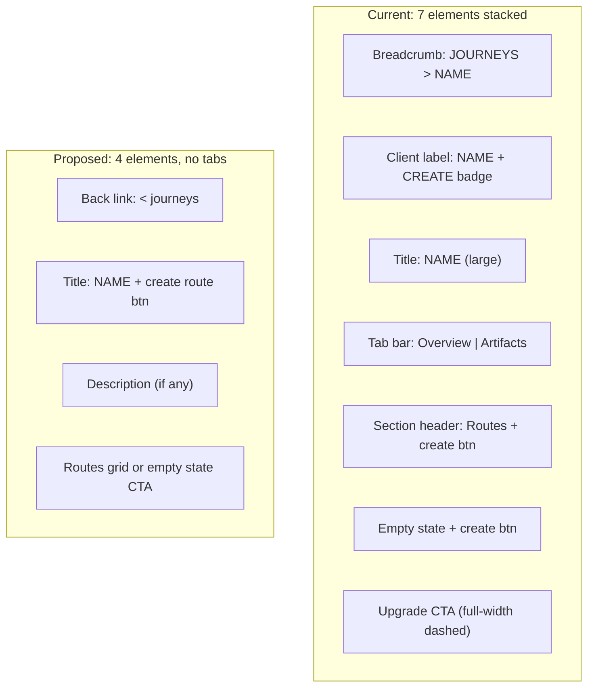

# Journey Detail Page — IA Audit and Cleanup

## Part 1: Information Architecture Audit

### Current hierarchy (internal model -> UI term)

```
WorkspaceProject -> Journey    (container for a creative project)
  Project        -> Route      (a workspace for generating images/videos)
    Session      -> Waypoint   (a generation session within a route)
      Output     -> Generation (individual image/video output)
```

### Problems found

**A. Redundant navigation layers**

The journey name appears **three times** in ~100px of vertical space:

1. Breadcrumb: `JOURNEYS > THOUGHTFORM HERALDING`
2. Client label: `THOUGHTFORM HERALDING` + `CREATE` badge
3. Title: `THOUGHTFORM HERALDING`

Meanwhile the top nav bar already has an active `JOURNEYS` link, making the breadcrumb doubly redundant.

**B. Tab split is false architecture for create-mode**

Create-mode journeys have two tabs: `Overview` and `Artifacts`. Both show the same thing: a routes grid. The "Artifacts" tab renders a simpler version of what Overview already shows. This creates the illusion of two distinct sections when there is really one.

**C. Duplicate create actions**

Three create-route triggers exist simultaneously:

1. `+ create route` button in the section header (always visible)
2. `+ CREATE FIRST ROUTE` button inside the empty state
3. `+ create route` button in the Artifacts tab header

**D. Inconsistent route card rendering**

Routes are rendered with two different components depending on which tab you are on:

- Overview tab: `RouteCard` from `components/journeys/RouteCard.tsx` (richer, with thumbnails)
- Artifacts tab: inline `.routeLink` cards in JourneyShell (simpler, different layout)

This means the same data looks different depending on which tab you click.

**E. "Artifacts" is an unclear term**

The Artifacts tab contains route workspaces, not "artifacts" in any conventional sense. The tab's own description says "Your generated images and videos are stored in route workspaces" — the content is workspaces, but the tab is called Artifacts. For learn-mode this makes more sense (generated outputs from exercises), but for create-mode it is confusing.

**F. Stale mode badge**

The `CREATE` / `LEARN` badge in the header repeats what the journey card on the overview page already shows. It served a purpose when the page was the first encounter with the journey type, but now that the cards display the category prominently, it is noise.

**G. Prominent admin-only CTA**

"Add curriculum to this journey" is a full-width dashed button at the bottom of the main view. It is admin-only but visually dominates the page for admins, while being invisible to regular users (creating an inconsistent experience between roles).

**H. No hierarchy explanation anywhere**

The terms Journey, Route, Waypoint, and Generation are never explained to users. There is no onboarding, tooltip, or help text that clarifies what these mean or how they nest. The only hint is `"Create a route to open the workspace. Then add image or video waypoints to start generating."` buried in ProjectsView.

---

## Part 2: Proposed Changes

### 1. Replace breadcrumb with compact back link

The top nav already has an active `JOURNEYS` link. Replace the full `HudBreadcrumb` with a small back-arrow: `< journeys`. This eliminates the first of three name repetitions.

**File:** [app/journeys/[id]/page.tsx](app/journeys/[id]/page.tsx) — remove `HudBreadcrumb` import/usage, add a compact `Link` to `/journeys`

### 2. Collapse header to single title with inline actions

Remove the `clientLabel` + `modeBadge` row. The page header becomes:

```
< journeys
THOUGHTFORM HERALDING         [+ create route]
Optional description text here
```

- Title is the single source of the journey name
- `+ create route` button sits inline next to the title (replaces the section-level button AND the Artifacts-tab button)
- For learn-mode with `profile.clientName`, show it as the subtitle, not as a separate label above

**Files:** [components/learning/JourneyShell.tsx](components/learning/JourneyShell.tsx) — restructure `.header`; [app/journeys/[id]/JourneyShell.module.css](app/journeys/[id]/JourneyShell.module.css) — remove `.clientLabel`, `.modeBadge` CSS

### 3. Remove tab bar for create-mode; single unified view

For create-mode journeys, eliminate the tab bar entirely. Render a single view:

- Description (if present)
- Routes section label with count
- Route grid (using `RouteCard`) or empty-state CTA
- Compact admin upgrade action at the bottom

The tab bar remains for learn-mode journeys where Overview, Curriculum, Resources, and Artifacts are genuinely distinct.

**File:** [components/learning/JourneyShell.tsx](components/learning/JourneyShell.tsx) — conditionally skip tabs for `!isLearn`; render merged content directly

### 4. Unify route card rendering

Replace the simpler `.routeLink` cards in `ArtifactsContent` with the same `RouteCard` component used in Overview. This means routes look identical regardless of which tab (or no-tab view) shows them.

**File:** [components/learning/JourneyShell.tsx](components/learning/JourneyShell.tsx) — in `ArtifactsContent`, use `RouteCard` instead of inline `.routeLink` elements

### 5. Tone down admin upgrade CTA

Replace the full-width dashed button with a compact inline element near the title area (visible only to admins). Pattern: small mono text with diamond marker, similar to how the `+` create button works elsewhere.

**File:** [components/learning/JourneyShell.tsx](components/learning/JourneyShell.tsx) — replace `.upgradeCta` block

### 6. Clean up stale CSS

Remove CSS classes that are no longer referenced after the above changes: `.clientLabel`, `.modeBadge`, `.modeBadgeLearn`, `.upgradeCta`, `.upgradeCtaDiamond`, `.upgradeCtaText`, and the duplicate `.routeLink` / `.routeLinkCorner` styles if fully replaced by `RouteCard`.

**File:** [app/journeys/[id]/JourneyShell.module.css](app/journeys/[id]/JourneyShell.module.css)

---

## Visual before/after




---

## Future IA considerations (not in this PR)

These are noted for awareness but out of scope for this cleanup:

- **Terminology glossary**: Consider adding a small contextual hint in empty states that explains the Journey > Route > Waypoint hierarchy
- **"Artifacts" tab rename**: For learn-mode, consider renaming to "Workspaces" or "Generated" to match what the tab actually contains
- **Legacy `/projects` routes**: The app still has parallel `/projects/[id]` pages that duplicate `/routes/[id]` — these should eventually be consolidated
- **Waypoint visibility**: "Waypoint" appears as counts (`3 waypoints`) but is never explained; consider whether users need this term at all or if "sessions" or just "generations" is clearer

---

## Files touched

- `app/journeys/[id]/page.tsx` — remove breadcrumb, add back link
- `components/learning/JourneyShell.tsx` — collapse header, remove duplicate buttons, merge tabs for create-mode, unify route cards, tone down upgrade CTA
- `app/journeys/[id]/JourneyShell.module.css` — remove stale CSS classes

