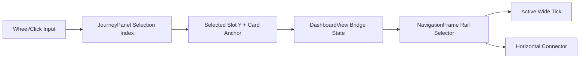

# Journey Rail Selector Redesign

## Objective

Replace the current full-list translate carousel with a **windowed 5-card selector** where:

- Wheel scroll moves selection one journey at a time.
- A **wider rail tick** moves/snaps to the selected card row.
- A **horizontal connector line** always extends from the left rail to the selected card.
- Clicking any visible card snaps selection and rail indicator to that card.

## Reference Pattern

Use Thoughtform’s connector behavior as interaction reference:

- `[c:/Users/buyss/Manifold Delta/Artifacts/01_thoughtform/app/astrogation/_components/SelectionConnector.tsx](c:/Users/buyss/Manifold Delta/Artifacts/01_thoughtform/app/astrogation/_components/SelectionConnector.tsx)`
- `[c:/Users/buyss/Manifold Delta/Artifacts/01_thoughtform/app/astrogation/page.tsx](c:/Users/buyss/Manifold Delta/Artifacts/01_thoughtform/app/astrogation/page.tsx)`

## Files to Change

- `[components/dashboard/JourneyPanel.tsx](components/dashboard/JourneyPanel.tsx)`
- `[components/dashboard/DashboardView.tsx](components/dashboard/DashboardView.tsx)`
- `[components/hud/NavigationFrame.tsx](components/hud/NavigationFrame.tsx)`
- `[app/globals.css](app/globals.css)`

## Implementation Plan

1. **Windowed Journey Rendering (5 visible cards)**
  - In `JourneyPanel`, replace rendering `journeys.map(...)` across the entire list with a computed window centered around current selection where possible.
  - Implement a deterministic window algorithm:
    - Total slots: 5
    - Middle anchor: selected card at slot 3 when list has enough headroom/tailroom
    - Clamp at start/end for boundary selections
  - Keep wheel behavior as discrete index stepping; update selected journey id as today.
2. **Stable Slot Geometry + Selection Position Reporting**
  - Define fixed slot centers for 5 rows inside `JourneyPanel` (derived from actual rendered card heights + gap, or measured row refs).
  - Expose selected slot Y (or normalized 0..1 progress) from `JourneyPanel` to parent (`DashboardView`) through a callback prop.
  - Ensure click selection updates both selected journey id and reported Y in one frame (snap behavior).
3. **Rail Selector Tick + Connector in Navigation Frame**
  - Extend `NavigationFrame` API with selector position input (pixel Y relative to rail, or normalized progress).
  - Render a new **active wide tick element** on left rail at the computed Y.
  - Render an always-visible horizontal connector path from rail X to the selected card anchor X/Y.
  - Keep existing static tick rhythm and labels as background; moving selector overlays above them.
4. **Coordinate JourneyPanel with NavigationFrame**
  - In `DashboardView`, bridge selection geometry from `JourneyPanel` to `NavigationFrame` state channel (prop/context/CSS var route, whichever is least invasive with current architecture).
  - Ensure updates happen on wheel, click, initial load, and journey list mutations (add/delete/rename).
5. **Visual and Motion Polish**
  - Add CSS for active wide tick + connector in `globals.css` with subtle Thoughtform-style transition timing.
  - Preserve existing typography/color tokens (`--gold`, `--dawn-`*) and HUD line weight.

## Verification Checklist

- Wheel input moves selection one item and snaps wide rail tick to matching row.
- Clicking a visible card snaps selection + rail tick + connector to that card.
- Exactly 5 cards are visible when journey count > 5.
- For long lists (e.g., 20 journeys), window shifts correctly while preserving smooth selection continuity.
- Connector remains visible and anchored to selected card at all times.
- No regressions in journey CRUD, card hover/action behavior, and mobile breakpoints.

## Data Flow (Target)

