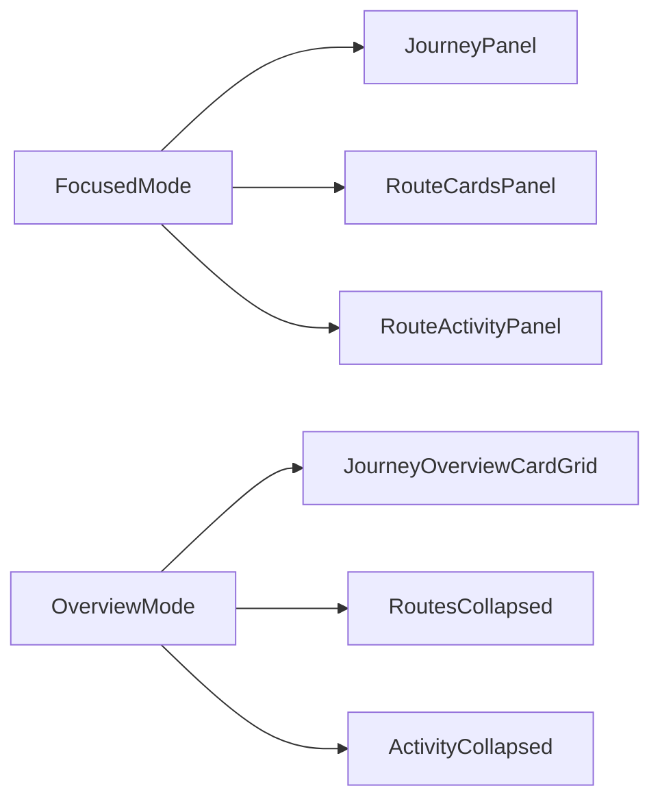

# Journeys Disclosure Toggle

## Goal

Keep `/journeys` feeling like one workspace surface. Clicking the overview affordance should no longer jump to the older standalone browse layout; it should simply collapse the `ROUTES` and `ACTIVITY` columns and reveal the full journeys browse cards inside the same shell.

## Current Seam

[components/dashboard/DashboardView.tsx](components/dashboard/DashboardView.tsx) already owns `viewMode`, but it currently swaps between two different page shapes:

```211:240:components/dashboard/DashboardView.tsx
const toggleBtn = (
  <button
    type="button"
    onClick={() => setViewMode((m) => (m === "focused" ? "overview" : "focused"))}
  >
    {viewMode === "focused" ? "all journeys" : "focused"}
  </button>
);

if (viewMode === "overview") {
  return (
    <section>
      <SectionHeader label="JOURNEYS" action={toggleBtn} />
      {/* old overview layout */}
```

The focused workspace is a separate 3-column grid:

```303:389:components/dashboard/DashboardView.tsx
<section
  className="dashboard-two-panel w-full animate-fade-in-up"
  style={{
    display: "grid",
    gridTemplateColumns: "360px 1fr 280px",
  }}
>
  <JourneyPanel action={toggleBtn} />
  <RouteCardsPanel ... />
  <div className="dashboard-activity-col">
    <RouteActivityPanel routeId={selectedRouteId} />
  </div>
</section>
```

`JourneyPanel` already gives us the right insertion point for a compact disclosure affordance:

```236:245:components/dashboard/JourneyPanel.tsx
<SectionHeader
  label="JOURNEYS"
  action={
    <div style={{ display: "flex", alignItems: "center", gap: "var(--space-sm)" }}>
      {externalAction}
      {isAdmin && (
```

## Implementation Direction

### 1. Replace the text button with a disclosure control

- Update [components/dashboard/DashboardView.tsx](components/dashboard/DashboardView.tsx) so the mode switch renders as a compact symbol-first control, not a bordered text button.
- Reuse the `SectionHeader` action slot already threaded through [components/dashboard/JourneyPanel.tsx](components/dashboard/JourneyPanel.tsx).
- Prefer one of these low-friction seams:
  - extend [components/ui/ParticleIcon.tsx](components/ui/ParticleIcon.tsx) with a chevron/disclosure glyph, or
  - reuse the existing arrow glyph with rotation if it reads cleanly in the HUD language.
- Add `aria-expanded` and a stable label like `Show all journeys` / `Collapse journeys overview`.

### 2. Keep one workspace shell for both modes

- Refactor [components/dashboard/DashboardView.tsx](components/dashboard/DashboardView.tsx) so it always returns the same outer `dashboard-two-panel` section.
- Remove the separate `if (viewMode === "overview") return <section ...>` page-shape swap.
- Focused and overview should become layout variants of the same workspace instead of two different top-level compositions.

### 3. Make overview mode a collapsed workspace state

- In overview mode:
  - hide or collapse [components/dashboard/RouteCardsPanel.tsx](components/dashboard/RouteCardsPanel.tsx)
  - hide or collapse [components/dashboard/RouteActivityPanel.tsx](components/dashboard/RouteActivityPanel.tsx)
  - expand the journeys browse content to occupy the reclaimed space
- Reuse the existing overview browse cards already built in [components/journeys/JourneyOverviewCard.tsx](components/journeys/JourneyOverviewCard.tsx) so the cards stay richer than the compact focused-state list.
- Keep the `JOURNEYS` header in the same vertical/horizontal position as focused mode.




### 4. Tune layout and state behavior

- Update [app/globals.css](app/globals.css) only as needed for the collapsed-overview layout and breakpoint behavior.
- Preserve existing `selectedJourneyId` and `selectedRouteId` state so collapsing into overview does not lose the focused selection when the user re-expands.
- Keep admin affordances intact: the create `+` should remain available in the `JOURNEYS` header even when the disclosure control is present.

## Files Most Likely To Change

- [components/dashboard/DashboardView.tsx](components/dashboard/DashboardView.tsx)
- [components/dashboard/JourneyPanel.tsx](components/dashboard/JourneyPanel.tsx)
- [components/journeys/JourneyOverviewCard.tsx](components/journeys/JourneyOverviewCard.tsx) if overview cards need minor layout adaptation inside the workspace shell
- [components/ui/ParticleIcon.tsx](components/ui/ParticleIcon.tsx) or a small new disclosure control primitive
- [app/globals.css](app/globals.css)

## Success Criteria

- The `JOURNEYS` overview affordance reads as a disclosure/toggle, not a page-switch button.
- `/journeys` keeps one visual shell in both states.
- Overview mode feels like the focused workspace with collapsed side panels, not a return to the older browse page.
- The full journeys cards are visible in overview mode, and focused mode restores the previous routes/activity columns without losing selection context.

