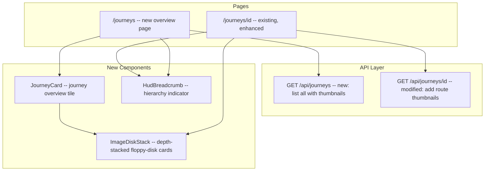

# Journeys Image Stack Redesign

## Architecture Overview




## 1. API Layer

### New: `GET /api/journeys` ([app/api/journeys/route.ts](app/api/journeys/route.ts))

List all accessible journeys with up to 6 recent output thumbnails per journey. Reuses the same access-control pattern from the [dashboard API](app/api/dashboard/route.ts) (lines 18-33 for workspace membership, lines 82-126 for journey queries). Add a nested Prisma include to pull the latest outputs:

```typescript
briefings: {
  select: {
    sessions: {
      select: {
        generations: {
          where: { outputs: { some: {} } },
          orderBy: { createdAt: "desc" },
          take: 2,
          select: {
            outputs: {
              orderBy: { createdAt: "desc" },
              take: 1,
              select: { id: true, fileUrl: true, fileType: true, width: true, height: true }
            }
          }
        }
      }
    }
  }
}
```

Flatten into a `thumbnails: { id, fileUrl, fileType, width, height }[]` array per journey (capped at 6).

### Modified: `GET /api/journeys/[id]` ([app/api/journeys/[id]/route.ts](app/api/journeys/%5Bid%5D/route.ts))

Extend the existing route query to include a `thumbnailUrl` per route (same pattern used in [/api/sessions](app/api/sessions/route.ts) -- latest generation's first output URL). Each route in the response gains a `thumbnailUrl: string | null` field.

## 2. ImageDiskStack Component

**Files:** `components/journeys/ImageDiskStack.tsx` + `ImageDiskStack.module.css`

The core visual component. A stack of image cards layered on the Z-axis, each styled as a chamfered "floppy disk" frame.

### Floppy-disk shape

Achieved through the existing Thoughtform chamfer pattern (used by the [SIGIL badge](components/hud/NavigationFrame.tsx) at line 348):

```css
clip-path: polygon(
  12px 0%, calc(100% - 12px) 0%,    /* top chamfers */
  100% 12px, 100% calc(100% - 12px), /* right chamfers */
  calc(100% - 12px) 100%, 12px 100%, /* bottom chamfers */
  0% calc(100% - 12px), 0% 12px      /* left chamfers */
);
```

The inner content area gets corner bracket marks (from [ForgeGenerationCard](components/generation/ForgeGenerationCard.module.css) `.energyFlow::after` pattern) and an image rendered with `object-fit: cover`.

### Depth stack effect

Adapted from [VideoIterationsStackHint](components/generation/VideoIterationsStackHint.tsx) (lines 26-50). Up to 3 layers behind the active card:

- Each layer offsets: `translateY(layerIndex * 6px) scale(1 - layerIndex * 0.03)`
- Decreasing opacity: `0.5 - layerIndex * 0.12`
- Gold glow on edges: `box-shadow: 0 (layerIndex*4)px (layerIndex*8)px rgba(202,165,84, opacity)`
- `backdrop-filter: blur(1px)` for depth separation
- `z-index: -layerIndex` for proper stacking

### Interaction

- Click the stack to advance to the next image (top card transitions out, next card promotes)
- CSS transition: 200ms ease for `transform`, `opacity`, `box-shadow`
- Small diamond position indicator below: `2/6` in mono 9px
- Arrow key navigation when focused

### Props

```typescript
type ImageDiskStackProps = {
  images: { id: string; fileUrl: string; fileType: string; width: number | null; height: number | null }[];
  aspectRatio?: string;  // default "3/4"
  size?: "sm" | "md";    // sm for journey overview, md for route detail
};
```

## 3. JourneyCard Component

**File:** `components/journeys/JourneyCard.tsx`

A card for the journeys overview page. Two-column layout:

- **Left**: Journey name (mono, uppercase), description, route count, generation count -- styled like existing [ProjectCard](components/projects/ProjectCard.tsx) metadata
- **Right**: `ImageDiskStack` showing the journey's recent thumbnails

Wraps in a link to `/journeys/[id]`. Corner brackets on hover (reuse ProjectCard pattern).

## 4. HudBreadcrumb Component

**File:** `components/ui/hud/HudBreadcrumb.tsx`

Subtle navigation hierarchy indicator. Style matches the existing back-link pattern on [JourneyDetailPage](app/journeys/%5Bid%5D/page.tsx) (lines 119-132):

- Font: `var(--font-mono)`, 10px, uppercase, `letter-spacing: 0.08em`
- Color: `var(--dawn-30)` for inactive segments, `var(--dawn-50)` for current
- Diamond separator (5px rotated square, `var(--dawn-15)`) between levels
- Each segment is a link except the current page

```
◇ journeys  ◇  journey name  ◇  route name
```

## 5. Page Updates

### New: `/journeys` page ([app/journeys/page.tsx](app/journeys/page.tsx))

- Fetches from `GET /api/journeys`
- Renders `HudBreadcrumb` with single segment: `journeys`
- Grid of `JourneyCard` components (responsive: 1 col mobile, 2 col xl)
- Loading/error/empty states matching existing patterns from [JourneyDetailPage](app/journeys/%5Bid%5D/page.tsx)
- Wrapped in `RequireAuth` + `NavigationFrame` (modeLabel: "journeys")

### Modified: `/journeys/[id]` page ([app/journeys/[id]/page.tsx](app/journeys/%5Bid%5D/page.tsx))

- Replace `ProjectCard` grid with enhanced route cards that include `ImageDiskStack` (using `thumbnailUrl` from the modified API)
- Add `HudBreadcrumb`: `journeys > {journey.name}`
- Add "create route" button in the `HudPanelHeader` actions area (styled as a HUD text-action button)
- Route cards become two-column: metadata left, image stack right

## Key Design Decisions

- **Chamfered corners** (clip-path polygon) instead of border-radius -- per Thoughtform design rules ("Radius: Always 0")
- **Gold glow** color: `rgba(202, 165, 84, ...)` matching `--gold` token
- **Depth stack** follows VideoIterationsStackHint's approach but applies to entire cards rather than edge layers
- **Aspect ratio** defaults to 3:4 (portrait, matching the existing ImageGallery)
- Corner brackets and energy flow reuse existing CSS patterns from ForgeGenerationCard

