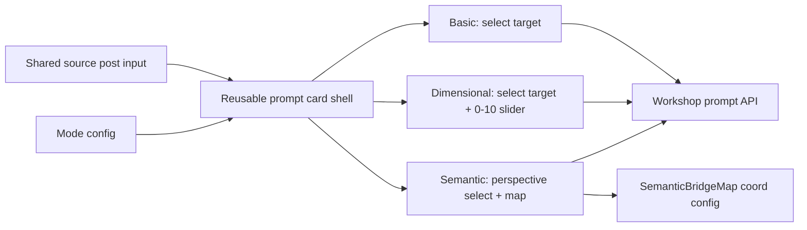

# Harmonize Navigate Prompt Cards

## Goal

Keep the current sticky morphing scene, but rebuild the prompt surface so the three modes share one reusable card shell, one shared single-line source-post input, aligned action rows, and proportionate responsive behavior.

## Current Constraints

`NavigateStory` currently hardcodes the prompt copy and mode branches inside one component:

```146:150:components/workshops/sections/NavigateStory.tsx
const promptText = promptMode === "semantic"
  ? `“Analyze ${clientName}’s brand strategy from the perspective of ${bridgePerspective}."`
  : promptMode === "dimensional"
    ? `“Rate this ${clientName} social post: cringe ${cringe}/10, formality ${formality}/10. Then rewrite it to match those values."`
    : `“Rewrite this ${clientName} social post for clarity and brevity."`;
```

`SemanticBridgeMap` also fixes its destination geometry instead of letting the selected perspective drive it:

```77:81:components/workshops/sections/SemanticBridgeMap.tsx
const leftPoint = { x: 22, y: 64 };
const rightPoint = { x: 80, y: 34 };
const midPoint = { x: 52, y: 50 };
```

## Approach

- Refactor [components/workshops/sections/NavigateStory.tsx](components/workshops/sections/NavigateStory.tsx) so the three prompt modes render through one shared prompt-playground shell.
- Add a shared single-line source-post input at the top of the active card and persist that value across all three modes.
- Replace the current hardcoded mode controls with config-driven variants:
  - `basic`: prompt sentence with one inline dropdown after `for`
  - `dimensional`: reuse that dropdown plus a `0–10` slider for the selected attribute
  - `semantic`: perspective dropdown plus semantic-map metadata for label and target coordinates
- Extract the reusable workshop prompt primitives into dedicated files under [components/workshops/sections/](components/workshops/sections/) and move their styling into a CSS module so spacing, wrapping, and proportion scaling are easier to maintain than the current large inline-style blocks.
- Update [components/workshops/sections/SemanticBridgeMap.tsx](components/workshops/sections/SemanticBridgeMap.tsx) to accept option-driven coordinates and labels from `NavigateStory`, so the selected semantic perspective changes both the copy and the visual destination point.
- Expand [app/api/workshops/prompt-playground/route.ts](app/api/workshops/prompt-playground/route.ts) so request validation and prompt construction support the new mode-specific parameters while preserving the current auth and Anthropic flow.

## Responsive Strategy

- Use fluid widths and spacing (`clamp`, `minmax`, wrapping control rows, max inline sizes) so the shared source input, select, slider, and `Navigate` button scale proportionally inside the sticky viewport.
- Keep the button inline at the right edge of the active control row for all three modes, with clean wrap/stack behavior at narrower widths.
- Avoid fixed multi-column layouts inside the active card unless they can collapse cleanly without overlapping the fixed workshop HUD.




## Files

- [components/workshops/sections/NavigateStory.tsx](components/workshops/sections/NavigateStory.tsx)
- [components/workshops/sections/SemanticBridgeMap.tsx](components/workshops/sections/SemanticBridgeMap.tsx)
- [app/api/workshops/prompt-playground/route.ts](app/api/workshops/prompt-playground/route.ts)
- New extracted prompt-playground component/style files under [components/workshops/sections/](components/workshops/sections/)

## Validation

- Verify the sticky scene still transitions cleanly between the three modes.
- Verify the shared source input drives generation in every mode.
- Verify the semantic dropdown changes both the prompt text and the map destination position/label.
- Verify the active control row and CTA remain aligned and wrap cleanly on smaller widths.
- If the prompt builder is extracted into a pure helper cleanly, add a small focused test around request-to-prompt mapping; otherwise cover this flow manually because no existing tests target it.

