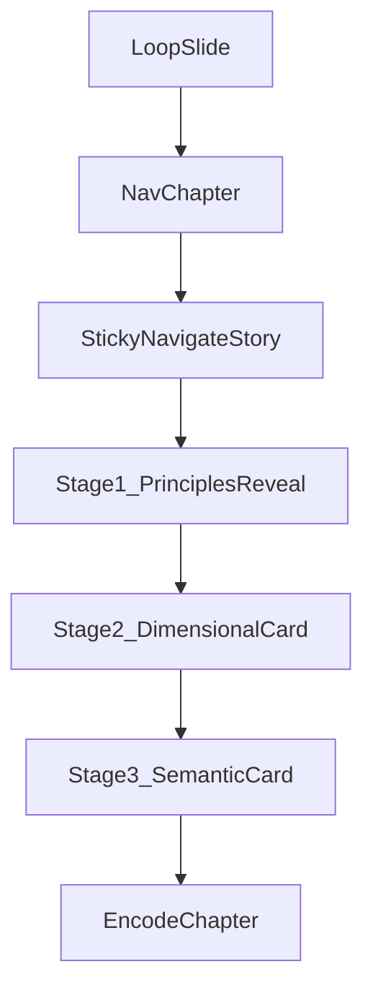

# Rebuild Navigate Story

## Scope

Replace the current three-part Navigate flow with one pinned narrative module that reveals the four principle cards first, then transitions into a 3-card prompt progression: normal prompt, dimensional prompting, and semantic navigation. Keep the chapter’s existing map language and workshop styling, but align the interaction model more closely with the stacked reveal patterns seen on [Poppins](https://www.wearepoppins.com/en).

## Files To Change

- [components/workshops/BrandedWorkshopPage.tsx](components/workshops/BrandedWorkshopPage.tsx)
Current ownership:
  - `nav-principles` uses `CardGrid` + `PCard`
  - `nav-dimensional` uses `DimensionalSlider`
  - `nav-semantic` uses `SemanticReveal`
  - `Lead`, `Slide`, `ChapterSlide`, `RolodexTOC` already control layout and chapter progression
- [components/workshops/sections/LoopTerrainMap.tsx](components/workshops/sections/LoopTerrainMap.tsx)
Current size cap is `MAX_W = 660`, `MAX_H = 420`
- [lib/workshops/templates/thoughtformWorkshop.ts](lib/workshops/templates/thoughtformWorkshop.ts)
Update default Navigate agenda from three content sections to one story section
- [scripts/seed-poppins.mjs](scripts/seed-poppins.mjs)
Keep seeded workshop structure aligned with the new agenda shape
- New workshop-specific prompt route, e.g. [app/api/workshops/prompt-playground/route.ts](app/api/workshops/prompt-playground/route.ts)
This should be stateless and Claude-backed, instead of reusing the persistent project brainstorm route

## UX Structure

Use a tall section plus a sticky inner viewport instead of true scroll-jacking. That preserves normal browser scroll behavior while giving the effect of “the page stays put and reveals cards.”

Within `StickyNavigateStory`:

- Stage 1: four principle cards reveal one-by-one while the sticky frame stays pinned
- Stage 2: a second, differently colored card rises in and introduces dimensional prompting with live sliders
- Stage 3: a third colored card rises in and introduces semantic prompting with a live bridge parameter input/dropdown
- After the last stage completes, the page resumes normal scroll into Encode

## Visual Direction

Apply the strongest Poppins card colors from the reference site as stage identities:

- Principles: mostly neutral / off-white card surfaces with selective accent states
- Dimensional: lime-driven stage inspired by the bright green Poppins panels
- Semantic: pink or yellow stage, chosen to contrast clearly with the dimensional card and read as a new prompting mode

Use those colors as stage containers and reveal surfaces, not as full-page floods. Keep the workshop’s cream background and map/grid field underneath so the story still feels like Thoughtform x Poppins rather than a copy of the marketing site.

## Interaction Design

### Loop Key Visual

- Increase the loop scene footprint by raising `MAX_W`/`MAX_H` and rebalancing the orthographic framing in [components/workshops/sections/LoopTerrainMap.tsx](components/workshops/sections/LoopTerrainMap.tsx)
- Keep the map centered and readable; this remains the key visual for the workshop’s conceptual loop

### Principles Stage

- Replace the simultaneous `CardGrid` reveal with progressive staged visibility
- Use sticky scroll progress to reveal cards in sequence: `Context > Templates`, `Clear > Vague`, `Iterate > Perfect`, `Partner > Tool`
- Once a card is revealed, it stays visible while the next one enters
- Map each card to a Poppins-inspired accent treatment drawn from the reference palette

### Prompt Progression Stage

Replace the current disjoint `Exercise` / `DimensionalSlider` / `SemanticReveal` flow with a single narrative stack:

- Card 1: simple prompt card showing the baseline “rewrite this post for clarity/brevity” behavior
- Card 2: dimensional card with live sliders such as `cringe` and `formality`; output updates in place
- Card 3: semantic card with a user-controlled bridge parameter (dropdown or editable input) such as `werewolf`, allowing the user to change the perspective and regenerate the output

## Claude Integration

Use a new dedicated stateless route instead of the project brainstorm route.

Recommended basis:

- Reuse patterns from [app/api/prompts/enhance/route.ts](app/api/prompts/enhance/route.ts) for authenticated, non-persistent Anthropic calls
- Do not repurpose [app/api/projects/[id]/brainstorm/messages/route.ts](app/api/projects/[id]/brainstorm/messages/route.ts), which is tied to project chat persistence and access control

Planned API shape:

- Request: source post text, stage type (`basic`, `dimensional`, `semantic`), dimensional values, semantic bridge term, and optional client/brand context
- Response: generated workshop-ready prompt text plus Claude output for the active stage
- Model/env: start from `ANTHROPIC_API_KEY` and existing Anthropic model envs in [lib/env.ts](lib/env.ts); add a workshop-specific model env only if needed

## Frontend Safeguards

- Debounce slider/input-triggered Claude calls so the UI feels live without spamming requests
- Keep optimistic local preview state while Claude responds
- Use request IDs or abort controllers so stale responses do not overwrite newer slider/parameter changes
- Add graceful fallback copy if Anthropic is unavailable
- Respect reduced motion for reveal animations

## Content / Data Updates

- Collapse the Navigate agenda in [lib/workshops/templates/thoughtformWorkshop.ts](lib/workshops/templates/thoughtformWorkshop.ts) from `nav-principles` + `nav-dimensional` + `nav-semantic` into one story section, so the TOC and active-section logic stay coherent
- Mirror the same change in [scripts/seed-poppins.mjs](scripts/seed-poppins.mjs)

## Validation

- Verify sticky reveal behavior on desktop widths where the current cards sit in one row
- Verify the Rolodex TOC still highlights the Navigate story correctly
- Verify Claude calls remain scoped to the workshop playground and do not depend on project chat state
- Check that stage colors, motion, and alignment still feel consistent with both Poppins references and the Thoughtform workshop frame

