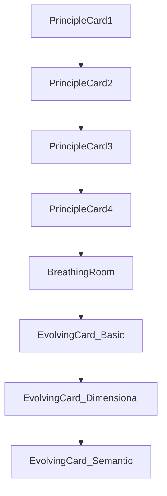

# Refine Navigate Story

## Goal

Keep the current simplified direction, but make it breathe more and feel more intentional:

- the evolving prompt card should enter later, after the four principle cards have had their own moment
- Claude generation should be fully manual
- the semantic bridge should become a richer isometric-style map inside the semantic card, with two disconnected points that only connect when the CTA is pressed

## Current Issues

The current story still starts the evolving prompt section too early, auto-generates in dimensional and semantic modes, and treats the semantic bridge as a generic active/inactive SVG rather than a staged connection.

```128:144:components/workshops/sections/NavigateStory.tsx
const handleGenerate = useCallback(() => {
  if (promptMode === "basic") callClaude("basic");
  else if (promptMode === "dimensional") callClaude("dimensional", { dimensions: { cringe, formality } });
  else callClaude("semantic", { bridgePerspective });
}, [promptMode, callClaude, cringe, formality, bridgePerspective]);

useEffect(() => {
  if (promptMode === "dimensional" && stage >= 5) {
    callClaude("dimensional", { dimensions: { cringe, formality } });
  }
}, [cringe, formality, stage, promptMode, callClaude]);

useEffect(() => {
  if (promptMode === "semantic" && stage >= 6) {
    callClaude("semantic", { bridgePerspective });
  }
}, [bridgePerspective, stage, promptMode, callClaude]);
```

```24:40:components/workshops/sections/SemanticBridgeMap.tsx
useEffect(() => {
  if (!active) {
    if (animRef.current) cancelAnimationFrame(animRef.current);
    return;
  }
  function tick() {
    tRef.current += 0.004;
    const path = pathRef.current;
    if (path) {
      const offset = tRef.current * 40;
      path.style.strokeDashoffset = `${-offset}`;
    }
    animRef.current = requestAnimationFrame(tick);
  }
  animRef.current = requestAnimationFrame(tick);
  return () => { if (animRef.current) cancelAnimationFrame(animRef.current); };
}, [active]);
```

## Files To Change

- [components/workshops/sections/NavigateStory.tsx](components/workshops/sections/NavigateStory.tsx)
  - push the evolving card further down in the stage timeline
  - remove automatic dimensional/semantic generation effects
  - add a right-aligned shared CTA in the controls row
  - make the CTA both animate the semantic connection and call Claude
- [components/workshops/sections/SemanticBridgeMap.tsx](components/workshops/sections/SemanticBridgeMap.tsx)
  - replace the current simple line-and-dots treatment with a more isometric map composition
  - separate `visible in semantic mode` from `route connected` state
- [components/workshops/sections/LoopTerrainMap.tsx](components/workshops/sections/LoopTerrainMap.tsx)
  - use as the aesthetic reference for the semantic card map language, not for direct 3D reuse
- [components/workshops/sections/WaypointTopography.tsx](components/workshops/sections/WaypointTopography.tsx)
  - reuse contour/route/waypoint ideas if helpful for the in-card semantic map
- [app/api/workshops/prompt-playground/route.ts](app/api/workshops/prompt-playground/route.ts)
  - keep the stateless Claude route, but only invoke it from explicit button clicks
- [components/workshops/BrandedWorkshopPage.tsx](components/workshops/BrandedWorkshopPage.tsx)
  - only minor spacing adjustments if the later reveal needs more vertical room in the section shell

## Revised Stage Structure

Keep the principle reveal intact, but delay the prompt card so it appears only once the principle stage has effectively finished.




Implementation intent:

- stages `0-3`: reveal the four principle cards one-by-one
- stage `4`: leave visual breathing room so the principles have time to stand alone
- stage `5`: reveal the evolving card in base mode
- stage `6`: same card expands to dimensional mode
- stage `7`: same card becomes semantic mode

## Evolving Card Changes

### Base mode

- keep the larger prompt text
- no semantic or dimensional controls yet
- CTA appears only when the card is active

### Dimensional mode

- reveal sliders inside the same card
- place the CTA on the same horizontal control row, aligned right of the sliders/readouts
- clicking the CTA is the only way to generate/update Claude output
- slider moves should only update local UI state, not fire requests

### Semantic mode

- replace the slider emphasis with the perspective selector row
- keep the CTA styled consistently with the dimensional row, aligned right of the selector
- clicking the CTA should:
  1. animate the semantic route from disconnected dots to a connected path
  2. trigger the Claude request
  3. fade in/update the output beneath the map

## Semantic Map Redesign

The current `SemanticBridgeMap` should become an in-card isometric-style composition inspired by the loop terrain visual.

Target behavior:

- render two waypoint anchors only at first: `Poppins Brand Strategy` on the left and the selected perspective (for example `Pack of Wolves`) on the right
- no connected route before interaction
- on CTA click, animate the route drawing between the two points
- keep the map above the output block, inside the semantic card
- use topographic contours, grid perspective, and waypoint markers so it feels like the same Thoughtform/Poppins navigation system as the loop visual

Recommended implementation shape:

- `SemanticBridgeMap` receives `showRoute` or `connectionState` instead of a single `active` boolean
- use a small SVG isometric grid plus contour halos and a route path, rather than the current flat 2D bridge
- animate the route reveal via dashoffset, path length, or opacity progression after the button press

## Interaction / Token Discipline

Claude generation should be fully explicit:

- remove both auto-generation `useEffect` hooks in `NavigateStory`
- preserve debounce/abort protection inside `callClaude`, but only call it from the shared CTA
- reset or invalidate displayed output when the user changes sliders or perspective, so the UI makes it clear the visible output is stale until they click again

## Validation

- verify the evolving card does not appear until after the principle sequence has had its own clear beat
- verify the dimensional and semantic states no longer auto-generate on control changes
- verify the CTA placement feels balanced and consistently styled in both dimensional and semantic rows
- verify semantic mode shows two disconnected map points before click, then animates the connection on click
- verify the semantic map now feels visually related to the loop terrain rather than like a placeholder diagram
- verify the output sits below the semantic map and updates only after the CTA fires

