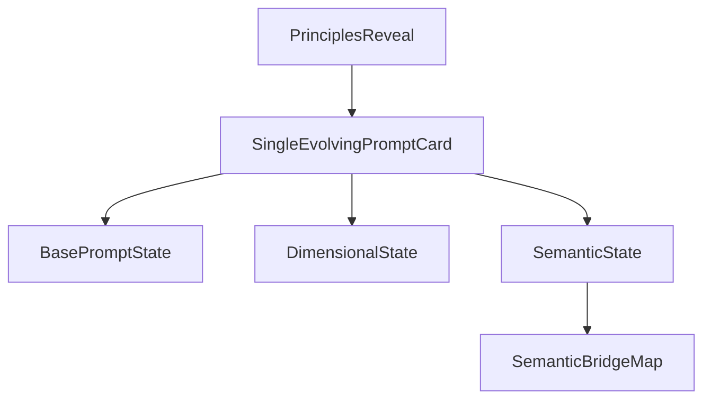

# Simplify Navigate Story

## Goal

Reduce the cognitive load in the current Navigate implementation by preserving the four principle-card reveal, but replacing the three stacked prompt cards with one persistent prompt card that evolves as the user scrolls. Add a local animated bridge/map illustration beneath that card to visualize the semantic interpolation between the source post and the selected perspective.

## Current Problem

The current `NavigateStory` renders the prompt progression as three separate stacked cards gated by `stage >= 4`, `stage >= 5`, and `stage >= 6`, which makes the section feel dense and visually top-heavy once the lower stages unlock.

```253:325:c:\Users\buyss\Manifold Delta\Artifacts\05_sigil.thoughtform\components\workshops\sections\NavigateStory.tsx
{/* Prompt progression stack */}
<div style={{ marginTop: 40, display: "flex", flexDirection: "column", gap: 16 }}>
  {stage >= 4 && (/* basic card */)}
  {stage >= 5 && (/* dimensional card */)}
  {stage >= 6 && (/* semantic card */)}
</div>
```

The Claude route already supports the three interaction modes we need, so the redesign should reuse that backend rather than changing the overall data flow.

```24:67:c:\Users\buyss\Manifold Delta\Artifacts\05_sigil.thoughtform\app\api\workshops\prompt-playground\route.ts
function buildSystemPrompt(stage: string, clientName?: string): string {
  if (stage === "basic") { /* ... */ }
  if (stage === "dimensional") { /* ... */ }
  return `You are a writing assistant demonstrating semantic navigation...`;
}
```

## Files To Change

- [components/workshops/sections/NavigateStory.tsx](components/workshops/sections/NavigateStory.tsx)
Refactor the prompt progression from three stacked cards into one evolving card shell with staged content areas.
- New local illustration component, e.g. [components/workshops/sections/SemanticBridgeMap.tsx](components/workshops/sections/SemanticBridgeMap.tsx)
Use the existing topographic/route language to show two coordinates and the bridge between them.
- [components/workshops/sections/WaypointTopography.tsx](components/workshops/sections/WaypointTopography.tsx)
Reuse or lightly extend its route/waypoint primitives if the bridge visualization benefits from shared geometry.
- [components/workshops/BrandedWorkshopPage.tsx](components/workshops/BrandedWorkshopPage.tsx)
Only minor adjustments if the simplified story needs different spacing or section height behavior.
- [app/api/workshops/prompt-playground/route.ts](app/api/workshops/prompt-playground/route.ts)
Keep the stateless Claude route, but tune copy/prompt framing so the textual output matches the new single-card interaction.

## New UX Structure

Keep the first half of the section as-is in spirit:

- Principle cards still reveal one-by-one
- Each principle card still adopts a Poppins-inspired frame color identity from [Poppins](https://www.wearepoppins.com/en)

Then replace the lower stacked-card block with one evolving card:

- Stage A: Base prompt only, set in larger type
- Stage B: Same card expands to reveal dimensional sliders and the prompt copy mutates from a simple rewrite ask to a 0-10 dimensional ask
- Stage C: Same card evolves again so the sliders either collapse into a secondary role or yield emphasis to a semantic perspective control; the prompt copy updates to the incompatible-context bridge framing
- Below the card: an animated bridge/map illustration visualizes “source social post” on one side and “wolf / selected perspective” on the other, with a route/interpolation path between them




## Card Interaction Design

### Base state

Use one bold prompt surface with larger text, minimal chrome, and no extra explanatory panel. The emphasis is: “this is the ordinary prompt most people would write.”

### Dimensional state

As scroll progresses:

- Add the slider controls into the same card, not as a new card underneath
- Rewrite the visible prompt text so it reads like a dimensional rating/manipulation prompt instead of a rewrite request
- Keep the Claude output area in the same position so the card feels like one instrument changing mode, not a new module appearing

### Semantic state

As scroll progresses again:

- Keep the same prompt card shell
- Replace or subordinate the dimensional controls with a perspective selector
- Update the visible prompt text to the semantic-bridge form
- Keep the selected perspective user-editable through a dropdown/input, but frame it as a single parameter of the same instrument

## Bridge Illustration

Implement the first pass as a local animation, not Claude-driven visualization.

Recommended approach:

- Left anchor: `Source Post`
- Right anchor: selected perspective, e.g. `Werewolf`
- Center route: animated dashed/contour path that visually “bridges” the two poles
- Use the repo’s existing map language rather than a literal diagram: route lines, contour halos, waypoints, interpolation motion
- Tie the right-side label and route emphasis to the current semantic parameter value

This should sit below the evolving prompt card so the card remains the main focus and the bridge map reads as reinforcement, not a competing primary surface.

## Claude Integration

Keep the existing route and request model, but simplify the frontend usage:

- `basic` stays tied to the initial plain-language prompt
- `dimensional` stays tied to slider values
- `semantic` stays tied to the selected bridge perspective

Backend changes should be limited to prompt wording and response shaping only if needed for better workshop output quality. No persistence, no project-chat reuse, and no change to the overall stateless call pattern.

## Validation

- Verify the first four principle cards still reveal sequentially and remain legible
- Verify only one prompt card is visible at a time, with progressive disclosure inside that card
- Verify Claude output updates in-place rather than creating new output regions per stage
- Verify the bridge illustration reads clearly as “two coordinates being connected” and does not overwhelm the prompt card
- Verify the overall scroll experience feels less dense than the current stacked-card version while preserving the Navigate chapter’s pacing

