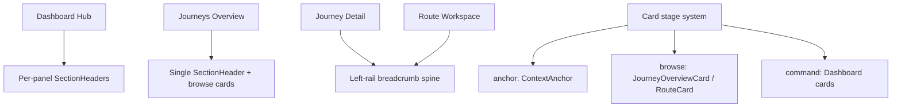

# Navigation IA Simplification

## Simple Solution

Stop trying to make every page use the same layout. Instead, make every page use the same **hierarchy grammar**:

- **Hub / command surfaces** keep separated panel headers.
- **Overview / browse surfaces** use richer browse cards plus one page-level section label.
- **Detail / workspace surfaces** use a left-rail breadcrumb spine where each segment is a **name**, with the **category shown as a tiny bearing** on that segment.

This avoids the redundancy trap of `JOURNEYS > Thoughtform Arcs > ROUTES > Vulpia` while still showing both category and specific context.

## Key Findings

- The app currently mixes category-only labels, name-only spine anchors, and route-workspace-specific context cards.
- `Journey Detail` is the main broken middle layer: it is deeper than the overview, but it currently shows less breadcrumb clarity than the route workspace.
- `Dashboard` is not actually a deeper step in the same path; it is a parallel command surface and should keep its per-panel labels.
- The site also has real IA drift in top-level navigation and terminology: `project` vs `route`, plus a visible `bookmarks` nav link without a page.

```353:393:components/hud/NavigationFrame.tsx
const breadcrumb = useMemo((): { backHref: string | null; segments: BreadcrumbSegment[] } | null => {
  if (parts[0] === "routes" && parts.length >= 3) {
    const segments: BreadcrumbSegment[] = [];
    if (journeyName) {
      segments.push({
        label: journeyName,
        href: journeyId ? `/journeys/${journeyId}` : undefined,
      });
    }
    segments.push({ label: mode });
    return { backHref, segments };
  }

  if (parts[0] === "journeys" && parts.length >= 2) {
    return {
      backHref: "/journeys",
      segments: [{ label: "journeys", href: "/journeys" }],
    };
  }
```

```115:119:components/learning/JourneyShell.tsx
<div className={styles.header}>
  <div style={{ display: "flex", alignItems: "center", justifyContent: "space-between", gap: "var(--space-md)" }}>
    <h1 className={styles.journeyTitle}>{journeyName || profile?.name}</h1>
```

## Recommended Model




## Immediate Implementation Direction

- Keep **Dashboard** as-is conceptually: `JOURNEYS`, `ROUTES`, `ACTIVITY` remain separate per-column headers because each panel owns its own create/action affordance.
- Keep **Journeys Overview** as a browse page: one `JOURNEYS` page label, richer browse cards, no dashboard-style drill-down column.
- Fix **Journey Detail** to use the same left-rail breadcrumb spine grammar as route pages.
- Enhance **Route Workspace** so its spine explicitly shows both category and name without adding duplicate segments.

## Breadcrumb Rule

For deep pages, every visible segment should be:

- **Bearing**: `JOURNEY`, `ROUTE`, `LESSON` (small, dawn-30, mono)
- **Name**: `Thoughtform Arcs`, `Vulpia`, etc. (main clickable/readable text)

That yields:

- `JOURNEY` + `THOUGHTFORM ARCS`
- `ROUTE` + `VULPIA`

instead of repeating category and name as separate sibling crumbs.

## Scope of Change

### Phase 1

- Extend [components/ui/ContextAnchor.tsx](components/ui/ContextAnchor.tsx) so spine mode supports bearing labels, not just inline mode.
- Update [components/hud/NavigationFrame.tsx](components/hud/NavigationFrame.tsx) breadcrumb builder to emit richer segment metadata.
- Pass `journeyName` / `journeyId` into [app/journeys/[id]/page.tsx](app/journeys/[id]/page.tsx) so journey detail can show `JOURNEY + journey name` in the spine.

### Phase 2

- Audit top-nav truthfulness in [components/hud/NavigationFrame.tsx](components/hud/NavigationFrame.tsx): decide whether `dashboard` should be explicit in nav, and whether `bookmarks` remains visible before its page exists.
- Normalize outward-facing terminology so `Route` is the user-facing noun everywhere, leaving `project` internal-only until a deeper refactor.

### Phase 3

- Formalize the card-stage ladder and remove ambiguous overlap between `JourneyCardCompact`, `JourneyOverviewCard`, dashboard cards, and legacy `ProjectCard`/`JourneyCard` usage.

## Success Criteria

- A new user can tell where they are from one glance at the left rail on deep pages.
- Category and name are both visible, but never duplicated as separate breadcrumb siblings.
- Dashboard remains a command surface, not a faux breadcrumb page.
- Journey detail stops being the weakest middle step in the hierarchy.
- Card density progresses by task: `anchor` -> `browse` -> `command`, instead of changing arbitrarily.

