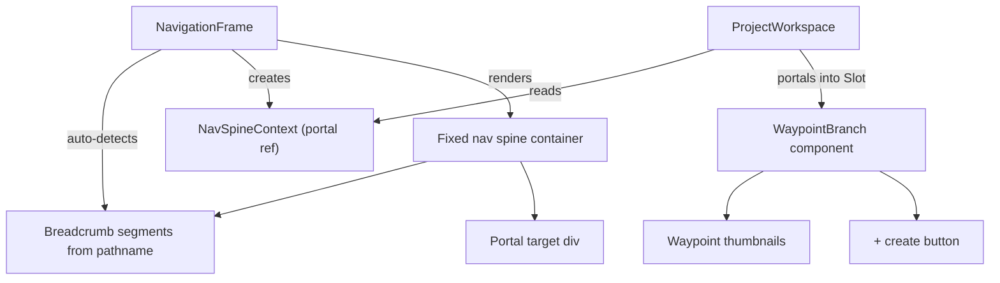

# Navigation Spine Tree System

## Concept

The left rail becomes a **navigation spine** -- a vertical tree that encodes your exact position in the hierarchy and, at workspace depth, your available waypoints. This mirrors how military HUD target stacks work: the topmost node is the broadest context, each level down is more specific, and the active target (waypoint) is highlighted.

Two orthogonal axes of navigation emerge:

- **Nav bar (horizontal)** -- lateral movement between areas: journeys, analytics, bookmarks, docs
- **Nav spine (vertical)** -- depth movement through the hierarchy: route > mode > waypoints

They never compete. The nav bar tells you *which area*; the spine tells you *how deep* and *what you're targeting*.

## Tree Structure by Page

```
Dashboard, Journeys list, Analytics, etc.     (no spine -- top-level)

/journeys/[id]                                 JOURNEYS

/journeys/[id]/lessons/[lid]                   JOURNEY NAME
                                                └ LESSON TITLE

/routes/[id]/image                             ROUTE
                                                └ IMAGE
                                                   ├ [waypoint thumb]  ← active
                                                   ├ [waypoint thumb]
                                                   └ [+]

/routes/[id]/video                             ROUTE
                                                └ VIDEO
                                                   ├ [waypoint thumb]
                                                   └ [+]
```

At workspace depth the tree absorbs the current ForgeSidebar -- waypoint thumbnails become tree children of the mode node, connected by the same 1px L-connectors. The `+` button sits at the bottom as the final leaf.

## Architecture




**Key pieces:**

1. `**NavSpineContext`** -- created by `NavigationFrame`, exposes a ref to the portal target `<div>` that sits directly below the auto-detected breadcrumb segments.
2. `**WaypointBranch`** -- a new lightweight component rendered by `ProjectWorkspace` that portals waypoint thumbnails into the spine. It replaces `ForgeSidebar` for image/video modes. Receives the same props (sessions, active, onSelect, onCreate, onDelete, thumbnails).
3. **Lesson page** -- drops its separate `HudBreadcrumb` and lets NavigationFrame's built-in tree handle it (already works via auto-detection, just needs the lesson segments updated to include the actual lesson title).

## Visual Design

### Tree connectors

All connectors are 1px `var(--dawn-15)` sharp right-angle lines (no radius). Mid-children use `├` (vertical line continues), last child uses `└` (vertical line ends).

### Waypoint thumbnails in-tree

- Size: **48x48** (down from 64x64) -- they are tree leaves, not primary nav
- Active waypoint: `1px solid var(--gold)` border
- Inactive: `1px solid var(--dawn-08)` border, `var(--dawn-15)` on hover
- Delete overlay on hover (same as current, scaled to 48px)
- Session name tooltip on hover (same pattern)

### Create button

- 48x40 rectangle at the bottom of the list
- `+` icon in `var(--dawn-50)`, `var(--gold)` on hover
- `1px dashed var(--dawn-15)` border, solid `var(--gold)` on hover

### Scroll

- `max-height` capped at ~50vh for the waypoint region
- 2px thin scrollbar (same as current sidebar)
- Tree connectors above the scroll region stay fixed

### Indentation per level

- Level 0 (root): 0px indent
- Level 1 (mode): 12px indent with L-connector
- Level 2 (waypoints): 24px indent with L-connector from mode node

## Files to Change

### New files

- `[context/NavSpineContext.tsx](context/NavSpineContext.tsx)` -- context + provider + `useNavSpine()` hook
- `[components/hud/WaypointBranch.tsx](components/hud/WaypointBranch.tsx)` -- portals waypoint list into spine

### Modified files

- `[components/hud/NavigationFrame.tsx](components/hud/NavigationFrame.tsx)` -- wrap breadcrumb in a container, expose portal target via context, render `NavSpineProvider`
- `[components/generation/ProjectWorkspace.tsx](components/generation/ProjectWorkspace.tsx)` -- replace `ForgeSidebar` with `WaypointBranch` for image/video modes
- `[app/journeys/[id]/lessons/[lessonId]/page.tsx](app/journeys/[id]/lessons/[lessonId]/page.tsx)` -- remove separate `HudBreadcrumb`, let NavigationFrame tree handle it (pass lesson title via context or prop)

### Potentially removed

- `[components/generation/ForgeSidebar.tsx](components/generation/ForgeSidebar.tsx)` + its CSS module -- fully replaced by `WaypointBranch`. (Keep if canvas mode still needs it; canvas has its own `CanvasSidebar`.)

## Scope Constraints

- **No changes to the top nav bar** -- it stays horizontal, handles lateral navigation
- **No tree on top-level pages** -- dashboard, journeys list, analytics remain clean
- **Canvas mode** -- already uses `CanvasSidebar`, leave untouched for now
- **Mobile** -- current sidebar has a `@media (max-width: 980px)` breakpoint that collapses it; the new spine should collapse similarly (hide tree, show a hamburger or minimal indicator)

