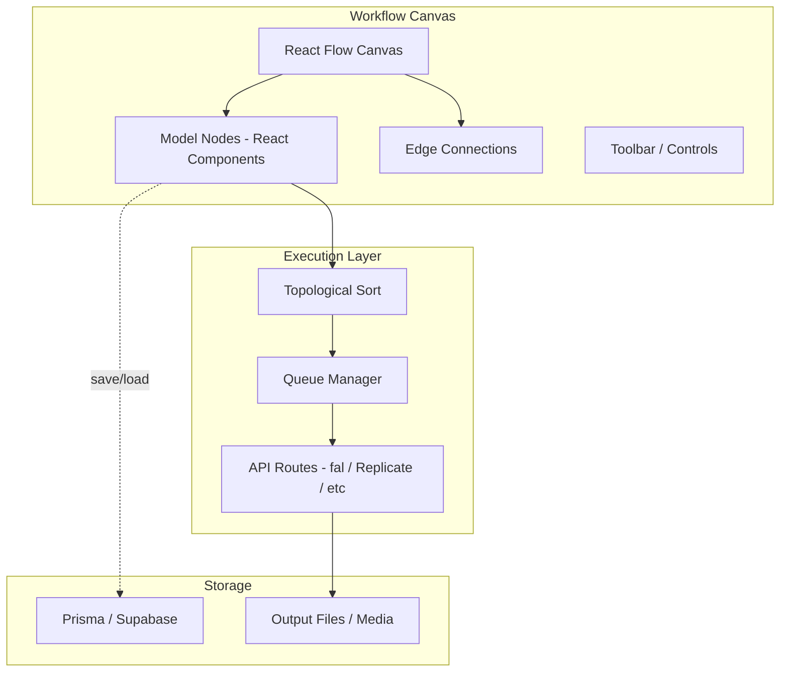

# Node-Based Canvas Workflow: Library Research

Your current stack is **Next.js 16 / React 19 / Tailwind 4 / TypeScript / Prisma + Supabase**. Below are the four serious contenders, ranked by fit.

---

## Tier 1 -- Strong Recommendations

### 1. React Flow (`@xyflow/react`) -- Best UI/DX, Largest Ecosystem

- **GitHub:** 35k+ stars, 4.4M weekly npm installs, MIT license
- **Rendering:** DOM-based (React components as nodes), with built-in virtualization
- **Key strengths:**
  - Nodes are just React components -- you can put previews, sliders, dropdowns, video players, anything inside them
  - First-class dark mode, CSS variable theming (pairs perfectly with Tailwind)
  - v12 added `useHandleConnections` and `useNodesData` hooks for reactive dataflow between nodes
  - SSR support (Next.js friendly), server-side image export
  - Plugins: Minimap, Controls, Background grid, NodeToolbar, NodeResizer
  - Has an official **AI Workflow Editor** template built on Next.js + shadcn/ui + Tailwind + Zustand
  - Used by Stripe, Typeform, and many AI tools
- **Execution engine:** None built-in -- you write your own graph traversal / topological sort to execute the workflow. This is actually a *positive* for your case since you need to call external APIs (fal, Replicate, etc.) with custom orchestration logic.
- **Performance:** Handles ~200-300 nodes comfortably with virtualization. Above 500+ nodes, DOM overhead becomes noticeable. For AI workflows (typically 5-50 nodes), this is more than sufficient.
- **Tradeoff:** You own the execution layer, but you already have API infrastructure for model calls in Sigil.

### 2. Rete.js v2 -- Best Built-in Execution Engine

- **GitHub:** 12k stars, framework-agnostic, MIT license
- **Rendering:** Pluggable -- can use React, Vue, Angular, Svelte, or Lit as the renderer
- **Key strengths:**
  - **Built-in dataflow engine** -- nodes declare inputs/outputs, engine handles topological execution automatically
  - **Control flow engine** -- for sequential/branching logic (if/else, loops)
  - **Hybrid engine** -- combine dataflow + control flow in one graph
  - LOD (Level of Detail) rendering for performance with large graphs
  - Plugin system: context menus, undo/redo history, auto-arrange, minimap, scopes/modules
  - Built-in code generation from graphs
- **Performance:** GPU-accelerated LOD rendering, dedicated performance docs. Handles large graphs better than React Flow at scale.
- **Tradeoff:** Steeper learning curve. The React renderer plugin adds a layer of abstraction between you and your components. Less community content / fewer examples than React Flow. Styling integration with Tailwind requires more manual work.

---

## Tier 2 -- Viable Alternatives

### 3. ComfyUI LiteGraph (`@comfyorg/litegraph`)

- **GitHub:** 8k stars (original), actively maintained fork by Comfy-Org
- **Rendering:** HTML5 Canvas2D -- not DOM-based, not React-based
- **Key strengths:**
  - Extremely performant for massive graphs (1000+ nodes) since it's raw Canvas rendering
  - Battle-tested by the entire ComfyUI community for AI image/video generation workflows
  - Lightweight, no framework dependency
- **Tradeoff:** Not React-native. You'd need to wrap it in a React component and bridge all interactions manually. No Tailwind/CSS styling of nodes -- everything is drawn via Canvas API. ComfyUI is actually *migrating away* from LiteGraph toward a Vue-based system (Nodes 2.0) because Canvas-based UIs are hard to extend with rich UI elements. Poor DX for custom node content.

### 4. NodeFlow (`nodeflowjs`)

- **Newer library, TypeScript-first, framework-agnostic
- 60fps target, React/Vue/Angular adapters
- **Tradeoff:** Much smaller community, less battle-tested, Pro license needed for advanced layout features. Too early for production bets.

---

## Recommendation Matrix

| Factor                   | React Flow   | Rete.js     | LiteGraph        | NodeFlow |
| ------------------------ | ------------ | ----------- | ---------------- | -------- |
| React 19 compat          | Native       | Plugin      | Wrapper needed   | Adapter  |
| Tailwind/CSS styling     | Excellent    | Manual      | None (Canvas)    | Manual   |
| Execution engine         | DIY          | Built-in    | DIY              | DIY      |
| Performance (50 nodes)   | Excellent    | Excellent   | Overkill         | Good     |
| Performance (500+ nodes) | Acceptable   | Good        | Excellent        | Unknown  |
| Community / ecosystem    | Largest      | Medium      | Medium (ComfyUI) | Small    |
| Custom node richness     | Best (React) | Good        | Limited (Canvas) | Good     |
| Next.js SSR support      | Yes (v12)    | No          | No               | No       |
| Learning curve           | Low          | Medium-High | Medium           | Low      |
| License                  | MIT          | MIT         | MIT              | Mixed    |

---

## My Recommendation: React Flow (`@xyflow/react`)

For Sigil, **React Flow is the strongest choice** because:

1. **Nodes as React components** -- you can embed image previews, video players, model parameter controls, progress bars, all styled with Tailwind. This is critical for a creative AI tool where visual feedback matters.
2. **You already own the execution layer** -- Sigil already has API routes for calling fal/Replicate/etc. A simple topological sort over the graph to resolve dependencies and execute nodes in order is straightforward to build.
3. **Next.js native** -- SSR support, no hydration issues, works with your existing app router setup.
4. **Official AI Workflow Editor template** -- xyflow literally ships a Next.js + shadcn + Tailwind + Zustand template for AI image generation workflows. This is almost exactly your use case.
5. **Ecosystem** -- Zustand for state (lightweight), shadcn for controls, Tailwind for styling. All things you're already using or could adopt trivially.

**Rete.js is the runner-up** if you find yourself needing complex execution semantics (branching, loops, conditional routing) that go beyond simple dataflow. Its built-in engine would save you from writing your own graph executor. Consider it if the workflow logic becomes the hard part.

---

## Architecture Sketch (React Flow in Sigil)

## Next Steps (if you want to proceed)

- **Prototype:** Install `@xyflow/react` and build a minimal canvas with 2-3 node types (e.g., "Image Gen", "Video Gen", "Upscale") wired to your existing API routes
- **State:** Use Zustand store for graph state (nodes, edges, execution status)
- **Persistence:** Serialize graph JSON to Prisma/Supabase for saving/loading workflows
- **Execution:** Build a topological sort runner that walks the graph and calls APIs in dependency order

