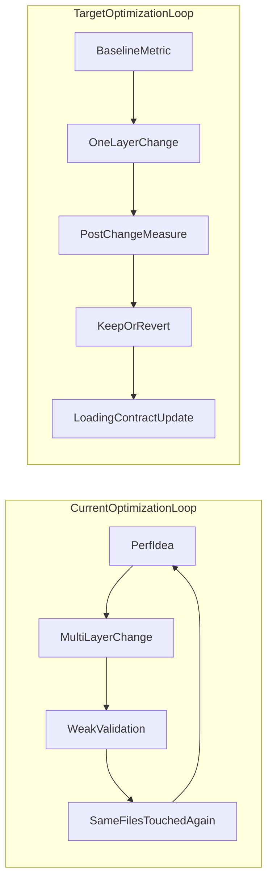

# Performance Pattern Audit and Simplification Plan

## Current Signal (From What We Reviewed)

- The new master plan in [docs/performance/PERFORMANCE_PLAN.md](docs/performance/PERFORMANCE_PLAN.md) identifies **network RTT and serial round trips** as the dominant bottleneck, with SQL compute usually much smaller.
- Recent performance work shows repeated churn in the same surfaces/files, especially [app/dashboard/page.tsx](app/dashboard/page.tsx), [lib/prefetch/dashboard.ts](lib/prefetch/dashboard.ts), [app/journeys/page.tsx](app/journeys/page.tsx), [lib/prefetch/journeys.ts](lib/prefetch/journeys.ts), and [app/api/journeys/route.ts](app/api/journeys/route.ts).
- Cursor plans overlap heavily on SWR tuning, prefetch changes, query parallelization, and cache/header tweaks, but use inconsistent acceptance criteria.
- Several changes appear to optimize opposite layers simultaneously (e.g., dynamic rendering directives while adding API caching), which can increase complexity without clear wins.

## Working Hypothesis To Validate

- We did not fail because of "no optimization"; we likely failed because of **optimization without a single loading contract and without strict experiment gates**.

## Execution Plan

1. Build a single evidence matrix for the last 10 days (commit -> tactic -> touched layer -> expected gain -> measured gain -> keep/revert recommendation).
2. Normalize all existing performance plans into one deduplicated strategy map, anchored to [docs/performance/PERFORMANCE_PLAN.md](docs/performance/PERFORMANCE_PLAN.md), and mark conflicts.
3. Define one canonical loading contract per major surface (dashboard, journeys, route workspace):
  - SSR ownership
  - SWR revalidation policy
  - API cache policy
  - thumbnail/media loading policy
4. Identify explicit debt candidates to remove (duplicate data paths, overlapping providers/prefetchers, redundant endpoints) before adding new optimizations.
5. Prioritize fixes by bottleneck class, in order:
  - network RTT + serial fetch chains
  - duplicate fetch paths
  - payload size and media strategy
  - query micro-optimizations
6. Establish regression guardrails for all pages:
  - route-level p50/p95 budget
  - duplicate-request budget after initial SSR
  - DB round-trip count budget per route
7. Produce a staged rollout plan: quick wins first, then structural simplifications, then optional advanced optimizations.

## Primary Files To Anchor Analysis

- [docs/performance/PERFORMANCE_PLAN.md](docs/performance/PERFORMANCE_PLAN.md)
- [app/dashboard/page.tsx](app/dashboard/page.tsx)
- [lib/prefetch/dashboard.ts](lib/prefetch/dashboard.ts)
- [app/journeys/page.tsx](app/journeys/page.tsx)
- [lib/prefetch/journeys.ts](lib/prefetch/journeys.ts)
- [app/api/dashboard/route.ts](app/api/dashboard/route.ts)
- [app/api/journeys/route.ts](app/api/journeys/route.ts)
- [next.config.ts](next.config.ts)
- [components/generation/VideoIterationCountsContext.tsx](components/generation/VideoIterationCountsContext.tsx)
- [app/api/projects/[id]/video-iteration-counts/route.ts](app/api/projects/[id]/video-iteration-counts/route.ts)

## Expected Deliverables

- Performance archaeology report (what worked, what churned, what should be removed).
- Canonical loading architecture doc for all page types.
- Ordered implementation backlog that minimizes tech debt and avoids spaghetti cross-layer changes.
- Measurable acceptance criteria for each optimization step.

