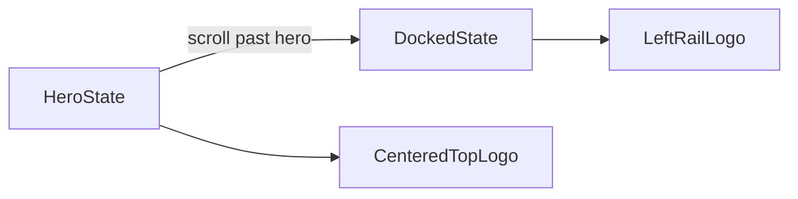

# Poppins Logo Motion Plan

## Current Problem

The current workshop frame hardcodes a cropped inline logo fragment in the top-left corner:

```47:59:components/workshops/BrandedWorkshopFrame.tsx
{logoSvg && (
  <div
    style={{
      position: "fixed",
      top: `calc(var(--hud-padding) + 4px)`,
      left: `calc(var(--hud-padding) + ${RAIL_WIDTH + 12}px)`,
      zIndex: 50,
      pointerEvents: "none",
      height: 24,
    }}
    dangerouslySetInnerHTML={{ __html: logoSvg }}
  />
)}
```

And the exported asset is not the full logo -- it starts at the wordmark path and drops the left icon/sparkle region from the original source SVG:

```1:3:lib/workshops/templates/thoughtformWorkshop.ts
export const POPPINS_LOGO_SVG = `<svg viewBox="129 45 370 75" ...>
  <path d="M129.503 114.878V62.593..." ... />
```

The source file is full-width and includes the brandmark/icon + wordmark:

```1:4:C:/Users/buyss/Dropbox/03_Thoughtform/04_Arcs/02_Workshops/20260318_Poppins/01_Source/Poppins.svg
<svg width="499" height="128" viewBox="0 0 499 128" ...>
  <path d="M24.889 ..." ... />
  <path d="M68.6588 ..." ... />
```

The page also still renders a left-side chapter readout beneath the logo region:

```71:81:components/workshops/BrandedWorkshopPage.tsx
<div style={{ position: "fixed", top: HUD_PAD + 56, left: HUD_PAD + RAIL_WIDTH + 12, ... }}>
  {activeCh && (
    <div style={{ display: "flex", alignItems: "center", gap: 8 }}>
      ...
      {activeCh.title}
```

## Target Behavior

- **Hero state**: the full Poppins logo sits centered at the top of the page, functioning like a landing-page masthead above the hero headline.
- **Docked state**: once the user scrolls past the landing section, that same logo transitions to the top-left rail-adjacent position.
- **No crop**: use the full source SVG, preserving icon + wordmark and proper viewBox scaling.
- **No conflict**: remove or relocate the current left readout so it does not compete with the docked logo.

## Implementation

### 1. Replace cropped inline SVG with the real asset

- Stop using the cropped `POPPLINS_LOGO_SVG` snippet in `[lib/workshops/templates/thoughtformWorkshop.ts](lib/workshops/templates/thoughtformWorkshop.ts)` for this placement.
- Read the full SVG source from `[C:/Users/buyss/Dropbox/03_Thoughtform/04_Arcs/02_Workshops/20260318_Poppins/01_Source/Poppins.svg](C:/Users/buyss/Dropbox/03_Thoughtform/04_Arcs/02_Workshops/20260318_Poppins/01_Source/Poppins.svg)` and convert it into a reusable asset in the app layer.
- Preferred implementation: create a React component or sanitized inline SVG constant in `[components/workshops/PoppinsLogo.tsx](components/workshops/PoppinsLogo.tsx)` using the full `viewBox="0 0 499 128"` so the logo scales cleanly.

### 2. Introduce a single animated logo layer

Create a dedicated logo overlay component, for example `[components/workshops/WorkshopLogoMotion.tsx](components/workshops/WorkshopLogoMotion.tsx)`, that:

- Watches whether the active section is still `hero` (or whether scrollTop is below a hero threshold)
- Renders the logo as one fixed element with two states:
  - `hero`: centered horizontally near the top of the viewport
  - `docked`: aligned just right of the top-left HUD corner / left rail
- Transitions via CSS transform and opacity rather than swapping two separate logos, so it feels like the same logo moving through space
- Scales appropriately between hero and docked states

## Motion sketch




### 3. Feed section state into the frame

Right now the frame knows nothing about which section is active. The easiest clean refactor:

- Move the logo overlay out of `[components/workshops/BrandedWorkshopFrame.tsx](components/workshops/BrandedWorkshopFrame.tsx)` and into `[components/workshops/BrandedWorkshopPage.tsx](components/workshops/BrandedWorkshopPage.tsx)` or a child component there, because `BrandedWorkshopPage` already tracks `activeSection`.
- Keep `BrandedWorkshopFrame` responsible only for rails + corner brackets.
- Use the existing `activeSection === "hero"` state in the workshop page to drive logo position.

### 4. Clear the left rail region

- Remove the current left chapter readout from `[components/workshops/BrandedWorkshopPage.tsx](components/workshops/BrandedWorkshopPage.tsx)` or move it lower so it does not compete with the docked logo.
- Preferred default: while the logo is docked, the left rail region should show just the logo; chapter state can remain communicated by the right TOC and the progress/rail system.

## Verification

- On initial load, the full Poppins logo is centered at the top and fully visible.
- The logo is not cropped at any viewport size.
- Scrolling to the next section transitions the same logo into the left rail position.
- No chapter label or other UI overlaps the docked logo.
- The HUD corner brackets and rails remain intact.

