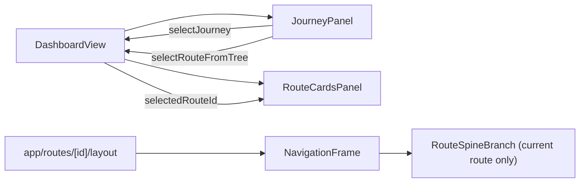

# Dashboard + Route Rail/Card Redesign

## Confirmed Scope

- Redesign **both** Dashboard card types (Journey + Route).
- Route page spine shows **current route only** under journey header (no sibling route list).
- Reuse Dashboard connector/rail visual language inside Route page.
- Replace text-based Open affordances with particle-arrow behavior inspired by [Sci-fi UI Kit](https://www.figma.com/design/AyDHKhU20vrPZYuOGLUIHj/Sci-fi-UI-Kit--Free---Community-?node-id=1-6&p=f&t=Ul4uizmHpTGZDOxq-11).

## Implementation Plan

### 1) Add reusable "filled" vs "line" card primitives + particle arrow action

- Extend [components/ui/CardFrame.tsx](components/ui/CardFrame.tsx) with a presentation variant (filled frame vs line-under-title treatment).
- Add a reusable arrow action primitive based on `ParticleIcon` from [components/ui/ParticleIcon.tsx](components/ui/ParticleIcon.tsx) and use it through title/action slots.
- Keep existing state handling (`default`, `selected`, `active`, `dim`) and compose with the new presentation mode.

### 2) Dashboard Journey rail: collapsible Journey → Routes tree

- Update [components/dashboard/JourneyPanel.tsx](components/dashboard/JourneyPanel.tsx):
  - Clicking a journey card toggles a small connector-tree reveal for routes.
  - Journey card keeps filled/full summary treatment; nested route rows use stripped line-only treatment.
  - Replace current text `Open` action with particle-arrow action.
  - Preserve `data-journey-selected` on the journey card node so `JourneyConnector` continues to lock to the selected card.
  - Guard current wheel-scrolling behavior so expanded tree rows remain usable.

### 3) Dashboard Route cards redesign + selection sync

- Update [components/dashboard/DashboardView.tsx](components/dashboard/DashboardView.tsx) to lift route selection state so Journey tree clicks can focus a route card.
- Update [components/dashboard/RouteCardsPanel.tsx](components/dashboard/RouteCardsPanel.tsx) to support controlled `selectedRouteId` + `onSelectRoute` while preserving existing create/rename/delete behaviors.
- Redesign [components/dashboard/RouteCard.tsx](components/dashboard/RouteCard.tsx) visual treatment to match new primitive grammar and particle-arrow affordance.

### 4) Route page: reuse rail grammar with stripped journey + current-route branch

- Update [components/hud/NavigationFrame.tsx](components/hud/NavigationFrame.tsx):
  - Keep stripped journey header in nav spine.
  - Add a route-branch node beneath it using the same branch connector style as Dashboard tree language.
  - Mark the route-page journey anchor with a connector target attribute so the existing `JourneyConnector` can visually align in Route context as well.
- Add a focused route branch component in HUD scope (new file under `components/hud/`, reusing branch spacing/connector patterns from [components/hud/WaypointBranch.tsx](components/hud/WaypointBranch.tsx)).

### 5) Keep data contract minimal for route page

- Use existing `journeyName` + `routeName` passed from [app/routes/[id]/layout.tsx](app/routes/[id]/layout.tsx) and [lib/prefetch/workspace.ts](lib/prefetch/workspace.ts).
- No sibling-route prefetch changes needed for this pass because route page only shows current route.

### 6) Figma/design-system sync

- Update [packages/figma-plugin/src/generators/components.ts](packages/figma-plugin/src/generators/components.ts) specimens to include:
  - Filled vs line-only card presentations.
  - Dashboard Journey card with collapsed/expanded route-tree state examples.
  - Dashboard Route card redesign states.
  - Route-page stripped journey + current-route branch specimen.

## Interaction/Data Flow

## Primary Files

- [components/ui/CardFrame.tsx](components/ui/CardFrame.tsx)
- [components/ui/ParticleIcon.tsx](components/ui/ParticleIcon.tsx)
- [components/dashboard/DashboardView.tsx](components/dashboard/DashboardView.tsx)
- [components/dashboard/JourneyPanel.tsx](components/dashboard/JourneyPanel.tsx)
- [components/dashboard/RouteCardsPanel.tsx](components/dashboard/RouteCardsPanel.tsx)
- [components/dashboard/RouteCard.tsx](components/dashboard/RouteCard.tsx)
- [components/hud/NavigationFrame.tsx](components/hud/NavigationFrame.tsx)
- [components/hud/WaypointBranch.tsx](components/hud/WaypointBranch.tsx)
- [app/routes/[id]/layout.tsx](app/routes/[id]/layout.tsx)
- [lib/prefetch/workspace.ts](lib/prefetch/workspace.ts)
- [packages/figma-plugin/src/generators/components.ts](packages/figma-plugin/src/generators/components.ts)