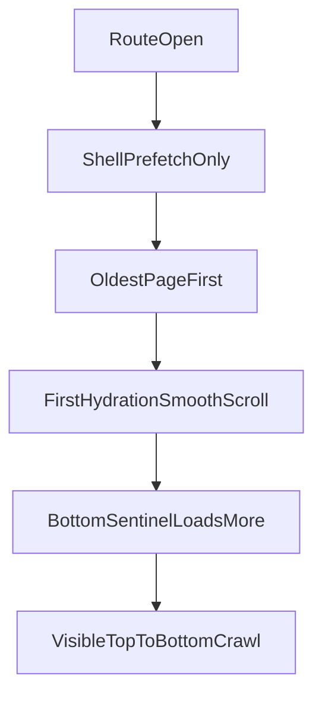

# Fix Route Feed Anchoring

## Diagnosis

- The last card is still clipped because [components/generation/ForgeGallery.module.css](components/generation/ForgeGallery.module.css) reserves a fixed bottom gutter with `padding: ... var(--feed-padding-bottom, 360px)`, but the fixed composer in [components/generation/ForgePromptBar.module.css](components/generation/ForgePromptBar.module.css) has variable runtime height.
- The composer height is dynamic in [components/generation/ForgePromptBar.tsx](components/generation/ForgePromptBar.tsx): the textarea auto-grows, can be manually resized up to `320px`, the params row can wrap, and a message row can appear. Because the route workspace shell is locked to `height: 100vh` with `overflow: hidden` in [app/globals.css](app/globals.css), the feed is the only scroll owner and cannot recover if that reserve is too small.
- The route opens by crawling downward because [app/api/generations/route.ts](app/api/generations/route.ts) returns the oldest page first (`orderBy: { createdAt: "asc" }`), [components/generation/ProjectWorkspace.tsx](components/generation/ProjectWorkspace.tsx) appends pages in fetch order, and [components/generation/ForgeGallery.tsx](components/generation/ForgeGallery.tsx) treats first hydration like a new item and runs `scrollTo({ top: feed.scrollHeight, behavior: "smooth" })` in a virtualized, dynamically measured list.

## Implementation Plan

### 1. Replace the fake bottom gutter with a measured composer reserve

- Add a measured root ref in [components/generation/ForgePromptBar.tsx](components/generation/ForgePromptBar.tsx) and observe its actual rendered height with `ResizeObserver`.
- Surface that measurement to [components/generation/ProjectWorkspace.tsx](components/generation/ProjectWorkspace.tsx) so the workspace can publish CSS variables such as composer height, bottom inset, and total reserve on the shared parent.
- Update [components/generation/ForgeGallery.module.css](components/generation/ForgeGallery.module.css) to compute feed bottom padding from those variables instead of a hard-coded fallback, with a small safety buffer so the last image/video can always clear the prompt bar.
- Keep the fixed-HUD composition intact; do not move scroll ownership away from the gallery.

### 2. Stop initial route-open scroll jank

- Split first-hydration anchoring from live-update follow behavior in [components/generation/ForgeGallery.tsx](components/generation/ForgeGallery.tsx).
- Remove the current double-`requestAnimationFrame` first-load smooth scroll and replace it with an initial bottom anchor using `behavior: "auto"` only after the first settled layout.
- Only auto-follow later updates when the user is already near the bottom, so older-history browsing is not yanked back down.
- Avoid smooth scrolling for the measured virtual list; this feed uses dynamic row measurement, so initial positioning should be immediate, not animated.

### 3. Make route open on the latest generation instead of the oldest page

- Change [app/api/generations/route.ts](app/api/generations/route.ts) so the route workspace can request the newest slice first rather than the oldest slice.
- Update [components/generation/ProjectWorkspace.tsx](components/generation/ProjectWorkspace.tsx) to merge pages in display order that remains chronological on screen while still making the newest page the initial slice.
- Rework history loading in [components/generation/ForgeGallery.tsx](components/generation/ForgeGallery.tsx) so older generations load upward instead of appending below the latest content on initial open.
- If the route should avoid client-side first-load repositioning entirely, reuse the same latest-first semantics in [lib/prefetch/workspace.ts](lib/prefetch/workspace.ts) for route prefetch metadata rather than fetching old history and correcting after paint.

### 4. Keep loading behavior performant and predictable

- Preserve the current media-loading improvements: no original-size eager decode for feed cards, and no animated loading field for completed-but-still-decoding outputs.
- Ensure the initial route load fetches only the newest page needed for the first viewport instead of walking through historical pages.
- Keep older history lazy and user-driven, triggered only when the user scrolls upward toward the top of the feed.
- Re-check that session switching, image/video generation, convert-to-video, reference reuse, lightbox, and download flows still behave the same after the feed anchoring changes.

## Key Files

- [components/generation/ForgePromptBar.tsx](components/generation/ForgePromptBar.tsx)
- [components/generation/ProjectWorkspace.tsx](components/generation/ProjectWorkspace.tsx)
- [components/generation/ForgeGallery.tsx](components/generation/ForgeGallery.tsx)
- [components/generation/ForgeGallery.module.css](components/generation/ForgeGallery.module.css)
- [app/api/generations/route.ts](app/api/generations/route.ts)
- [lib/prefetch/workspace.ts](lib/prefetch/workspace.ts)

## Verification

- Open a route with many generations and confirm the newest image/video is visible immediately on first paint without a downward crawl.
- Confirm the full last card can always be scrolled above the composer, even with a tall prompt, wrapped params, and a visible status message.
- Confirm older history loads only when scrolling upward and does not jump the viewport.
- Re-test image generation, video generation, session switching, convert-to-video, lightbox, and downloads.

