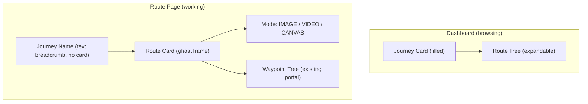
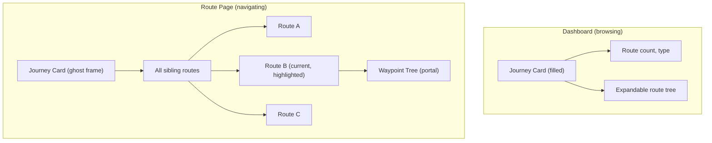
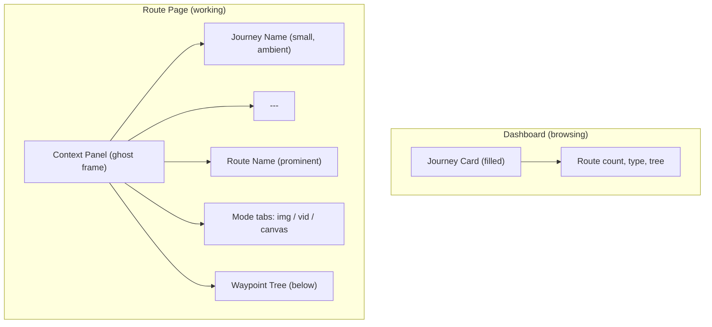

# Route Page Card: Information Architecture Options

## The Problem

On the Dashboard, the Journey card exists in a **browsing context** -- its job is to present an overview (name, route count, expandable route tree). On the Route page, the same card concept is "stripped down" to just the journey name and current route name. This feels like *subtraction* rather than *intentional design*. The card doesn't have a clear reason to exist in its current form.

The question: what should the left-spine card *do* on a Route page, where the user's mental model has shifted from "browsing journeys" to "working inside a route"?

---

## Current Information Available on Route Pages

From `[lib/prefetch/workspace.ts](lib/prefetch/workspace.ts)`:

- `journeyName`, `journeyId` (parent context)
- `projectName` (current route name)
- `sessions[]` (waypoints, with id/name/type)

**Not available** (would need new prefetch): sibling routes in the same journey.

The `WaypointBranch` component already renders below the ghost card via a portal, showing waypoints with thumbnails and tree connectors.

---

## Option A: Route-Centric Spine (flip the hierarchy)

**Philosophy**: The Route page is about the Route. The Journey is just a breadcrumb -- it tells you *where you came from*, not *what you're doing*. Give the Route the prominent card treatment.

**What it looks like:**

- Journey name = small gold text label with a back-arrow, no card frame around it
- Below it, a `ghost` card frames the **route name** prominently, with the current mode shown as a subtle indicator (e.g., `IMAGE` in mono text or a particle dot)
- The waypoint tree (already built) flows below the route card naturally

**Data needed:** Already available (route name, mode from URL segment).

**Trade-off:** Breaks the visual metaphor of "journey card lives in the spine." But it matches the user's actual focus -- the route, not the journey.

---

## Option B: Contextual Switcher (sibling navigation)

**Philosophy**: The card earns its place by being *useful* -- it becomes a navigation tool that lets you switch between routes without going back to Dashboard. The Journey card on a Route page has a *different job* than on the Dashboard: it's a switcher, not a summary.

**What it looks like:**

- Ghost card shows journey name (gold, with back-arrow)
- Below the divider, **all sibling routes** are listed (like the Dashboard tree, but always expanded)
- The current route is highlighted (gold text or subtle fill)
- Clicking a sibling route navigates to it
- The waypoint tree renders below for the active route

**Data needed:** Sibling routes -- requires extending `prefetchWorkspaceShell` to include other projects in the same journey. This is a small query addition (`WHERE workspaceProjectId = journeyId`).

**Trade-off:** Requires a data layer change. But it gives the ghost card a clear, differentiated purpose. The card is no longer "the same thing with less" -- it's a *different tool* for a different context.

---

## Option C: Workspace Context Panel (unified briefing)

**Philosophy**: The card on the Route page is a "mission briefing" -- a single cohesive panel that orients you within the workspace. It combines hierarchy (journey > route), mode context (image/video/canvas), and workspace state into one component.

**What it looks like:**

- Single ghost card, but the internal layout is restructured:
  - **Top**: Journey name in small text (ambient, de-emphasized)
  - **Middle**: Route name in larger/bolder text (this is the anchor)
  - **Bottom**: Subtle mode indicators -- three small labels or particle dots for image/video/canvas, with the active one highlighted in gold
- The waypoint tree flows below the card

**Data needed:** Already available (route name, mode from URL). Mode tabs would be links to `/routes/[id]/image`, `/routes/[id]/video`, `/routes/[id]/canvas`.

**Trade-off:** More complex component internally, but it adds genuine utility (mode switching from the spine) and gives the card a clear identity that's *different* from the Dashboard card by design, not by subtraction.

---

## Comparison Matrix

- **Option A** (Route-Centric): Simplest change, strongest IA clarity, breaks journey-card visual continuity
- **Option B** (Contextual Switcher): Most useful for multi-route journeys, requires data work, gives the card a clear differentiated purpose
- **Option C** (Context Panel): No new data needed, adds mode navigation utility, feels like a purposeful workspace tool

---

## Recommendation

**Option C** is the strongest from an IA standpoint. It doesn't require new data fetching, it adds genuine utility (mode switching), and it reframes the card from "stripped-down journey card" to "workspace context panel." The hierarchy is clear: journey (ambient) > route (anchor) > mode (tool). Each layer serves a purpose.

**Option B** is the most powerful if the user frequently works across multiple routes in a journey, but it requires a data layer change.

These options are not mutually exclusive -- Option C could later be extended with Option B's sibling route list.