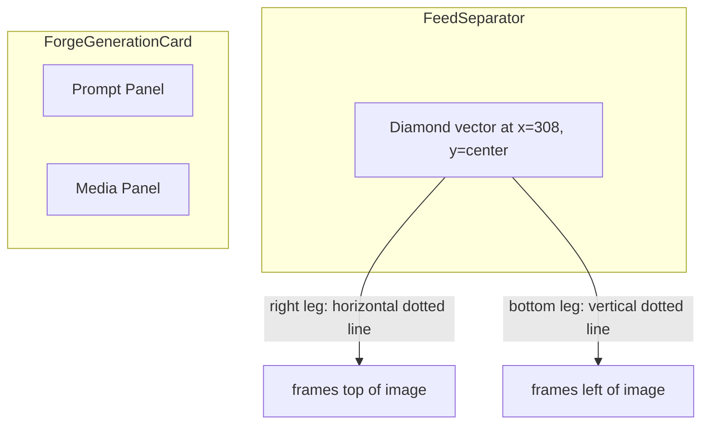

# Separator Bracket Lines

## Concept

Two thin dotted lines extend from the separator diamond to frame the top-left corner of the generated image card:



- **Horizontal line** (right leg): extends from the diamond's right point (~328px) rightward across the full width -- frames the TOP of the image
- **Vertical line** (bottom leg): extends from the diamond's bottom point downward -- frames the LEFT of the image

Together they create a subtle L-shaped bracket / wayfinding connector.

## Implementation

### 1. CSS pseudo-elements on `.feedSeparator` in [ForgeGallery.module.css](components/generation/ForgeGallery.module.css)

Add `::before` (horizontal) and `::after` (vertical) to `.feedSeparator`:

```css
.feedSeparator::before {
  content: "";
  position: absolute;
  top: 50%;
  left: 328px;        /* right point of 40px diamond centered at 308px */
  right: 0;
  height: 0;
  border-top: 1px dotted var(--gold);
  opacity: 0.25;
  pointer-events: none;
}

.feedSeparator::after {
  content: "";
  position: absolute;
  left: 308px;         /* center of diamond (bottom point) */
  top: calc(50% + 20px); /* bottom point of diamond */
  bottom: -200px;      /* extend into the card below */
  width: 0;
  border-left: 1px dotted var(--gold);
  opacity: 0.25;
  pointer-events: none;
}
```

### 2. Hide on mobile

Within the existing `@media (max-width: 980px)` block, hide the dotted lines since the layout stacks vertically and the effect no longer makes sense:

```css
.feedSeparator::before,
.feedSeparator::after {
  display: none;
}
```

### Notes

- `.feedSeparator` already has `position: relative` and no explicit `overflow`, so it defaults to `visible` -- the vertical line can extend beyond the separator bounds into the card area without any changes
- Lines use `var(--gold)` at low opacity (~0.25) to match the diamond's color but remain subtle
- The `1px dotted` style keeps lines thinner than the 40px diamond vector
- The vertical line extends 200px below the separator bottom -- enough to bracket a meaningful portion of the image without needing to know the exact card height
- All values are easy to tweak once we see how it looks
