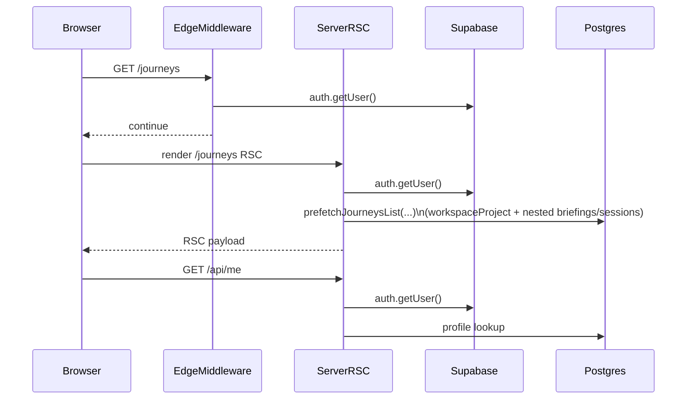

# Sigil Journeys performance recovery (Vesper-aligned)

## What’s actually happening (why it’s inconsistent)

- **Duplicate auth roundtrips**: `middleware.ts` does `supabase.auth.getUser()` for every protected page request, and server pages do it again via `getAuthedUser()` (`lib/auth/server.ts`). Then the client often calls `/api/me`, which calls `getAuthedUser()` again.
- **Heavy “thumbnails” work on the hot path**:
  - `/api/journeys` is designed to assemble “recent output thumbnails” and can scan a lot of `generations` + `outputs`.
  - Dashboard is **explicitly heavier in production**: `app/dashboard/page.tsx` sets `includeThumbnails = process.env.NODE_ENV === "production"`, so local feels fast while Vercel does the expensive path.
- **Next.js Link prefetch can DoS your own backend**: `components/journeys/JourneyCard.tsx` links to `/journeys/[id]` **without** `prefetch={false}` (contrast: `components/journeys/RouteCard.tsx` already disables prefetch). On a page with many cards, App Router may prefetch multiple journeys, multiplying auth+DB work.
- **Caching improvements don’t show on Vercel** because most JSON endpoints are `Cache-Control: private` (`lib/api/cache-headers.ts`), so **CDN won’t cache**; you mostly see “sometimes instant” from **browser cache (10s)** + **router cache/prefetch**, and “sometimes slow” from **cold starts / connection churn / heavier queries**.

Current high-latency waterfall (simplified):

## Phase 0 — Make production measurable (and allow Playwright)

- **Add a temporary “public demo admin” flag** (per your choice) so Playwright can hit `https://sigil.thoughtform.co/` without auth.
  - Files: `middleware.ts`, `lib/auth/server.ts`, optionally `app/login/page.tsx`
  - Approach: add `SIGIL_PUBLIC_DEMO=true` and when set:
    - `middleware.ts`: skip redirects and auth checks.
    - `getAuthedUser()`: return the existing `BYPASS_USER_ID` user even in production.
  - Guardrail: log a loud warning on boot/first request when enabled, and keep the flag off by default.
- **Baseline capture on Vercel (before changes)**:
  - Use DevTools Network to record:
    - `/journeys` and `/journeys/[id]` document + RSC requests
    - `/api/journeys`, `/api/journeys/[id]`, `/api/me` durations
    - `Server-Timing` headers already emitted by `app/api/journeys/route.ts` and `app/api/dashboard/route.ts`
  - Use Playwright MCP to gather p50/p95 navigation timing for:
    - cold start (first hit after 5–10 min idle)
    - warm (3 consecutive navigations)

## Phase 1 — Stop the biggest self-inflicted multipliers (quick wins)

- **Disable prefetch on Journey cards** so `/journeys` doesn’t trigger a burst of expensive `/journeys/[id]` prefetches.
  - File: `components/journeys/JourneyCard.tsx`
  - Change: `<Link ... prefetch={false}>`
- **Remove unnecessary client “refetch-on-mount” of heavy endpoints**
  - File: `components/journeys/JourneysOverviewContent.tsx`
  - Today: server prefetch passes `initialDataIncludesThumbnails=false`, so `skipInitialFetch` becomes false and `useEffect` calls `fetch('/api/journeys')`.
  - Change options:
    - Option A (minimal): when `initialJourneys` exists, don’t refetch immediately; provide a “Refresh” button.
    - Option B (better UX): refetch a **lightweight** endpoint on mount (no thumbnails) and lazy-load thumbnails separately.

## Phase 2 — Slim the Journeys hot path (match what UI actually needs)

- **Make `/journeys` first paint not depend on nested sessions/routes**
  - Files: `lib/prefetch/journeys.ts`, `app/journeys/page.tsx`
  - Goal: for the Journeys grid, only fetch fields used by `JourneyCard`:
    - `WorkspaceProject`: `id, name, description, type, _count.briefings`
    - Do **not** include `briefings.sessions` unless thumbnails are explicitly requested.
- **Split “journey list” from “journey thumbnails”** (Vesper pattern)
  - Files: `app/api/journeys/route.ts`, `components/journeys/JourneysOverviewContent.tsx`
  - New shape:
    - `GET /api/journeys` returns summary list only (fast, small payload)
    - `GET /api/journeys/thumbnails?ids=...` returns up to N thumbnails per journey (batch, paginated)
  - This prevents the expensive `generation/output` scan from being mandatory for “list view”.

## Phase 3 — Make thumbnails predictable-cost (Vesper’s LATERAL SQL approach)

- **Replace “scan many generations then fetch many outputs then sort in JS”** with a single SQL query using `LATERAL`.
  - Reference implementation: Vesper’s `src/app/api/projects/with-thumbnails/route.ts`.
  - Target files:
    - `app/api/journeys/route.ts` (journey thumbnails)
    - `app/api/journeys/[id]/route.ts` (route thumbnail per briefing)
  - Outcome: fewer rows moved, less JS work, stable query latency.

## Phase 4 — Remove auth duplication and smooth cold starts

- **Reduce Supabase auth network calls per navigation**
  - Files: `middleware.ts`, `lib/auth/server.ts`, `context/AuthContext.tsx`, `app/api/me/route.ts`
  - Changes:
    - Prefer a single source of truth for “is logged in” on page requests (either middleware OR server page, not both).
    - Consider switching server pages to session-based auth check (Vesper uses `auth.getSession()` in server components) to avoid an extra network `getUser()` call.
    - Make `/api/me` read-only and avoid the “create profile on read” fallback.
- **Prisma serverless stability + warmup (Vesper parity)**
  - File: `lib/prisma.ts`
  - Add:
    - connection-string validation + warnings (pooler/connection_limit)
    - a small `SELECT 1` warmup with retry/backoff (reduces cold-start spikes)
  - Also verify Vercel env:
    - `DATABASE_URL` should use **transaction pooler** (Supabase port 6543) with `pgbouncer=true&connection_limit=1`
    - `DIRECT_URL` should use the **direct** connection for migrations

## Phase 5 — Verification + regression guardrails

- Re-run the same Playwright scenarios and compare p50/p95.
- Add a lightweight “perf snapshot” checklist for future PRs:
  - request count for `/journeys` and `/journeys/[id]`
  - payload sizes for `/api/journeys`*
  - `Server-Timing` totals

