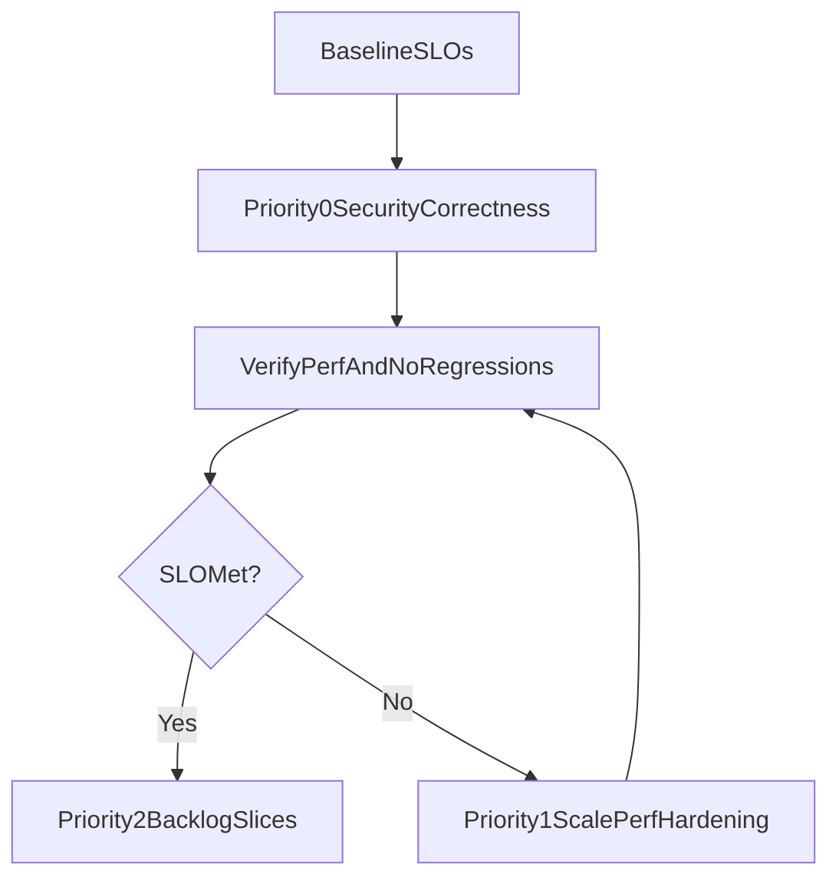

# Sigil Targeted Hardening Plan

## Recommendation

- Do **not** do a broad refactor now.
- Keep the recent performance flow (App Router route layout bootstrap + SWR hydration + reduced prefetch).
- Apply a **targeted hardening pass** on high-risk seams that affect security, scalability, and correctness.

## Why this path

- The current structure is directionally good and already improved latency.
- Highest risk is concentrated in a few files and policies, so low-blast-radius fixes give better ROI than a rewrite.
- This preserves momentum and avoids undoing performance work.

## Priority 0 (security/correctness first)

- Fix authenticated caching scope:
  - Change dashboard/admin stats responses from public short cache to private cache and add cookie variance where needed.
  - Files: [app/api/dashboard/route.ts](app/api/dashboard/route.ts), [app/api/admin/dashboard-stats/route.ts](app/api/admin/dashboard-stats/route.ts), [lib/api/cache-headers.ts](lib/api/cache-headers.ts)
- Harden auth hydration behavior:
  - In transient `/api/me` failures, do not immediately clear `user`; keep session state stable and retry role hydration.
  - Files: [context/AuthContext.tsx](context/AuthContext.tsx), [app/api/me/route.ts](app/api/me/route.ts)
- Tighten generation processor claim semantics:
  - Ensure `processing_locked` is treated as already claimed unless lock timeout logic explicitly reclaims.
  - Require internal invocation guard and ownership/admin checks in process route.
  - Files: [lib/models/generation-status.ts](lib/models/generation-status.ts), [app/api/generate/process/route.ts](app/api/generate/process/route.ts), [lib/models/processor.ts](lib/models/processor.ts)

## Priority 1 (scale/perf hardening without architecture changes)

- Replace per-output video-iteration polling fan-out with batched status fetch for visible output IDs.
  - Files: [hooks/useVideoIterations.ts](hooks/useVideoIterations.ts), [app/api/outputs/[id]/video-iterations/route.ts](app/api/outputs/[id]/video-iterations/route.ts), [components/generation/ForgeGenerationCard.tsx](components/generation/ForgeGenerationCard.tsx)
- Keep access policy consistent for admin paths and project-scoped APIs.
  - Files: [lib/auth/project-access.ts](lib/auth/project-access.ts), [lib/prefetch/workspace.ts](lib/prefetch/workspace.ts), [app/api/sessions/route.ts](app/api/sessions/route.ts), [app/api/generations/route.ts](app/api/generations/route.ts)
- Restore/clarify journey contract where `generationCount` is currently static.
  - Files: [app/api/journeys/route.ts](app/api/journeys/route.ts), [components/journeys/JourneyCard.tsx](components/journeys/JourneyCard.tsx)

## Priority 2 (security hardening backlog; schedule, don’t block)

- Add safe URL handling for all external reference-image fetches.
  - File: [lib/models/adapters/gemini.ts](lib/models/adapters/gemini.ts)
- Reduce realtime data exposure by narrowing channel scope and payload.
  - Files: [lib/supabase/realtime.ts](lib/supabase/realtime.ts), [hooks/useGenerationsRealtime.ts](hooks/useGenerationsRealtime.ts)
- Enforce workspace membership validation on project creation path.
  - File: [app/api/projects/route.ts](app/api/projects/route.ts)

## Operating model (how to proceed going forward)

- **Step 1:** Instrument and baseline p50/p95 for dashboard, journey detail, route open, generation list API.
- **Step 2:** Apply Priority 0 only; verify no UX regressions.
- **Step 3:** Apply Priority 1 only if metrics still show pressure (especially iteration polling fan-out).
- **Step 4:** Tackle Priority 2 in weekly security hardening slices.

## Success criteria

- No authenticated data served from shared public cache.
- No duplicate generation processing under concurrent triggers.
- Stable auth UX during transient `/api/me` failures.
- Reduced request fan-out for iteration badges at high card counts.
- Existing performance improvements retained (no rollback of current flow).

