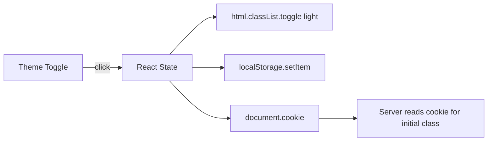

# Sigil Dashboard Harmony + Light Mode

## Design Analysis (Brand Architect Audit)

**Current issues visible in the screenshot:**

- **Vertical crowding** -- The "Generation Projects" header sits too close to the SIGIL gold bar. The brand spatial system requires `--space-lg` (24px) minimum between structural sections, and HUD-style UIs should use generous top padding to clear the header zone.
- **Redundant CTAs** -- Three actions compete: the gold header "+ New Project" button, the crosshair sigil (implying "add"), and the "Create First Project" button. The brand voice rule: one clear orientation message + one action per empty state.
- **Header bar feels disconnected** -- The "Generation Projects" label and "+ New Project" button sit in a blurred glass bar that doesn't connect visually to the content below it. The border-bottom is too faint.
- **Empty state is too tall** -- `py-24` (96px top/bottom) creates a large bordered void. The spatial system says product density should be "restrained" (md/lg), not sparse.

**Design direction (Frontend Design Skill):**

- Aesthetic: refined minimalism with instrument precision. Every element earns its place.
- Key motion moment: staggered fade-in of the nav panel + content area on page load.
- Differentiation: the HUD frame + gold panel give Sigil its character; the content area should feel clean and purposeful, not cluttered.

---

## Part 1: Dashboard Harmonization

### 1A. Increase top breathing room

**File:** `[app/globals.css](app/globals.css)`

Increase the shell's top padding so content starts further from the HUD corner brackets:

```css
.hud-shell {
  padding-top: calc(clamp(24px, 4vw, 56px) + 80px); /* was + 60px */
}
```

### 1B. Consolidate the header bar and empty state

**File:** `[components/projects/ProjectsView.tsx](components/projects/ProjectsView.tsx)`

**Header bar simplification:**

- Remove the blurred glass background and `border-bottom`. Replace with a clean, minimal layout: gold label on the left, button on the right, separated by space alone.
- Increase the `margin-bottom` from `mb-8` to `mb-6` (tighter coupling to content).

**Empty state cleanup (per brand voice rules):**

- Remove the crosshair sigil icon -- it implies "add" but is visually redundant with the button below.
- Keep: the "No projects yet" text + subtitle + one single CTA button.
- Reduce padding from `py-24` to `py-16`.
- Remove the `border` and `background: surface-0` from the empty state container -- let it breathe against the void. Use a subtle `dawn-08` top border only as a course line separator from the header.

**When projects exist (grid state):**

- The grid remains unchanged -- it's already well-structured.

### 1C. Refine the header bar typography

The "Generation Projects" label uses `fontSize: "10px"` which is too small relative to the 13px nav items. Per the typography system, HUD labels should be 9-11px mono uppercase. Bump it to `11px` for better hierarchy balance with the nav panel.

---

## Part 2: Light Mode

### Architecture

Sigil is a Next.js web app (not Electron like Synod), so persistence uses `localStorage` + a cookie for SSR flash prevention.




### 2A. Add light mode CSS tokens

**File:** `[app/globals.css](app/globals.css)`

Add `:root.light` overrides directly from the Thoughtform Color System spec (same values as Synod):

```css
:root.light {
  --void: #ECE3D6;
  --surface-0: #E4DAC9;
  --surface-1: #DDD2C0;
  --surface-2: #F2EAE0;
  --dawn: #110F09;
  --dawn-70: rgba(17, 15, 9, 0.88);
  --dawn-50: rgba(17, 15, 9, 0.62);
  --dawn-40: rgba(17, 15, 9, 0.5);
  --dawn-30: rgba(17, 15, 9, 0.4);
  --dawn-15: rgba(17, 15, 9, 0.15);
  --dawn-12: rgba(17, 15, 9, 0.12);
  --dawn-08: rgba(17, 15, 9, 0.08);
  --dawn-04: rgba(17, 15, 9, 0.04);
  --gold: #9A7A2E;
  --gold-dim: rgba(154, 122, 46, 0.4);
  --gold-30: rgba(154, 122, 46, 0.3);
  --gold-20: rgba(154, 122, 46, 0.2);
  --gold-15: rgba(154, 122, 46, 0.15);
  --gold-10: rgba(154, 122, 46, 0.1);
}
```

Because every component already uses `var(--gold)`, `var(--dawn)`, etc., the entire UI flips automatically.

### 2B. Theme toggle in the nav panel

**File:** `[components/hud/NavigationFrame.tsx](components/hud/NavigationFrame.tsx)`

Add a small theme toggle at the bottom of the nav panel (below Bookmarks), using Sun/Moon icons (Lucide, already available via Next.js ecosystem or inline SVG). The toggle:

- Reads initial theme from `localStorage` on mount
- Toggles `.light` class on `document.documentElement`
- Persists to `localStorage`
- Uses a `useEffect` to read the saved theme on hydration

Position: bottom of the nav panel, before the panel's bottom edge, styled as a small mono-uppercase label with an icon.

### 2C. SSR flash prevention

**File:** `[app/layout.tsx](app/layout.tsx)`

Add a small inline `<script>` in the `<head>` that reads the theme from `localStorage` before React hydrates, applying the `.light` class immediately to prevent a dark-to-light flash:

```tsx
<script dangerouslySetInnerHTML={{ __html: `
  try { if (localStorage.getItem('sigil-theme') === 'light') document.documentElement.classList.add('light') } catch(e) {}
`}} />
```

### 2D. HUD element adjustments for light mode

The HUD corners and rails use `var(--gold)` and `var(--dawn-30)` which will auto-adapt. The gold title bar background (`var(--gold)`) will use the darkened light-mode gold `#9A7A2E`. No component changes needed -- the CSS variable swap handles everything.

One exception: the `body` background and text already use `var(--void)` and `var(--dawn)` via CSS, so they flip automatically too.