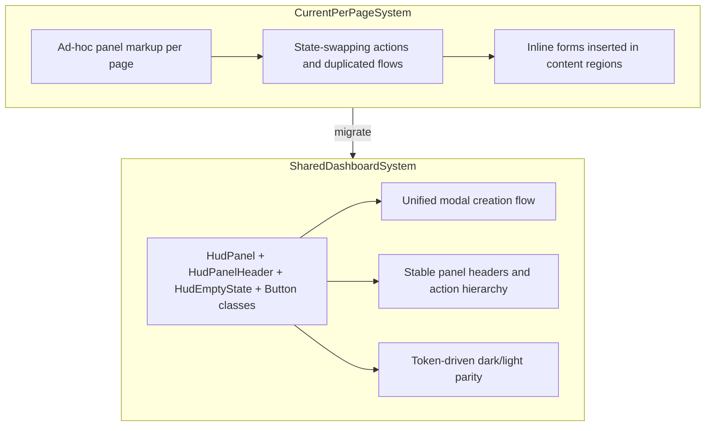

# Sigil Dashboard UX Cleanup

## Problem Analysis

The issues are systemic (not only `ProjectsView`):

1. **Inconsistent panel grammar** -- panel headers, empty states, and action placements are authored per-page, leading to drift.
2. **State-swapping primary actions** -- header actions change role ("new" becoming "cancel"), breaking orientation and expected hierarchy.
3. **Multiple creation surfaces** -- inline form + panel CTA flows produce redundancy and accidental duplication.
4. **Imperative styling and hover logic** -- repeated inline style mutations hurt maintainability and consistency.
5. **Theme reliability concerns** -- some interactions appear broken because behavior and styles are not centralized.

## Design Direction (Thoughtform Brand + Frontend Skill)

- **Instrument-first UI**: panel structure must read as navigation instrumentation, not ad-hoc forms.
- **Stable landmarks**: header actions remain stable; cancellation lives in modal footer only.
- **Single-path creation**: one project creation path (modal) from any CTA entry point.
- **Token-only styling**: all new surfaces/actions use `var(--*)` tokens so light/dark stays coherent.
- **Retrofuturist clarity**: sharp geometry, mono hierarchy, restrained motion, purposeful separators.

---

## Changes

### 1. Foundation: shared panel/action primitives

**Files:**

- `[components/ui/hud/HudPanel.tsx](components/ui/hud/HudPanel.tsx)`
- `[components/ui/hud/HudPanelHeader.tsx](components/ui/hud/HudPanelHeader.tsx)`
- `[components/ui/hud/HudPanelActions.tsx](components/ui/hud/HudPanelActions.tsx)`
- `[components/ui/hud/HudEmptyState.tsx](components/ui/hud/HudEmptyState.tsx)`
- `[app/globals.css](app/globals.css)`

Create a reusable panel grammar used across dashboard surfaces:

- `HudPanel`: consistent outer frame (border, background behavior, spacing contract)
- `HudPanelHeader`: stable title/action row
- `HudPanelActions`: standardized primary/secondary action ordering
- `HudEmptyState`: consistent title/body/cta composition
- shared class utilities for buttons/inputs/labels (CSS-driven hover/focus states only)

### 2. One modal flow for creation and cancellation

**Files:**

- `[components/ui/Dialog.tsx](components/ui/Dialog.tsx)`
- `[components/projects/ProjectsView.tsx](components/projects/ProjectsView.tsx)`

Define one creation flow:

- header action is always `+ NEW PROJECT`
- cancel action only exists in the modal footer
- empty-state CTA opens the same modal path
- no inline form insertion between header and empty/grid content

### 3. Projects dashboard migration

**File:** `[components/projects/ProjectsView.tsx](components/projects/ProjectsView.tsx)`

Migrate to shared panel primitives:

- clean header/action row
- unified loading/error/empty/grid state framing
- no duplicated CTA or form paths
- remove imperative inline hover mutations in favor of shared classes

### 4. Analytics/Admin and dashboard siblings migration

**Files (minimum):**

- `[app/analytics/page.tsx](app/analytics/page.tsx)`
- `[app/admin/page.tsx](app/admin/page.tsx)`
- dashboard-level components they render (identified during implementation)

Apply same panel/action language:

- same panel shell and header semantics
- same primary/secondary button hierarchy
- same empty-state tone and spacing rhythm

### 5. Responsive and accessibility pass

**Files:** shared panel/dialog components + affected pages

Enforce:

- keyboard-first dialog (Escape close, focus return, tab order)
- visible focus states on all actions
- button density and wrapping behavior for narrow widths
- panel spacing rhythm at `>1100`, `<=1100`, and mobile breakpoints

### 6. Theme parity hardening

**Files:** `[app/globals.css](app/globals.css)` + shared component styles

Ensure all shared classes are token-based (`var(--*)`) with no hardcoded dark values, so dark/light behavior is automatic and consistent.

---

## Architecture Summary

## Acceptance Criteria

- Every dashboard surface uses shared panel primitives (no bespoke panel shells).
- No header action changes role/state; cancel appears only in modal/footer contexts.
- Exactly one creation flow exists for Projects (all entry points open the same modal).
- No duplicate form rendering paths anywhere on main dashboard pages.
- Hover/focus/disabled states are CSS-class based, not imperative inline mutation.
- Dark and light modes render all new primitives correctly via tokens.
- Build passes and core pages (`/projects`, `/analytics`, `/admin`) are visually/interaction-consistent.

