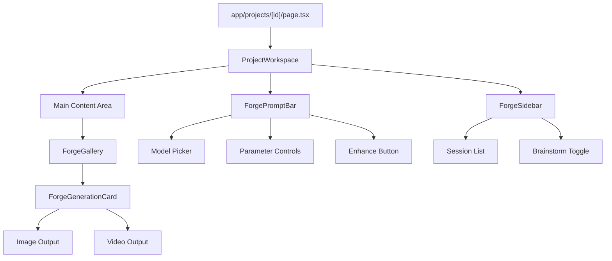

# Sigil Forge UI Rebuild

## Context

The current Sigil session page (`components/generation/`) has 5 components with a messy layout (screenshot 2 confirms). Atlas already has a polished Forge UI for image/video generation. The backend (API routes, model adapters, Supabase realtime, storage, prompt enhancement) is based on Vesper's architecture and must remain stable, but any verified Sigil/Vesper flow discrepancy must be corrected.

## Architecture: What Changes vs What Stays

**REMOVE (UI only):**

- `components/generation/ProjectWorkspace.tsx` -- orchestrator, will be rewritten
- `components/generation/GenerationGallery.tsx` -- replaced by Forge-style gallery
- `components/generation/PromptBar.tsx` -- replaced by ForgePromptBar pattern
- `components/generation/SessionBar.tsx` -- replaced by ForgeSidebar pattern
- `components/generation/BrainstormPanel.tsx` -- replaced by a cleaner side panel

**PRESERVE (default no-change backend boundary):**

- All API routes: `/api/generate/`, `/api/generate/process/`, `/api/generations/`, `/api/sessions/`, `/api/outputs/`, `/api/prompts/enhance/`, `/api/models/`, `/api/projects/`
- All lib code: `lib/models/` (adapters, registry, routing), `lib/supabase/` (client, server, admin, storage, realtime), `lib/cost/`, `lib/auth/`, `lib/prisma.ts`
- Hook: `hooks/useGenerationsRealtime.ts`
- Prisma schema, NavigationFrame, auth components, admin components
- `app/projects/[id]/page.tsx` (route entry point -- will import new workspace component)

**AUDIT/ADJUST IF DISCREPANCY FOUND (Vesper parity lane):**

- `app/api/generate/route.ts`
- `app/api/generate/process/route.ts`
- `app/api/prompts/enhance/route.ts`
- `app/api/generations/`*
- `lib/models/`* (adapters/registry/routing)
- `lib/supabase/realtime.ts` and `lib/supabase/storage.ts`
- `hooks/useGenerationsRealtime.ts`

**CREATE (new, Forge-inspired):**
All new components use **CSS Modules** (`.module.css`) and Thoughtform design tokens from `globals.css`.

## New Component Architecture

## Component Specifications

### 1. `components/generation/ForgeSidebar.tsx` + `.module.css`

- **From Atlas**: Session list with thumbnails, inline rename, create/delete, active highlighting
- **Adapts to Sigil**: Calls `/api/sessions?projectId=X`, POST `/api/sessions`, DELETE `/api/sessions/[id]`
- **Additions**: Project name display (read-only, link back to projects), image/video session type badges, brainstorm panel toggle button
- **Layout**: Fixed left column, ~240px wide, scrollable session list

### 2. `components/generation/ForgeGallery.tsx` + `.module.css`

- **From Atlas**: Grid layout, auto-polling for processing generations, empty state
- **Adapts to Sigil**: Uses `GenerationItem` type from current codebase, calls `/api/generations?sessionId=X`
- **Keeps**: `useGenerationsRealtime` hook for live updates, 10s polling fallback for processing items
- **Layout**: Responsive grid (1-3 columns), scrollable, generation cards with prompt text visible

### 3. `components/generation/ForgeGenerationCard.tsx` + `.module.css`

- **From Atlas**: `ForgeVideoCard` pattern -- corner accents, processing overlay with diamond indicator, hover actions, status display
- **Handles both**: Image outputs (click to lightbox) and video outputs (inline player)
- **Actions**: Reuse params, retry (failed), dismiss, approve/unapprove, delete output, convert image to video
- **Status states**: Processing (pulsing indicator), completed (show outputs), failed (error + retry)

### 4. `components/generation/ForgePromptBar.tsx` + `.module.css`

- **From Atlas**: Bottom-fixed bar, unified container, model picker dropdown, parameter row, generate button
- **Adapts to Sigil**: Calls POST `/api/generate` with Sigil's schema (`sessionId`, `modelId`, `prompt`, `parameters`), calls POST `/api/prompts/enhance` for enhancement
- **Controls row**: Mode toggle (image/video), aspect ratio, resolution, num outputs, duration (video only)
- **Features**: Ctrl+Enter to submit, reference image URL input, enhance button with loading state
- **Model picker**: Fetches from `/api/models`, filtered by current generation type

### 5. `components/generation/ForgeLoadingOverlay.tsx` + `.module.css`

- **From Atlas**: Full-overlay with phase messages, progress indication, cancel option
- **Simplified**: Shown over gallery cards during processing (not full-screen in Sigil context)

### 6. `components/generation/ForgeCostTicker.tsx` + `.module.css`

- **From Atlas**: Small HUD-style cost readout in top-right, expands on hover
- **Adapts**: Reads from `/api/analytics/overview` or a simple cost aggregation endpoint

### 7. `components/generation/BrainstormPanel.tsx` + `.module.css`

- **Carried over from current Sigil** but restyled with CSS Modules and cleaner layout
- **Same API**: `/api/projects/[id]/brainstorm/messages`
- **Triggered from**: Sidebar toggle button, slides in as right panel or floating modal on narrow screens

### 8. `components/generation/ProjectWorkspace.tsx` (rewritten orchestrator)

- **State management**: Sessions, generations, prompt, model selection, parameters -- same state as current but cleaner
- **Layout**: Three-column (sidebar | gallery | brainstorm) with prompt bar fixed at bottom
- **Wiring**: Connects all child components to Sigil's API endpoints, passes callbacks down

## CSS Module Strategy

Each component gets a `.module.css` file using only Thoughtform tokens from `globals.css`:

- Backgrounds: `var(--void)`, `var(--surface-0)`, `var(--surface-1)`, `var(--surface-2)`
- Text: `var(--dawn)` and opacity variants
- Accent: `var(--gold)` and opacity variants
- Borders: `1px solid var(--dawn-08)`, hover `var(--dawn-15)`, active `var(--gold)`
- Typography: `var(--font-mono)` for HUD labels, `var(--font-sans)` for body
- Motion: `var(--duration-fast)` / `var(--ease-out)`
- Zero border-radius everywhere

## Key Backend/Flow Watchpoints

1. **Generation submission**: Current flow is `POST /api/generate` -> creates record -> fire-and-forget to `/api/generate/process`. The new UI must send the same payload shape: `{ sessionId, modelId, prompt, negativePrompt?, parameters: { aspectRatio, resolution, numOutputs, duration, referenceImageUrl? } }`
2. **Prompt enhancement**: `POST /api/prompts/enhance` with `{ prompt, modelId, referenceImageUrl? }` -- returns `{ enhancedPrompt }`. Uses Anthropic Claude with DB-configurable system prompts.
3. **Realtime**: `useGenerationsRealtime` hook subscribes to Supabase broadcast channel `sigil:generations`. This hook is preserved as-is.
4. **Model selection**: `/api/models` returns all registered models. Frontend filters by `type` (image/video) based on active session type.
5. **Session types**: Sessions have a `type` field ("image" or "video"). The mode toggle in the prompt bar filters sessions and models accordingly.

## Vesper Parity Audit (Explicit)

Before final UI cutover, run a targeted parity review against Vesper flow and patch only true discrepancies:

1. **Prompt enhancement parity**: Confirm request shape and fallback behavior match expected production semantics for image vs video prompts.
2. **Model routing parity**: Validate fallback routing and error propagation when provider keys are missing or providers fail.
3. **Processing lifecycle parity**: Confirm state transitions (`processing` -> `processing_locked` -> `completed|failed`) and retry semantics.
4. **Output persistence parity**: Verify upload-to-storage fallback path, output metadata persistence, and media-type handling.
5. **Realtime/polling parity**: Ensure broadcast updates and polling fallback both preserve monotonic generation state.
6. **Stuck/failed handling parity**: Validate remediation path so queued/processing jobs are recoverable and visible.

## API Contract Validation

Create a UI-to-API contract matrix and enforce it in the new orchestrator/components:

- `POST /api/generate`: strict payload mapping for `parameters` values and optional fields.
- `POST /api/prompts/enhance`: strict typing for `modelId`, `prompt`, and optional `referenceImageUrl`.
- `GET /api/generations`: normalize nullable fields and status values for rendering.
- `PATCH/DELETE /api/outputs/[id]`: optimistic UI handling with rollback on failure.
- `POST /api/generations/[id]/retry`: lifecycle and status refresh guarantees.
- `GET/POST/DELETE /api/sessions`: active-session recovery behavior after mutation.

## Regression Matrix (Must Pass)

Happy path:

1. Create image session -> submit image generation -> output renders -> approve/delete works.
2. Create video session -> submit video generation -> video output renders -> replay/download works.
3. Prompt enhance -> enhanced text injected -> generation still succeeds.
4. Reuse params from prior generation -> submit succeeds with expected parameters.
5. Convert image to video pre-fills reference image and submits successfully.

Failure/edge path:

1. Provider failure returns failed status and retry works.
2. Realtime temporarily unavailable falls back to polling without stale UI state.
3. Storage upload fallback path still surfaces provider output URL.
4. Session deletion updates selected session safely and UI does not crash.
5. Unauthorized/access-denied responses show controlled UI error states.

## Clean-Slate Enforcement

After new UI is wired and regression matrix passes:

- Remove old generation components and all dead imports/usages.
- Remove workspace CSS classes no longer referenced by new CSS Modules.
- Remove duplicate utility logic replaced by shared helpers.
- Confirm no old class names remain in `components/generation/`.

## Acceptance Criteria

1. Session page UI is fully rebuilt and visually aligned with Atlas Forge elements (excluding Atlas-specific HUD/rails).
2. All generation workflows (image/video/enhance/retry/realtime) remain stable with no regressions.
3. Any Sigil-Vesper flow discrepancy found during audit is resolved.
4. Legacy UI code is removed to avoid future tech debt.
5. End-to-end manual verification checklist is complete.

## Files to Clean from globals.css

Remove workspace-specific CSS classes that will be replaced by CSS Modules:

- `.workspace-container`, `.workspace-body`, `.workspace-main`
- `.sigil-session-bar`, `.sigil-session-card`
- `.sigil-gallery`, `.sigil-gen-card`, `.sigil-status-badge`
- `.sigil-prompt-bar`

Keep shared utility classes: `.sigil-btn-primary`, `.sigil-btn-ghost`, `.sigil-btn-secondary`, `.sigil-input`, `.sigil-textarea`, `.sigil-select`, `.hud-panel-empty`, dialog classes.