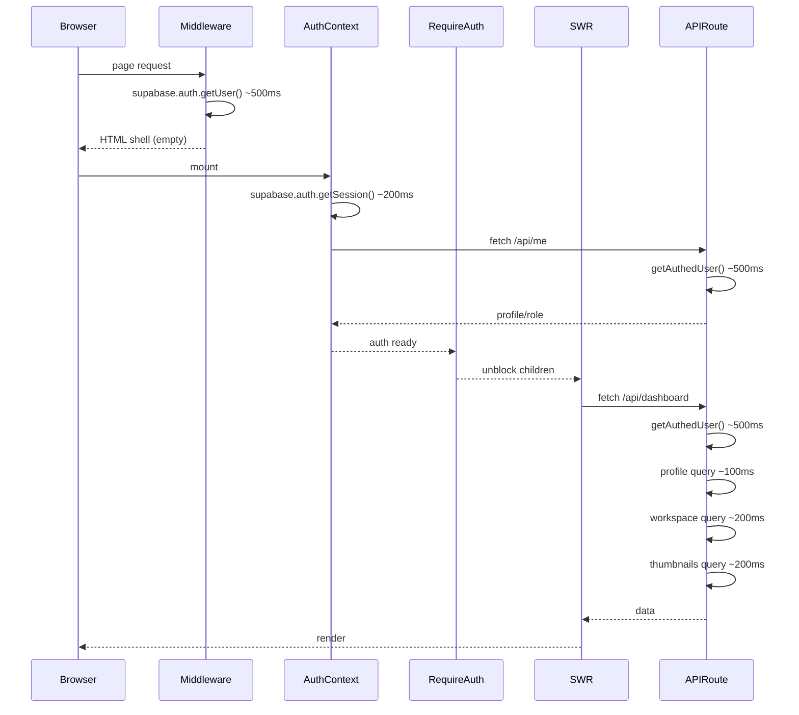

# Sigil Performance Recovery

## Root Cause Analysis

The performance gap between Sigil (30s dashboard) and Vesper (fast) comes from five compounding bottlenecks:

### 1. Client-side data waterfall (biggest contributor)

Every page load follows this chain:




That is 4 serial Supabase auth roundtrips + 4 serial Prisma queries before the user sees anything. On Vercel cold starts, each Supabase `getUser()` can take 500ms+.

**Vesper's fix:** Server component does `Promise.all([project, profile, sessions])` on the server (1 auth call, parallel DB), then hydrates React Query. Client renders with data on first paint.

### 2. Sequential API queries

Every API route follows `auth -> profile -> main query -> thumbnails` in strict sequence. Vesper runs `Promise.all()`.

### 3. No client-side cache persistence

SWR with `dedupingInterval: 10_000` means every navigation back to dashboard refetches after 10 seconds. Vesper uses `staleTime: 5min` / `gcTime: 30min` so cached data survives navigation.

### 4. No code splitting on heavy pages

Dashboard and journeys import all components eagerly. Vesper uses `next/dynamic` with `{ ssr: false }` and skeleton loading for heavy UI.

### 5. No build-time optimizations

Sigil's `next.config.ts` lacks `optimizePackageImports`, WebP/AVIF formats, and node polyfill exclusions.

---

## Phase 1: Server-Side Prefetch + Hydration (highest impact)

Convert dashboard and journeys pages from client-fetch to server-prefetch, passing data as initial props.

### Dashboard

In [app/dashboard/page.tsx](app/dashboard/page.tsx), convert to a server component that calls Prisma directly (same queries as the API route but in parallel), then passes `initialData` to `DashboardView`:

```typescript
export default async function DashboardPage() {
  const user = await getAuthedUser();
  if (!user) redirect("/login");

  const [profile, workspaceProjects] = await Promise.all([
    prisma.profile.findUnique({ where: { id: user.id }, select: { role: true } }),
    prisma.workspaceProject.findMany({ ... }),
  ]);

  const thumbnails = await fetchThumbnailsBatched(workspaceProjects);
  const journeys = assembleJourneys(workspaceProjects, thumbnails);

  return (
    <NavigationFrame title="SIGIL" modeLabel="dashboard" workspaceLayout>
      <DashboardView initialData={{ journeys }} isAdmin={profile?.role === "admin"} />
    </NavigationFrame>
  );
}
```

Then in [components/dashboard/DashboardView.tsx](components/dashboard/DashboardView.tsx), accept `initialData` as `fallbackData` in SWR:

```typescript
const { data } = useSWR("/api/dashboard", dashboardFetcher, {
  fallbackData: initialData,
  revalidateOnFocus: false,
  dedupingInterval: 60_000,
  revalidateOnMount: false,
});
```

This eliminates the entire `middleware auth -> AuthContext -> RequireAuth -> SWR fetch -> API auth` waterfall. The page renders with data immediately.

**Note:** `RequireAuth` is moved inside the server component -- the `getAuthedUser()` call + `redirect("/login")` replaces the client-side auth gate entirely for these pages. The `AuthContext` still mounts for client-side role info and sign-out, but it no longer blocks the first paint.

### Journeys List

Same pattern for [app/journeys/page.tsx](app/journeys/page.tsx) -- convert to server component, fetch journeys server-side, pass as `initialJourneys` prop.

### Journey Detail

Same for [app/journeys/[id]/page.tsx](app/journeys/[id]/page.tsx) -- server-prefetch the journey, its routes, and thumbnails in parallel, pass as initial props.

### Extract shared prefetch helpers

Create [lib/prefetch/dashboard.ts](lib/prefetch/dashboard.ts) and [lib/prefetch/journeys.ts](lib/prefetch/journeys.ts) containing the parallel-fetch logic, reusable by both the server page and the API route (for SWR revalidation).

---

## Phase 2: Parallelize API Route Queries

For the API routes that SWR will still hit for background revalidation:

### [app/api/dashboard/route.ts](app/api/dashboard/route.ts)

Currently sequential: `auth -> profile -> workspaceProjects -> thumbnails`.  
Change to: `auth -> Promise.all([profile, workspaceProjects]) -> thumbnails`.

### [app/api/journeys/route.ts](app/api/journeys/route.ts)

Same pattern -- parallelize profile + workspace query after auth.

### [app/api/journeys/[id]/route.ts](app/api/journeys/[id]/route.ts)

Currently 5 sequential steps: `auth -> profile -> journey -> membership -> thumbnails`.  
Change to: `auth -> Promise.all([profile, journey]) -> membership (only if non-admin) -> thumbnails`.

### [lib/prefetch/workspace.ts](lib/prefetch/workspace.ts)

Currently: `auth -> projectAccessFilter -> project -> Promise.all([sessions, generations])`.  
Change to: `auth -> Promise.all([projectAccessFilter, project metadata]) -> Promise.all([sessions, generations])`.

Actually, `projectAccessFilter` returns a `where` clause used by the project query, so they can't fully parallelize. But the profile lookup that determines admin status can be folded into the auth step or parallelized with the project query.

---

## Phase 3: SWR Caching Improvements

In [components/dashboard/DashboardView.tsx](components/dashboard/DashboardView.tsx) and all SWR hooks:

- Increase `dedupingInterval` from `10_000` to `60_000` (1 minute) for dashboard data
- Add `revalidateOnMount: false` when `fallbackData` is provided (server data is fresh)
- Add `revalidateIfStale: false` for the first 60 seconds

This matches Vesper's `staleTime: 5min` / `refetchOnMount: false` pattern.

---

## Phase 4: Dynamic Imports for Heavy Components

In [components/dashboard/DashboardView.tsx](components/dashboard/DashboardView.tsx):

- Dynamic-import `RouteCardsPanel` (likely the heaviest sub-component with thumbnails)
- Dynamic-import admin stats panel

In [components/generation/ProjectWorkspace.tsx](components/generation/ProjectWorkspace.tsx):

- Already has some dynamic imports for `BrainstormPanel`, `ConvertToVideoModal`, `CanvasWorkspace`
- Verify these are working correctly

In journeys pages:

- Dynamic-import the journey detail panels with skeleton loading

---

## Phase 5: Build and Config Optimizations

In [next.config.ts](next.config.ts):

```typescript
const nextConfig: NextConfig = {
  images: {
    remotePatterns: [ /* existing */ ],
    formats: ['image/webp', 'image/avif'],
  },
  experimental: {
    optimizePackageImports: ['lucide-react'],
  },
  webpack: (config, { isServer }) => {
    if (!isServer) {
      config.resolve.fallback = {
        net: false, tls: false, fs: false, dns: false,
        child_process: false, canvas: false,
      };
    }
    return config;
  },
};
```

This is identical to Vesper's config and reduces bundle size (especially lucide-react icon tree-shaking).

---

## Phase 6: Route Layout Streaming (optional, high-effort)

The [app/routes/[id]/layout.tsx](app/routes/[id]/layout.tsx) currently blocks with `await prefetchWorkspaceData(id)`. This could be converted to use React Suspense streaming so the layout shell renders immediately while data loads. However, this is a bigger change and should only be done if Phases 1-5 don't achieve acceptable load times.

---

## Expected Impact


| Phase                      | Estimated improvement         | Effort |
| -------------------------- | ----------------------------- | ------ |
| Phase 1 (server prefetch)  | -15-20s on dashboard/journeys | Medium |
| Phase 2 (parallel queries) | -2-5s on all API responses    | Low    |
| Phase 3 (SWR caching)      | Instant on repeat navigation  | Low    |
| Phase 4 (dynamic imports)  | -1-2s first paint             | Low    |
| Phase 5 (build config)     | -0.5-1s bundle parse          | Low    |
| Phase 6 (streaming)        | -3-5s on route pages          | High   |


Phase 1 alone should cut dashboard load from 30s to under 5s by eliminating the 4-hop auth waterfall and converting sequential client fetches into a single parallel server fetch.

---

## Relationship to Existing Hardening Plan

This plan is **complementary** to the [sigil-targeted-hardening plan](sigil-targeted-hardening_701d637c.plan.md). The hardening plan focuses on cache scope correctness, auth stability, and security. This plan focuses on load-time performance. They can be executed in either order, but the cache header fixes from the hardening plan (changing `public` to `private` for authenticated endpoints) should be coordinated with Phase 3 here.