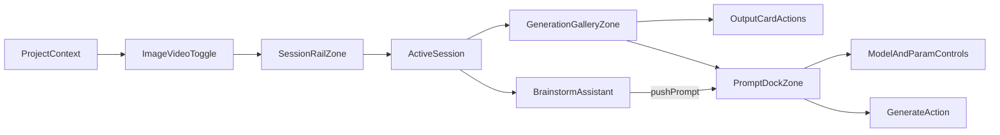

# Sigil Vesper UX Transfer Plan

> **Note:** This plan file currently lives in the Vesper repo for authoring convenience. On execution, it will be moved to the Sigil repo at `C:/Users/buyss/Dropbox/03_Thoughtform/08_Artifacts/05_sigil.thoughtform/.cursor/plans/`.

## Outcome

Deliver a reusable, brand-agnostic UX blueprint for the Vesper project/session workspace, then implement it in Sigil using shadcn/ui + Tailwind as the component foundation, dressed in Sigil's Thoughtform brand tokens and HUD primitives.

## Source Architecture (What we are transferring)

- Vesper workspace orchestration and fixed-region composition in [ProjectClientShell.tsx](C:/Users/buyss/Dropbox/03_Thoughtform/08_Artifacts/07_vesper.loop/Loop-Vesper/src/app/projects/[id]/ProjectClientShell.tsx).
- Generation canvas + prompt dock + control rail behavior in [GenerationInterface.tsx](C:/Users/buyss/Dropbox/03_Thoughtform/08_Artifacts/07_vesper.loop/Loop-Vesper/src/components/generation/GenerationInterface.tsx).
- Session navigation behavior and thumbnail affordances in [FloatingSessionBar.tsx](C:/Users/buyss/Dropbox/03_Thoughtform/08_Artifacts/07_vesper.loop/Loop-Vesper/src/components/sessions/FloatingSessionBar.tsx).

## Sigil Target Architecture (Where it lands)

- Main workspace shell and session/generation composition in [ProjectWorkspace.tsx](C:/Users/buyss/Dropbox/03_Thoughtform/08_Artifacts/05_sigil.thoughtform/components/generation/ProjectWorkspace.tsx).
- Prompt dock controls and model/parameter UX in [PromptBar.tsx](C:/Users/buyss/Dropbox/03_Thoughtform/08_Artifacts/05_sigil.thoughtform/components/generation/PromptBar.tsx).
- Project creation entrypoint in [ProjectsView.tsx](C:/Users/buyss/Dropbox/03_Thoughtform/08_Artifacts/05_sigil.thoughtform/components/projects/ProjectsView.tsx).
- Existing token/hud primitives in [globals.css](C:/Users/buyss/Dropbox/03_Thoughtform/08_Artifacts/05_sigil.thoughtform/app/globals.css).

## UX Brief to Produce in Sigil Repo

- Create a design-brief document at [docs/ux/vesper-session-project-brief.md](C:/Users/buyss/Dropbox/03_Thoughtform/08_Artifacts/05_sigil.thoughtform/docs/ux/vesper-session-project-brief.md).
- Include:
  - **IA and flow**: Project -> Session -> Generation -> Output lifecycle.
  - **Layout zones**: left session rail, center gallery, bottom prompt dock, optional right assistant panel.
  - **Positioning rules**: one primary nav layer per context, capped fixed elements, explicit z-index hierarchy.
  - **Image/video mode switching**: generation type toggle filters sessions and swaps compatible model sets; last-active-session-per-type memory on tab switch.
  - **Output-level interactions**: per-card actions (approve/reject, delete, reuse parameters, convert image-to-video), status indicators (processing/complete/failed/dismissed), and action affordance positioning.
  - **Brainstorm assistant flow**: right-panel assistant can push prompts directly into the generation input; docked on desktop, floating overlay on mobile.
  - **Interaction states**: create/switch/rename/delete sessions, generate/retry/reuse outputs, loading/empty/error states.
  - **Responsive behavior**: desktop three-zone, tablet two-zone, mobile stacked/bottom-sheet behavior.
  - **Realtime guidance**: recommend Supabase realtime subscriptions for generation status (replace 5s polling) with optimistic UI updates.
  - **Navigation Grammar mapping**: explicit table mapping each zone to Thoughtform primitives (viewport frame, heading indicator, data readouts, etc.).
  - **Token translation guidance**: preserve structure/spacing hierarchy; swap visual tokens only.

## Implementation Workstreams

1. **Document-first translation**
  - Author canonical component-positioning spec and user flow diagrams in the new brief file.
  - Include Navigation Grammar primitive-to-zone mapping table.
  - Add before/after screenshots references and acceptance checklist.
2. **Layout normalization in Sigil workspace**
  - Refactor [ProjectWorkspace.tsx](C:/Users/buyss/Dropbox/03_Thoughtform/08_Artifacts/05_sigil.thoughtform/components/generation/ProjectWorkspace.tsx) into explicit zones with stable container widths.
  - Keep session rail and prompt dock behavior deterministic across breakpoints.
3. **Image/video mode switching**
  - Add generation type toggle (image/video) to workspace that filters the session rail and swaps compatible model sets.
  - Remember last-active-session per type so switching back is instant.
  - Source pattern: Vesper `generationType` state + `handleGenerationTypeChange` in ProjectClientShell.
4. **Gallery output-level UX**
  - Implement per-card action bar: reuse parameters, rerun, convert-to-video (creates/switches to video session with image as reference).
  - Status badges (processing, complete, failed, dismissed) with retry and dismiss affordances.
  - Source pattern: `handleReuseParameters`, `handleRerunGeneration`, `handleConvertToVideo`, `handleDismissGeneration` in GenerationInterface.
5. **Prompt dock and controls alignment**
  - Update [PromptBar.tsx](C:/Users/buyss/Dropbox/03_Thoughtform/08_Artifacts/05_sigil.thoughtform/components/generation/PromptBar.tsx) to match briefed control grouping (model + generation parameters + prompt + actions).
  - Ensure active/selection patterns use directional indicators, not ambiguous fills.
6. **Brainstorm assistant-to-prompt flow**
  - Wire right-panel brainstorm chat to push prompts into the generation input via callback (`onSendPrompt` -> `externalPrompt` state).
  - Desktop: docked right panel. Mobile: floating overlay.
  - Source pattern: `BrainstormChatWidget` variants (docked/floating) in ProjectClientShell.
7. **Realtime generation status**
  - Replace 5-second polling in Sigil's `ProjectWorkspace` with Supabase realtime channel subscriptions.
  - Add optimistic UI for new generations (temp ID -> real ID swap on confirmation).
  - Source pattern: `useGenerationsRealtime` hook + optimistic mutation in Vesper.
8. **Project/session creation UX coherence**
  - Extend [ProjectsView.tsx](C:/Users/buyss/Dropbox/03_Thoughtform/08_Artifacts/05_sigil.thoughtform/components/projects/ProjectsView.tsx) and session creation entry points to align naming and onboarding flow with brief rules.
9. **Token-safe styling pass**
  - Adjust/add only structural classes in [globals.css](C:/Users/buyss/Dropbox/03_Thoughtform/08_Artifacts/05_sigil.thoughtform/app/globals.css) for spacing/layout/density consistency.
  - Keep brand substitution isolated to tokens so Sigil/Thoughtform variants can swap cleanly.
10. **Validation and rollout**
  - Add a QA checklist to the brief and verify all states in desktop/tablet/mobile.
    - Capture final UI snapshots for handoff to designer and implementation team.

## Structural Diagram

## Navigation Grammar Zone Mapping

- **Viewport Frame** (corner brackets) -- outer workspace shell; 4 corners of the full-screen project view
- **Heading Indicator** (gold left-border / underline) -- active session in session rail; active generation type toggle
- **Data Readouts** (mono, uppercase, 9px) -- session metadata (name, creator), generation status badges, model/parameter display
- **Course Lines** (1px dawn-08 borders) -- zone separators between session rail and gallery, gallery and prompt dock, prompt dock internal dividers
- **Depth Layers** -- void (gallery background), surface-0 (session rail, prompt dock), surface-1 (brainstorm panel, dropdowns), surface-2 (modals/dialogs)
- **Signal Strength** (dawn opacity scale) -- primary text (dawn), secondary labels (dawn-70), metadata (dawn-30), borders (dawn-08)
- **Waypoints** (gold diamonds) -- session thumbnails active indicator, new-items scroll indicator, generation status dots
- **Bearing Labels** (01, 02, 03) -- session numbering in rail, generation sequence markers
- **Telemetry Rails** -- optional: edge tick marks along session rail for session count orientation
- **Compass Anchor** -- empty state: centered diamond or brandmark when no generations exist

## Component Technology Boundary

The implementation uses **shadcn/ui + Tailwind utility classes** as the component and styling foundation -- same as Vesper. However, these must be dressed in Thoughtform brand overrides:

**Use freely:**

- shadcn/ui primitives (Dialog, Button, Select, Textarea, etc.) as structural components
- Tailwind utility classes for layout, spacing, flexbox, grid, responsive breakpoints
- Sigil's existing `.sigil-`* class extensions (`.sigil-btn-primary`, `.sigil-input`, `.sigil-textarea`, `.sigil-select`, etc.)
- Thoughtform/Sigil CSS custom properties (`--gold`, `--dawn-`*, `--surface-`*, `--void`, `--font-mono`, etc.)

**Never port from Vesper:**

- `border-radius` / `rounded-`* classes -- Sigil enforces `border-radius: 0 !important` globally; use corner brackets or chamfers for shape language
- `backdrop-blur-`* effects -- Sigil uses opaque surfaces with depth layers, not frosted glass
- Generic shadcn theme tokens (`bg-background`, `text-muted-foreground`, `bg-card/95`) -- replace with Sigil token equivalents (`var(--void)`, `var(--dawn-70)`, `var(--surface-0)`)
- `rounded-full` indicators / pills -- use diamonds (45deg rotated squares) per Thoughtform shape law
- `animate-bounce` and spring-like motion -- use mechanical 80-150ms transitions with `var(--ease-out)`

**Rule of thumb:** if a Vesper component uses `rounded-2xl backdrop-blur-xl bg-card/95`, the Sigil equivalent is `border border-[var(--dawn-08)] bg-[var(--surface-0)]` with optional corner brackets.

## Critical Rules from Analysis

- Reduce competing fixed anchors seen in Vesper by enforcing one global nav anchor + one context anchor per viewport.
- Keep gallery width content-driven; avoid arbitrary mixed max-width systems.
- Retain optimistic session/generation UX patterns, but simplify visual complexity by strict zone ownership.
- Preserve Project -> Session -> Generation mental model exactly; only brand expression changes.

## Acceptance Criteria

- Designer can read one brief and reconstruct full layout/interaction behavior without code spelunking.
- Sigil workspace implements identical UX geometry with Sigil token styling.
- No overlap collisions between nav/session/prompt regions at target breakpoints.
- Project/session/generation flows are consistent across creation, switching, empty, loading, and error states.
- Image/video toggle filters sessions correctly and remembers last-active per type.
- Output cards expose reuse, rerun, and convert-to-video actions consistently.
- Brainstorm assistant can push prompts into generation input on both desktop (docked) and mobile (floating).
- Generation status updates via realtime subscriptions (no visible 5s polling lag).
- Every zone maps to at least one Navigation Grammar primitive per the mapping table above.

