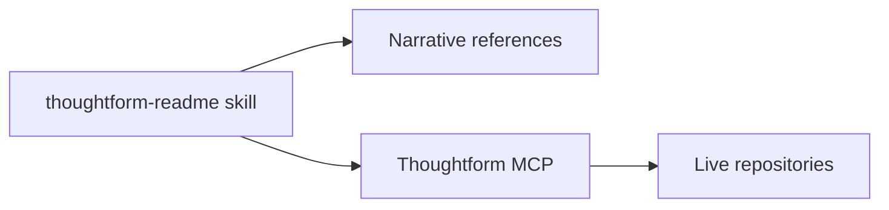

# Thoughtform README Skill

## Why The Plan Needs Updating

The first plan correctly targeted narrative quality, but it under-specified four critical requirements from your latest brief:

- Audience translation for designers and PMs (not only developers)
- Explicit authenticity stance (no pretending to be a senior engineer/designer)
- Repo-by-repo philosophy mapping as a first-class output
- Operational credibility (security/scalability posture, including Sentinel discipline)

This revision keeps the original direction and adds structure to make those constraints enforceable.

## Critical Nuance To Encode

Your documentation must carry a precise identity arc:

- 2022 origin: Midjourney unlocked visual expression that had been blocked for years by fine-motor limitations
- Core drive: storytelling, worldbuilding, and meaning-making before software status
- Cultural tension: AI can liberate creativity, but unchecked usage creates slop and semantic collapse
- Human counterweight: taste, direction, and guidance are non-negotiable
- Professional evolution: from using AI for creative output to using design/product thinking to build tools
- Positioning truth: Creative Technologist operating across production, workshops, L&D, and change management
- North star: build interfaces and practices that help people navigate intelligence rather than command software

This should read as a working philosophy and operating model, not a personal mythology or sales pitch.

## Skill vs MCP Decision

Recommendation: **do not replace the Thoughtform MCP**. Use a hybrid architecture with clear responsibility boundaries.

- **Skill owns narrative truth**: philosophy, identity framing, repo constellation map, writing standards, and README generation workflow
- **MCP owns operational truth**: live repo trees, current files, design tokens, component registries, and repo-specific retrieval
- **Skill calls MCP when needed**: to fetch up-to-date technical facts before drafting documentation
- **Single source of truth model**: the skill references become the canonical narrative lens; MCP remains the canonical systems interface




## Updated Objective

Build a personal Cursor skill at `~/.cursor/skills/thoughtform-readme/` that produces documentation which is:

- Philosophically aligned with Thoughtform ("navigate intelligence" over "command software")
- Tangible for product/design/software audiences
- Honest about your builder identity (intuitive generalist, systems thinker)
- Credible on engineering rigor (security, reliability, scalability as tractable systems work)
- Explicitly non-performative (no pretending to be a senior developer or polished design executive)
- Demonstrably useful to future employers by showing philosophy + strategy + practical building in one artifact

## Source Material To Ground The Skill

The skill must explicitly draw from:

- Thoughtform philosophy and cardinal model: [c:\Users\buyss\Dropbox\03_Thoughtform\02_Groundtruth\00 - Thoughtform System Prompt (2026301).md](c:\Users\buyss\Dropbox\03_Thoughtform\02_Groundtruth\00 - Thoughtform System Prompt (2026301).md)
- Narrative journey and professional through-line: [c:\Users\buyss\Dropbox\03_Thoughtform\02_Groundtruth\04 - About Vincent Buyssens.md](c:\Users\buyss\Dropbox\03_Thoughtform\02_Groundtruth\04 - About Vincent Buyssens.md)
- Intuitive-yet-concrete interface thinking: [c:\Users\buyss\Dropbox\03_Thoughtform\03_Canon\01_Articles\Silicon Jungle - AI Interfaces-compressed_2.pdf](c:\Users\buyss\Dropbox\03_Thoughtform\03_Canon\01_Articles\Silicon Jungle - AI Interfaces-compressed_2.pdf)
- Design/development role convergence: [c:\Users\buyss\Dropbox\03_Thoughtform\03_Canon\06_Videos & Podcast\Ryo Lu (Cursor) AI Turns Designers into Developers.md](c:\Users\buyss\Dropbox\03_Thoughtform\03_Canon\06_Videos & Podcast\Ryo Lu (Cursor) AI Turns Designers into Developers.md)
- Personal authorship in AI systems: [c:\Users\buyss\Dropbox\03_Thoughtform\03_Canon\01_Articles\Github Next - Mosaic.txt](c:\Users\buyss\Dropbox\03_Thoughtform\03_Canon\01_Articles\Github Next - Mosaic.txt)
- Skill construction best practices: [c:\Users\buyss\Dropbox\03_Thoughtform\03_Canon\01_Articles\The-Complete-Guide-to-Building-Skill-for-Claude.pdf](c:\Users\buyss\Dropbox\03_Thoughtform\03_Canon\01_Articles\The-Complete-Guide-to-Building-Skill-for-Claude.pdf)
- Engineering safeguards and reliability loop: [c:\Users\buyss\Manifold Delta\Artifacts\03_atlas.thoughtformsentinel.md](c:\Users\buyss\Manifold Delta\Artifacts\03_atlas.thoughtformsentinel.md)

## Updated Skill Structure

```
~/.cursor/skills/thoughtform-readme/
  SKILL.md
  references/
    identity-spine.md
    repo-constellation.md
    readme-anatomy.md
    voice-calibration.md
    skill-mcp-contract.md
    quality-rubric.md
```

## SKILL.md Revisions

### Frontmatter Improvements

Description should include both WHAT and WHEN with trigger phrases such as README rewrite, portfolio docs, repo positioning, project narrative, and hiring/client-facing documentation.

### New Required Sections In SKILL.md

1. Philosophy alignment rules (Thoughtform loop + cardinals)
2. Audience lenses:
  - Designer lens: interaction model, aesthetics, component logic
  - PM lens: use case, decision velocity, workflow outcomes
  - Technical lens: architecture, risk controls, extensibility
3. Authenticity guardrails:
  - Never claim expert credentials the user did not claim
  - Position as intuitive generalist with strong taste and system transfer
  - Distinguish shipped behavior from aspirational roadmap
4. Credibility guardrails:
  - Include security/reliability paragraph when appropriate
  - Mention safeguards (e.g., Sentinel-style feedback loops) without fake guarantees
5. README generation workflow:
  - Repo discovery
  - Existing README audit
  - Constellation mapping
  - Draft generation
  - Rubric-based self-check
6. Positioning doctrine:
  - Primary identity framing: Creative Technologist
  - Secondary capability framing: AI product navigator, workshop/L&D strategist, change management practitioner
  - Explicitly avoid title inflation and "senior developer" implication unless user asks
7. Tone constraints:
  - No sales copy, no hype language, no inflated claims
  - Aspirational language must always anchor to shipped examples or explicit experiments

## Reference File Requirements

### `references/identity-spine.md`

Capture the narrative spine used across all README outputs:

- Creative Technologist origin story and constraints-to-capability transformation
- 2022 Midjourney inflection and why this mattered personally and professionally
- Anti-slop stance: why human taste and navigation are central
- LLM shift: from generation novelty to collaboration and navigation practice
- Professional polarity shift: creative production -> tool and system building
- Starhaven as north-star context for the broader creative industry mission
- Social-technical through-line: community mobilization, culture translation, and change navigation as pre-AI foundations
- Loop-era expansion: from workshops to productized internal tools and software-for-few policy thinking
- Clear statement that this is not developer-title performance, but systems-level creative practice

### `references/repo-constellation.md`

For each repo, include:

- One-line purpose
- Primary "navigation domain"
- Origin pressure (what problem forced it into existence)
- What it inherits from prior repos
- What it contributes to the next repo
- Who benefits (client, internal operator, workshop participant, etc.)
- Practical proof points (what shipped, what changed behavior, what was learned)

Repos to cover:

- [c:\Users\buyss\Manifold Delta\Artifacts\02_astrolabe.thoughtform](c:\Users\buyss\Manifold Delta\Artifacts\02_astrolabe.thoughtform)
- [c:\Users\buyss\Manifold Delta\Artifacts\03_atlas.thoughtform](c:\Users\buyss\Manifold Delta\Artifacts\03_atlas.thoughtform)
- [c:\Users\buyss\Manifold Delta\Artifacts\01_thoughtform](c:\Users\buyss\Manifold Delta\Artifacts\01_thoughtform)
- [c:\Users\buyss\Manifold Delta\Artifacts\05_sigil.thoughtform](c:\Users\buyss\Manifold Delta\Artifacts\05_sigil.thoughtform)
- [c:\Users\buyss\Manifold Delta\Artifacts\07_vesper.loop\Loop-Vesper](c:\Users\buyss\Manifold Delta\Artifacts\07_vesper.loop\Loop-Vesper)
- [c:\Users\buyss\Manifold Delta\Artifacts\10_Babylon](c:\Users\buyss\Manifold Delta\Artifacts\10_Babylon)
- [c:\Users\buyss\Manifold Delta\Artifacts\11_Heimdall](c:\Users\buyss\Manifold Delta\Artifacts\11_Heimdall)

### `references/readme-anatomy.md`

Define a consistent README structure with this order:

1. Title and positioning line
2. Why this exists
3. What this enables
4. Navigation surfaces (concrete capabilities)
5. Role in the Thoughtform constellation
6. Architecture and implementation notes
7. Security/reliability/scalability posture
8. Getting started
9. Current frontier (roadmap)

### `references/voice-calibration.md`

Calibrate writing style to be:

- Aspirational but specific
- Vision-forward but grounded in shipped artifacts
- Clear enough for design and product readers
- Strictly anti-slop and anti-hype

Include examples of strong and weak phrasing.

Must include:

- "No sales pitch" patterns and replacements
- "Do not pretend expertise" patterns and replacements
- "Aspirational but tangible" sentence structures for portfolio audiences
- "No self-mythologizing" patterns and replacements (ground big claims in concrete work, constraints, and outcomes)

### `references/skill-mcp-contract.md`

Define how the skill and MCP collaborate without conflict:

- What is canonical in skill references (identity, philosophy, tone, repo narrative roles)
- What is canonical in MCP/live repos (current structure, components, code facts, runtime state)
- Required pre-draft fact checks via MCP before final README output
- Update protocol when repo reality diverges from narrative framing

### `references/quality-rubric.md`

Add scoring checks before final output:

- Philosophy fit
- Audience clarity (designer, PM, technical)
- Authenticity and non-overclaiming
- Concrete evidence and implementation detail
- Constellation coherence
- Practical onboarding quality

## Use Cases To Encode (From The Skill Guide)

1. Generate a new README from scratch for a repo in the brand world
2. Rewrite an existing technical README into a narrative + technical hybrid
3. Generate a repo profile document that explains role, lineage, and philosophy fit
4. Update constellation registry entries when a repo evolves (so the skill stays current as single-source narrative context)

Each use case should include:

- Trigger phrases
- Required inputs
- Output shape
- Common failure modes

## Success Criteria

The skill is considered ready when:

- It triggers reliably on README/documentation narrative prompts
- Outputs do not overstate credentials or capabilities
- Outputs are useful to designers/PMs and still actionable for builders
- Every README explicitly maps the repo into the wider constellation
- Security/scalability concerns are addressed as active practice, not ignored
- The Creative Technologist arc is recognizable without reading as self-promotion
- The skill and MCP boundaries are explicit and consistently followed

## Key Implementation Decisions

- Keep the skill personal (`~/.cursor/skills/`) so it works across repos
- Keep the MCP; do not replace it. Use it for live repo/system retrieval while the skill owns narrative and writing doctrine
- Use progressive disclosure so SKILL.md stays lean and references carry depth
- Make repo constellation mapping mandatory, not optional
- Add explicit anti-patterns for AI hype and generic developer boilerplate
- Treat this as a documentation system skill, not just a README formatter

