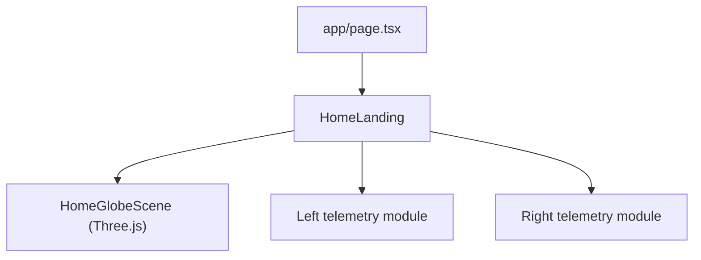

# Three.js Home Globe

## Direction

Use **raw Three.js** for the new Home centerpiece rather than `@react-three/fiber`.

Why:

- the current codebase already uses custom canvas/render loops instead of a 3D React abstraction
- there is no existing Three.js stack in [package.json](package.json)
- the visual can stay self-contained in one or two focused components without introducing a broader scene framework

## Visual Model

- **Centerpiece**: a hero-sized celestial wireframe globe
- **Grammar**: navigation instrument, not VFX spectacle
- **Panels**: light left/right telemetry modules, not full operational dashboards yet

The globe should read as:

- a latitude/longitude sphere
- slow axial rotation
- soft breathing pulse
- faint orbital ring(s)
- depth-based alpha and glow so it feels dimensional
- gold-on-void with dawn-muted structural lines

## Files To Change

- [package.json](package.json)
- [app/page.tsx](app/page.tsx)
- [components/home/HomeLanding.tsx](components/home/HomeLanding.tsx)
- likely new files under [components/home](components/home)

## Proposed Component Split

- Keep [components/home/HomeLanding.tsx](components/home/HomeLanding.tsx) as the page composition shell
- Extract the 3D scene into a dedicated component, for example:
  - [components/home/HomeGlobeScene.tsx](components/home/HomeGlobeScene.tsx)
- Keep left/right telemetry in `HomeLanding`, but upgrade them into light module cards/readouts that frame the globe

## Globe Implementation

- Add `three` as a dependency
- Build the scene with:
  - `Scene`
  - `PerspectiveCamera`
  - `WebGLRenderer`
  - grouped line/ring meshes for latitude/longitude structure
  - optional point cloud / waypoint nodes layered on top
- Use a deterministic globe generator instead of random particles:
  - meridians as circular line loops
  - parallels as horizontal rings
  - optional sparse point markers on intersections
- Animate only:
  - slow Y rotation
  - slight tilt drift
  - subtle scale/breathing pulse
- Keep performance modest:
  - single renderer
  - one scene
  - no postprocessing on first pass
  - DPR-aware sizing

## Side Module Design

- Replace the current plain text stacks in [components/home/HomeLanding.tsx](components/home/HomeLanding.tsx) with light modules that still feel restrained:
  - mono bearing label
  - 1–3 compact readouts each
  - thin course lines / subtle frame treatment
- Suggested content for now:
  - left: `SIGIL`, version, status, active mode
  - right: `THOUGHTFORM`, `NAVIGATE INTELLIGENCE`, a small admin/system summary
- Admin-only fields can be conditionally shown, but the overall composition remains visible to non-admins

## Motion / Aesthetic Rules

- no bounce, no spectacle overload
- motion should feel mechanical and observatory-like
- the globe dominates the page visually, roughly 50–60% viewport height
- side modules should support the globe, not compete with it
- keep everything token-driven and consistent with the existing HUD shell

## Validation

- Home still works in light and dark themes
- globe remains centered and scales cleanly on large and medium screens
- side modules never overlap the globe on narrower widths
- scene teardown is clean on unmount
- no major frame drops on a typical laptop

