# Tone-Driven README Rollout

## Scope Confirmed

- Update skill first (tone calibration + anti-slop constraints), then rewrite READMEs.
- Target repos only:
  - [c:\Users\buyss\Manifold Delta\Artifacts\01_thoughtform\README.md](c:\Users\buyss\Manifold Delta\Artifacts\01_thoughtform\README.md)
  - [c:\Users\buyss\Manifold Delta\Artifacts\02_astrolabe.thoughtform\README.md](c:\Users\buyss\Manifold Delta\Artifacts\02_astrolabe.thoughtform\README.md)
  - [c:\Users\buyss\Manifold Delta\Artifacts\03_atlas.thoughtform\README.md](c:\Users\buyss\Manifold Delta\Artifacts\03_atlas.thoughtform\README.md)
  - [c:\Users\buyss\Manifold Delta\Artifacts\05_sigil.thoughtform\README.md](c:\Users\buyss\Manifold Delta\Artifacts\05_sigil.thoughtform\README.md)
- Exclude Loop repos (Vesper/Babylon/Heimdall) from README rewrites in this pass.
- Git workflow selected: commit + push directly to `main` in each corresponding repo.

## Observed Gaps (Current State)

- Current READMEs are strong on technical setup but mostly architecture-first and product-doc style.
- Thoughtform/Sigil need stronger origin narrative and explicit shipped-vs-frontier separation.
- Astrolabe/Atlas are conceptually rich but too long and uneven in voice; they need tighter scanability and fewer generic/boilerplate patterns.
- Across repos, preserve practical setup and architecture sections, but move them below narrative framing.

## Execution Strategy

```mermaid
flowchart LR
  toneInputs["Tone Sources"] --> skillUpdate["Update thoughtform-readme skill"]
  skillUpdate --> repo1["Rewrite thoughtform README"]
  repo1 --> push1["Commit and push thoughtform"]
  push1 --> repo2["Rewrite Astrolabe README"]
  repo2 --> push2["Commit and push Astrolabe"]
  push2 --> repo3["Rewrite atlas README"]
  repo3 --> push3["Commit and push atlas"]
  push3 --> repo4["Rewrite sigil README"]
  repo4 --> push4["Commit and push sigil"]
```

## Step-by-Step Plan

1. **Calibrate and update skill tone layer**
  - Update:
    - [C:\Users\buysscursor\skills\thoughtform-readme\SKILL.md](C:\Users\buyss.cursor\skills\thoughtform-readme\SKILL.md)
    - [C:\Users\buysscursor\skills\thoughtform-readme\references\voice-calibration.md](C:\Users\buyss.cursor\skills\thoughtform-readme\references\voice-calibration.md)
    - [C:\Users\buysscursor\skills\thoughtform-readme\references\quality-rubric.md](C:\Users\buyss.cursor\skills\thoughtform-readme\references\quality-rubric.md)
  - Add explicit tone markers from your prose:
    - direct but nuanced argumentation
    - tension framing (opportunity vs risk)
    - concrete constraints before claims
    - no emoji, no hype adjectives, no AI-generic filler
    - "not X, but Y" contrast patterns when useful
2. **Repo 1: rewrite Thoughtform README**
  - Keep stack/dev/env/project structure accuracy.
  - Reorder into: why this exists -> what this enables -> navigation surfaces -> constellation role -> architecture -> reliability posture -> setup -> frontier.
  - Align with public Thoughtform language from [https://thoughtform.vercel.app/](https://thoughtform.vercel.app/).
  - Commit and push to `https://github.com/thoughtform-co/thoughtform.git` (`main`).
3. **Repo 2: rewrite Astrolabe README**
  - Keep critical technical sections: migrations, ingestion/navigation queues, observability, API routes, troubleshooting.
  - Reduce verbosity while preserving unique positioning.
  - Remove checklist/boilerplate patterns that read like generated docs.
  - Commit and push to `https://github.com/thoughtform-co/Astrolabe.git` (`main`).
4. **Repo 3: rewrite Atlas README**
  - Preserve key concepts + Supabase setup + architecture principles.
  - Strengthen practical proof points and shipped outcomes.
  - Remove generic deployment/template language and symbol-heavy roadmap styling.
  - Commit and push to `https://github.com/thoughtform-co/atlas.git` (`main`).
5. **Repo 4: rewrite Sigil README**
  - Preserve dual-mode journey model, data hierarchy, environment variables, scripts, and design-system specifics.
  - Add stronger origin narrative and practical impact framing for workshops/L&D + creation.
  - Commit and push to `https://github.com/thoughtform-co/sigil.git` (`main`).
6. **Per-repo quality gate before push**
  - Run docs-only checks:
    - tone pass (no emoji/slop/hype)
    - factual pass against repo structure and env vars
    - identity pass (Creative Technologist positioning, no developer-title inflation)
  - Use commit messages that clearly indicate README narrative update.
7. **Final report back**
  - Provide per-repo summary of what changed and the pushed commit SHA for each repo.

## Default Conventions During Execution

- One focused README commit per repo.
- Direct push to `main` (as selected).
- Keep technical commands and setup snippets intact unless incorrect.
- Keep prose in English while preserving your personal tone patterns and avoiding AI-style generic writing.

