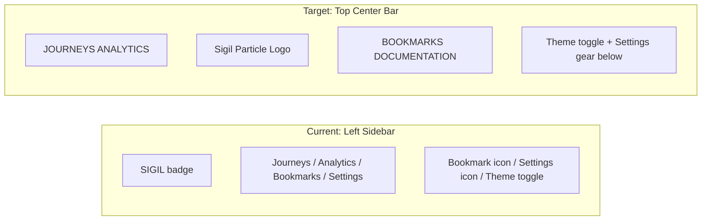

# Top Navigation Bar Redesign

## Current vs Target Layout




**Visual layout of the new top bar:**

```
 [left rail]  JOURNEYS   ANALYTICS   ---[ SIGIL LOGO ]---   BOOKMARKS   DOCUMENTATION  [theme] [right rail]
                                                                                        [gear]
```

## Files to Change

### 1. NavigationFrame rewrite ([components/hud/NavigationFrame.tsx](components/hud/NavigationFrame.tsx))

This is the main change. The left `<nav>` sidebar (lines 322-461) and the top-right icon area (lines 463-508) are replaced with a single centered top bar.

**New top bar structure:**

- Fixed position at top, horizontally centered between left and right rails
- `display: flex; align-items: center; justify-content: center`
- Left group: `JOURNEYS` | `ANALYTICS` -- same mono/uppercase styling, gold when active, `var(--dawn-40)` otherwise
- Center: New `SigilParticleLogo` component (see below)
- Right group: `BOOKMARKS` | `DOCUMENTATION`
- Far right (outside the centered bar, in the current top-right position): Theme toggle stays; settings gear moves below it, wrapped in admin check via `useAuth().isAdmin`

**Remove:**

- The `SIDEBAR_ITEMS` array and the left panel rendering (lines 31-36, 321-461)
- The `showNavPanel`, `navSize`, `navCollapsed`, `toggleNav` logic -- no longer needed since the bar is always visible
- The bookmarks `ParticleIcon` link -- bookmarks is now a text link in the top bar
- The `bookmarkPixels()` function (lines 61-75) -- no longer used

**Keep:**

- `ParticleIcon`, `settingsPixels()`, `themePixels()` -- still used for top-right icons
- Left/right tick rails -- unchanged
- Corner brackets -- unchanged
- Theme toggle logic -- unchanged

**New nav items:**

```typescript
const LEFT_NAV = [
  { href: "/journeys", label: "journeys" },
  { href: "/analytics", label: "analytics" },
];
const RIGHT_NAV = [
  { href: "/bookmarks", label: "bookmarks" },
  { href: "/documentation", label: "documentation" },
];
```

**Active state**: Gold text + a subtle underline (2px `var(--gold)` bottom border or `::after` pseudo), matching the current left-bar gold accent.

**Main content padding**: Remove the large `paddingLeft` that accounted for the sidebar. Content area centers with:

- `padding-left: calc(var(--hud-padding) + RAIL_WIDTH + 8px)`
- `padding-right: calc(var(--hud-padding) + 20px)`
- Same for both `showNavPanel` and workspace modes (no sidebar offset)

**Top bar height**: ~48px (matching the SIGIL badge + rail alignment). Content `padding-top` adjusts from the current `calc(var(--hud-padding) + 80px)` -- the 80px already accounts for the badge height, so roughly the same.

### 2. New SigilParticleLogo component ([components/hud/SigilParticleLogo.tsx](components/hud/SigilParticleLogo.tsx))

A new pixelated SVG logo using the same `ParticleIcon` pixel-art approach (3px grid, SVG rects). Renders a compact abstract sigil glyph (inspired by the Elder Futhark rune used on the login page) at ~32x32px.

- Uses the same `GRID=3`, `snap()` helper, and `rgba()` coloring as existing `ParticleIcon`
- Pixels form a diamond/rune shape (the `Othala` rune or a stylized diamond with inner cross)
- Subtle CSS pulse animation using the existing `sigilParticlePulse` keyframe from [globals.css](app/globals.css) (line 786)
- Links to `/dashboard` (home)
- Gold color always (brand mark)

### 3. Settings icon admin-gating

Currently the settings icon is visible to all users (access is gated at the page level). Move the settings `ParticleIcon` link below the theme toggle and wrap it in an admin check:

```tsx
const { isAdmin } = useAuth();
// ...
{isAdmin && (
  <Link href="/admin" ...>
    <ParticleIcon pixels={settingsPx} ... />
  </Link>
)}
```

This requires importing `useAuth` from `@/context/AuthContext`.

### 4. CSS adjustments ([app/globals.css](app/globals.css))

- Remove `.sigil-nav-panel` styles (line 327-329) -- panel no longer exists
- Remove the `@media (max-width: 1100px)` rule that hides `.sigil-nav-panel` (lines 322-335)
- Update `.hud-shell` padding: remove the sidebar-width offset from `padding-left`, keep `padding-top` at `calc(var(--hud-padding) + 80px)` (or adjust if the top bar height changes)
- `.hud-shell--workspace` keeps `height: 100vh; overflow: hidden; padding-top: 0` -- workspace pages still own their own scroll, but now get `padding-top: calc(var(--hud-padding) + 56px)` to clear the fixed top bar

### 5. Remove `showNavPanel` / `navSize` props from all page usages

Every page that passes `showNavPanel` or `navSize` to `NavigationFrame` needs those props removed since the top bar is always shown. These pages are:

- [app/dashboard/page.tsx](app/dashboard/page.tsx) -- remove `showNavPanel navSize="large"`
- [app/journeys/page.tsx](app/journeys/page.tsx) -- remove `showNavPanel navSize="large"`
- [app/journeys/[id]/page.tsx](app/journeys/[id]/page.tsx) -- remove `showNavPanel navSize="large"`
- [app/analytics/page.tsx](app/analytics/page.tsx) -- remove `showNavPanel`
- [app/admin/page.tsx](app/admin/page.tsx) -- remove `showNavPanel`
- [app/projects/page.tsx](app/projects/page.tsx) -- remove `showNavPanel`
- [app/routes/[id]/image/page.tsx](app/routes/[id]/image/page.tsx) -- remove `showNavPanel={false}`
- [app/routes/[id]/video/page.tsx](app/routes/[id]/video/page.tsx) -- remove `showNavPanel={false}`
- [app/routes/[id]/canvas/page.tsx](app/routes/[id]/canvas/page.tsx) -- remove `showNavPanel={false}`
- [app/projects/[id]/image/page.tsx](app/projects/[id]/image/page.tsx) -- remove `showNavPanel={false}`
- [app/projects/[id]/video/page.tsx](app/projects/[id]/video/page.tsx) -- remove `showNavPanel={false}`
- [app/projects/[id]/canvas/page.tsx](app/projects/[id]/canvas/page.tsx) -- remove `showNavPanel={false}`

### 6. New placeholder page ([app/documentation/page.tsx](app/documentation/page.tsx))

Minimal placeholder page, same pattern as other pages:

```tsx
import { NavigationFrame } from "@/components/hud/NavigationFrame";
import { RequireAuth } from "@/components/auth/RequireAuth";
import { HudPanel, HudPanelHeader, HudEmptyState } from "@/components/ui/hud";

export default function DocumentationPage() {
  return (
    <RequireAuth>
      <NavigationFrame title="SIGIL" modeLabel="documentation">
        <section className="w-full max-w-[960px] animate-fade-in-up" style={{ paddingTop: "var(--space-2xl)" }}>
          <HudPanel>
            <HudPanelHeader title="Documentation" />
            <HudEmptyState title="Coming soon" body="Documentation will be available here." />
          </HudPanel>
        </section>
      </NavigationFrame>
    </RequireAuth>
  );
}
```

