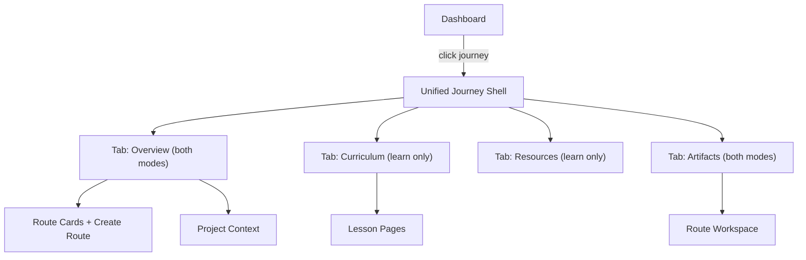

# Unified Journey Shell

## Problem

Right now `JourneyHub` and `CreationHub` are two completely different components. When you open a Create journey you see a flat route grid with no tabs, no header treatment, no hero -- a different world from the Learn journey. There's also no clear navigation path from the dashboard into these views.

Your ask: same skeleton, different depth. A Create journey is a Learn journey with fewer tabs. And it should always be upgradeable.

## Target UX

Both modes share:

- Same header (journey name, subtitle, client label, hero background with gradient mask)
- Same tab bar (just fewer tabs for Create)
- Same Artifacts tab (route grid with workspace links)
- Same breadcrumbs and HUD frame

Learn mode adds:

- Curriculum tab (chapter/lesson rail)
- Resources tab (docs, upload placeholder)
- Curriculum preview in Overview sidebar
- Progress tracking

## Implementation

### 1. Merge into one `JourneyShell` component

- Replace both [components/learning/JourneyHub.tsx](components/learning/JourneyHub.tsx) and [components/learning/CreationHub.tsx](components/learning/CreationHub.tsx) with a single `JourneyShell` component.
- It receives both API journey data (name, description, routes, type) and optional learning content.
- Tab set is computed from mode:
  - **Create**: `Overview`, `Artifacts`
  - **Learn**: `Overview`, `Curriculum`, `Resources`, `Artifacts`
- The `Overview` tab is the landing for both modes. For Create, it shows project description + route grid inline. For Learn, it shows project description + curriculum sidebar (as today).
- The `Artifacts` tab is the same for both: route cards with workspace links.
- Hero background, header, and tab bar are shared layout -- not duplicated per mode.

### 2. Upgrade path (Create to Learn)

- On a Create journey's Overview tab (admin only), show a subtle "Add curriculum" CTA.
- Clicking it flips the journey `type` from `create` to `learn` via a PATCH to the admin API.
- The tab bar immediately gains the Curriculum and Resources tabs.
- This is a one-line API call + state update, no page reload needed.
- Add a PATCH handler to [app/api/admin/workspace-projects/[id]/route.ts](app/api/admin/workspace-projects/[id]/route.ts) that accepts `{ type: "learn" | "create" }` if it doesn't already.

### 3. Dashboard navigation clarity

- In the dashboard [components/dashboard/DashboardView.tsx](components/dashboard/DashboardView.tsx), when a journey is selected in the left panel and routes are shown in the right panel, add a prominent **"Open journey"** link/button at the top of the right panel that navigates to `/journeys/[id]`.
- This gives a clear path from dashboard into the unified journey shell, rather than only showing routes.
- The existing route cards in the dashboard right panel remain for quick access, but the journey link is the primary entry point.

### 4. Update journey detail page

- Simplify [app/journeys/[id]/page.tsx](app/journeys/[id]/page.tsx) to always render `JourneyShell`, passing it the mode and optional content.
- Remove the three-way conditional (learn+content / learn+no-content / create). The shell handles everything internally.
- The `LearnEmptyState` becomes a state inside JourneyShell's Curriculum tab when no content is mapped yet.

### 5. Delete superseded code

- Remove `CreationHub` component (merged into `JourneyShell`).
- Remove `LearnEmptyState` (moved inside shell).
- Rename `JourneyHub.module.css` to `JourneyShell.module.css` and update imports.

## Files changed

- New: `components/learning/JourneyShell.tsx` (replaces JourneyHub + CreationHub)
- Rename: `app/journeys/[id]/JourneyHub.module.css` to `JourneyShell.module.css`
- Update: [app/journeys/[id]/page.tsx](app/journeys/[id]/page.tsx) -- simplified to always render JourneyShell
- Update: [components/dashboard/DashboardView.tsx](components/dashboard/DashboardView.tsx) or [components/dashboard/RouteCardsPanel.tsx](components/dashboard/RouteCardsPanel.tsx) -- add "Open journey" link
- Update: admin workspace-projects PATCH API if needed for type change
- Delete: `components/learning/CreationHub.tsx`, `components/learning/JourneyHub.tsx`

