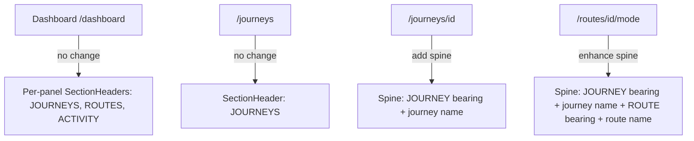

# Unified Breadcrumb System

## The Core Pattern

Standard breadcrumb best practice (GitHub, Figma, Linear, Notion): each segment is the **name** of the item at that level. The **category** is conveyed by position, not as a separate segment. When category needs to be explicit, it appears as a tiny bearing label above or beside the name -- not as its own clickable breadcrumb node.

Applied to Sigil, each breadcrumb segment becomes a **name with an optional category bearing**:

```
JOURNEY                         (bearing — tiny, dawn-30, mono 9px)
THOUGHTFORM ARCS  -->           (name — clickable, dawn/gold, mono 12px)
─────────────────               (course line)
ROUTE                           (bearing)
VULPIA                          (name — current context, gold, mono 17px)
```

This is actually what the existing nav-spine on route pages already does for the journey chip + route name -- it just lacks the category bearing labels and is missing from other pages.

## Per-Surface Behavior




- **Dashboard** (`/dashboard`): Keep separated per-panel `SectionHeader` labels (JOURNEYS, ROUTES, ACTIVITY) since the dashboard is a multi-panel workspace where each panel has its own create action.
- **Journeys list** (`/journeys`): Keep `SectionHeader` label JOURNEYS. This page IS the journeys list; there is no parent to breadcrumb to.
- **Journey detail** (`/journeys/[id]`): Add a nav-spine breadcrumb showing `JOURNEY` bearing + journey name, with the bearing clickable back to `/journeys`. Currently this page only shows a static "journeys" label with no journey name.
- **Route workspace** (`/routes/[id]/`*): Enhance the existing nav-spine to add a `JOURNEY` bearing above the journey name chip, and a `ROUTE` bearing above the route name. The journey chip remains clickable to `/journeys/[id]`.

## What Changes

### 1. Extend `ContextAnchor` spine mode with bearing support

The spine mode in [components/ui/ContextAnchor.tsx](components/ui/ContextAnchor.tsx) currently renders `label` (journey name) + `subtitle` (route name). Add optional `bearing` and `subtitleBearing` props so each segment can show its category context above the name.

### 2. Pass journey name into Journey Detail page

[app/journeys/[id]/page.tsx](app/journeys/[id]/page.tsx) currently renders `NavigationFrame` without `journeyName` or `journeyId`. The journey name is available from `prefetchJourneyDetail` -- pass it through so the nav-spine can show the journey-specific breadcrumb instead of just the static "journeys" label.

### 3. Update NavigationFrame breadcrumb logic

The breadcrumb builder in [components/hud/NavigationFrame.tsx](components/hud/NavigationFrame.tsx) (lines 353-393) currently:

- For `/journeys/[id]`: returns `[{ label: "journeys", href: "/journeys" }]` -- just the category, no journey name.
- For `/routes/[id]/*`: returns journey name + mode label -- names but no category bearings.

Update both paths to include bearing metadata so `ContextAnchor` can render the category + name stacked pattern.

### 4. Enhance ContextAnchor spine rendering

Update the spine mode in [components/ui/ContextAnchor.tsx](components/ui/ContextAnchor.tsx) to render bearing labels above name segments. The bearing is a tiny mono label in `dawn-30` that sits above the clickable name, following the Data Readouts grammar primitive (mono, uppercase, 9px, wide tracking).

## What Stays The Same

- Dashboard per-panel `SectionHeader` labels -- unchanged.
- Journeys overview `SectionHeader` -- unchanged.
- The `JourneyConnector` SVG tracking `data-journey-selected` -- unchanged.
- The `WaypointBranch` portal below the spine -- unchanged.
- The `HudBreadcrumb` component -- stays unused (its diamond-separated horizontal pattern is a different grammar from the vertical spine).

## Visual Result

On `/journeys/[id]` (journey detail):

```
JOURNEY              ← bearing (9px, dawn-30)
INKROOTS  -->        ← name chip (12px, gold, clickable → /journeys)
```

On `/routes/[id]/image` (route workspace):

```
JOURNEY              ← bearing
THOUGHTFORM ARCS --> ← name chip (clickable → /journeys/[id])
─────────────────    ← course line
ROUTE                ← bearing
VULPIA               ← route title (17px, gold)
```

On `/dashboard`:

```
JOURNEYS  +          ← SectionHeader (unchanged)
[cards...]

         ROUTES  +   ← SectionHeader (unchanged)
         [cards...]
```

