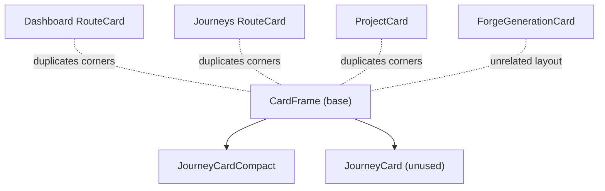

# Unified Card Primitive System

## Current State

Five independent card implementations with significant duplication:

- [CardFrame.tsx](components/ui/CardFrame.tsx) -- gold corner accents on hover, surface background, dawn border
- [JourneyCardCompact.tsx](components/ui/JourneyCardCompact.tsx) -- 3 `size` variants, `selected` state; used on Dashboard, Journeys, Route nav spine
- [Journeys RouteCard.tsx](components/journeys/RouteCard.tsx) -- manually duplicates CardFrame corners + grid layout with ImageDiskStack
- [ProjectCard.tsx](components/projects/ProjectCard.tsx) -- nearly identical to Journeys RouteCard, duplicates corners
- [Dashboard RouteCard.tsx](components/dashboard/RouteCard.tsx) -- chamfered media card with `isActive` state, video, scanlines, telemetry rails (unique enough to keep separate)
- [ForgeGenerationCard](components/generation/ForgeGenerationCard.tsx) -- horizontal prompt+media, CSS modules (separate concern)

## Phase 1: Strengthen CardFrame with state support

Extend [CardFrame.tsx](components/ui/CardFrame.tsx) with a `state` prop that drives border/background:

- `default` -- current behavior (`--surface-0` bg, `--dawn-08` border)
- `selected` -- gold tint (`--gold-10` bg, `--gold-30` border, corners always visible)
- `active` -- full gold border (`--gold` border, `--gold-10` bg)
- `dim` -- reduced opacity (`--surface-0` bg, `--dawn-04` border)

This eliminates the state logic currently scattered into consumers (JourneyCardCompact applies its own selected styles via `frameStyle`).

## Phase 2: Extract shared card sub-primitives

Create small, composable pieces in `components/ui/card/`:

- `**CardCategory**` -- diamond indicator + uppercase category label (currently inline in JourneyCardCompact, JourneyCard)
- `**CardTitle**` -- mono uppercase title with optional action/arrow slot (duplicated in all 5 cards)
- `**CardStats**` -- telemetry-style metric row with label+value pairs (duplicated in JourneyCardCompact, Dashboard RouteCard, Journeys RouteCard, ProjectCard)
- `**CardDivider**` -- the `1px solid var(--dawn-08)` separator (inline everywhere)

These are leaf components, not a rigid compound card. Each card composes them as needed.

## Phase 3: Refactor existing cards onto CardFrame

**Journeys RouteCard** ([components/journeys/RouteCard.tsx](components/journeys/RouteCard.tsx)):

- Replace the manual Link + 4 corner spans with `<CardFrame as={Link}>` 
- Use `CardTitle`, `CardStats` sub-primitives
- Keep ImageDiskStack as-is

**ProjectCard** ([components/projects/ProjectCard.tsx](components/projects/ProjectCard.tsx)):

- Same treatment -- replace manual corners with `<CardFrame as={Link}>`
- Use `CardTitle`, `CardStats`
- Consider merging with Journeys RouteCard if props are compatible (they are nearly identical)

**JourneyCardCompact** ([components/ui/JourneyCardCompact.tsx](components/ui/JourneyCardCompact.tsx)):

- Already uses CardFrame -- remove inline `selected` style overrides, use `state="selected"` instead
- Use `CardCategory`, `CardTitle`, `CardStats`, `CardDivider` sub-primitives

**JourneyCard** ([components/journeys/JourneyCard.tsx](components/journeys/JourneyCard.tsx)):

- Already uses CardFrame
- Adopt sub-primitives for consistency
- Currently unused in the app but worth keeping as the "full" variant

**Dashboard RouteCard** -- leave as-is (chamfered media card with unique interaction model).

## Phase 4: Update Figma plugin with card variant specimens

Extend [components.ts](packages/figma-plugin/src/generators/components.ts) generator:

Currently generates only a single generic CardFrame specimen. Add:

- **CardFrame states** -- default, hover (corners visible), selected (gold tint), active (gold border), dim
- **JourneyCardCompact sizes** -- default, compact, mini; each in default + selected states
- **Content card (RouteCard/ProjectCard)** -- with metadata, stats, image stack placeholder
- **Dashboard RouteCard** -- media card specimen with active/inactive states

## Phase 5: Set up Code Connect mappings

Use the Figma MCP `add_code_connect_map` tool to link the generated Figma specimens to their code components:

- CardFrame node -> `components/ui/CardFrame.tsx` / `CardFrame`
- JourneyCardCompact node -> `components/ui/JourneyCardCompact.tsx` / `JourneyCardCompact`
- RouteCard node -> `components/journeys/RouteCard.tsx` / `RouteCard`

This requires running the Figma plugin first to generate the nodes, then mapping them via MCP. We can run the plugin from Figma desktop, note the node IDs, and call `add_code_connect_map` for each.

## File impact

| File                                                 | Action                                 |
| ---------------------------------------------------- | -------------------------------------- |
| `components/ui/CardFrame.tsx`                        | Add `state` prop                       |
| `components/ui/card/CardCategory.tsx`                | New                                    |
| `components/ui/card/CardTitle.tsx`                   | New                                    |
| `components/ui/card/CardStats.tsx`                   | New                                    |
| `components/ui/card/CardDivider.tsx`                 | New                                    |
| `components/ui/card/index.ts`                        | New barrel export                      |
| `components/ui/JourneyCardCompact.tsx`               | Refactor to use sub-primitives + state |
| `components/journeys/JourneyCard.tsx`                | Adopt sub-primitives                   |
| `components/journeys/RouteCard.tsx`                  | Refactor onto CardFrame                |
| `components/projects/ProjectCard.tsx`                | Refactor onto CardFrame                |
| `packages/figma-plugin/src/generators/components.ts` | Add card variant specimens             |
| Figma Code Connect                                   | MCP calls after plugin run             |

