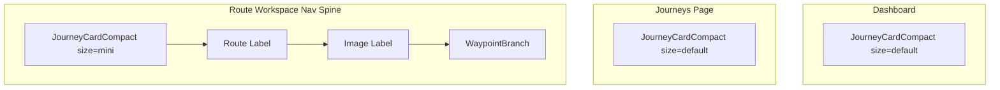

# Unified Journey Card Across All Pages

## Problem

Journey information is rendered three different ways:

- **Dashboard (`JourneyPanel`)**: hand-rolled inline-styled `
` with category row, divider, name, Open action, stats
- **Journeys page (`JourneyCard`)**: uses `CardFrame` + `CategoryRow` + `ImageDiskStack`, links to journey detail
- **Route workspace (`NavigationFrame`)**: plain gold text labels in the nav spine (`JOURNEY THOUGHTFORM ARCS > ROUTE VULPIA > IMAGE`)

This creates visual inconsistency. The route spine text feels disconnected from the card-based design language.

## Approach

Create a single compact journey card component and reuse it everywhere. The route workspace version will be a smaller "mini" variant that fits in the nav spine and connects to waypoints below.

### New shared component: `JourneyCardCompact`

File: [components/ui/JourneyCardCompact.tsx](components/ui/JourneyCardCompact.tsx)

A slim, reusable card built on `CardFrame` with two size variants:

- `**size="default"`** -- for Dashboard and Journeys page (current card height, full stats)
- `**size="mini"`** -- for route workspace nav spine (compact, no description, minimal stats)

Props:

- `name`, `type` (learn/create), `routeCount`, `generationCount`
- `href?` -- if present, card is a Link
- `onClick?` -- if present, card is interactive (Dashboard select)
- `selected?`, `hovered?` -- visual state for Dashboard
- `size?` -- `"default" | "mini"`
- `action?` -- ReactNode slot for the right side (e.g. "Open" button on Dashboard, or nothing on route spine)

Core structure reuses existing primitives:

- `CardFrame` for the outer shell (surface-0, dawn-08 border, gold corner brackets on hover)
- `CategoryRow` for the learn/create indicator
- Mono text for name + stats

### Dashboard (`JourneyPanel`)

File: [components/dashboard/JourneyPanel.tsx](components/dashboard/JourneyPanel.tsx)

- Replace the 140-line hand-rolled card markup (lines 257-385) with `<JourneyCardCompact>`
- Keep the tree L-connectors, hover zone action logic, and Open button -- pass Open as `action` prop
- Keep `onSelectJourney` as `onClick`

### Journeys page (`JourneysOverviewContent`)

File: [components/journeys/JourneysOverviewContent.tsx](components/journeys/JourneysOverviewContent.tsx)

- Replace `JourneyCard` usage with `<JourneyCardCompact>` wrapped in a Link
- This unifies the card visual while keeping the grid layout
- The existing `JourneyCard` + `ImageDiskStack` can be deprecated later

### Route workspace nav spine

File: [components/hud/NavigationFrame.tsx](components/hud/NavigationFrame.tsx)

- Replace the plain text `JOURNEY THOUGHTFORM ARCS` label with `<JourneyCardCompact size="mini">`
- The mini card shows: category diamond, journey name, route count -- all in a compact card frame
- Below it, keep the tree connector structure for ROUTE and IMAGE labels (those stay as text)
- The waypoint branch (`WaypointBranch`) already portals into the spine -- it connects below the mini card naturally

### Waypoint connection

The `WaypointBranch` component already renders into the nav spine portal ref. With the mini card replacing the text label, waypoints will visually descend from a proper card instead of floating text. The existing tree connector SVGs handle the visual link. The only adjustment is the `marginTop` on `WaypointBranch` to account for the slightly taller mini card vs the old text label.

