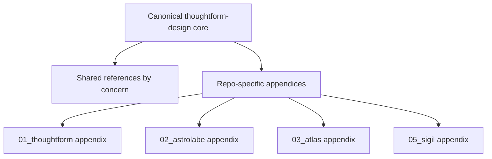

# Unified Thoughtform Skill Plan

## Goal

Make `[C:/Users/buyss/.cursor/skills/thoughtform-design/SKILL.md](C:/Users/buyss/.cursor/skills/thoughtform-design/SKILL.md)` the single canonical Thoughtform skill, absorb the strongest content from `[C:/Users/buyss/.cursor/skills/thoughtform-brand-architect/SKILL.md](C:/Users/buyss/.cursor/skills/thoughtform-brand-architect/SKILL.md)`, and reorganize the guidance so the shared brand system is separate from repo-specific implementation details.

## Why This Merge

The current split is conceptually clean but operationally messy:

- `[C:/Users/buyss/.cursor/skills/thoughtform-brand-architect/SKILL.md](C:/Users/buyss/.cursor/skills/thoughtform-brand-architect/SKILL.md)` owns philosophy, identity, color theory, motion, voice, HUD implementation caveats, and presentation rules.
- `[C:/Users/buyss/.cursor/skills/thoughtform-design/SKILL.md](C:/Users/buyss/.cursor/skills/thoughtform-design/SKILL.md)` owns navigation grammar, component conventions, Figma extraction workflow, and code-facing design usage.
- The older repos already expose a shared family resemblance with different emphases: Thoughtform.co’s HUD/tokens in `[C:/Users/buyss/Manifold Delta/Artifacts/01_thoughtform/app/styles/variables.css](C:/Users/buyss/Manifold Delta/Artifacts/01_thoughtform/app/styles/variables.css)`, Astrolabe’s rail/HUD math in `[C:/Users/buyss/Manifold Delta/Artifacts/02_astrolabe.thoughtform/lib/navigation/rail-contract.ts](C:/Users/buyss/Manifold Delta/Artifacts/02_astrolabe.thoughtform/lib/navigation/rail-contract.ts)`, Atlas’s particle/canvas grammar in `[C:/Users/buyss/Manifold Delta/Artifacts/03_atlas.thoughtform/design/mockups/thoughtform_redesign/PARTICLE_GUIDELINES.md](C:/Users/buyss/Manifold Delta/Artifacts/03_atlas.thoughtform/design/mockups/thoughtform_redesign/PARTICLE_GUIDELINES.md)`, and Sigil’s component/layer guardrails in `[C:/Users/buyss/Manifold Delta/Artifacts/05_sigil.thoughtform/.cursor/skills/sigil-component-guardrails/SKILL.md](C:/Users/buyss/Manifold Delta/Artifacts/05_sigil.thoughtform/.cursor/skills/sigil-component-guardrails/SKILL.md)`.

## Target Structure

## Plan

### 1. Collapse the Two Global Skills Into One Canonical Entry Point

- Rewrite `[C:/Users/buyss/.cursor/skills/thoughtform-design/SKILL.md](C:/Users/buyss/.cursor/skills/thoughtform-design/SKILL.md)` so it becomes the only top-level Thoughtform design skill.
- Pull in the best “doctrine” material from `[C:/Users/buyss/.cursor/skills/thoughtform-brand-architect/SKILL.md](C:/Users/buyss/.cursor/skills/thoughtform-brand-architect/SKILL.md)`: navigation metaphor, identity foundations, color-tier logic, motion rules, voice, presentation framing, HUD implementation caveats.
- Keep `SKILL.md` short and discovery-friendly; move detail into references.
- Retire `thoughtform-brand-architect` after migration by replacing it with either a brief deprecation note or by removing it once all explicit references are updated.

### 2. Reorganize References by Concern, Not by Legacy Skill Boundary

- Preserve the strongest current references, but regroup them under one skill directory.
- Shared references should cover: grammar, tokens, color system, typography, motion, spatial layout, identity, voice/tone, components, particle icons, data visualization, presentations, and Figma index.
- Implementation-heavy material that currently leaks repo-specific paths into the “canonical” layer should move into appendices, especially HUD and rail implementation guidance now split across `[C:/Users/buyss/.cursor/skills/thoughtform-brand-architect/references/hud-frame-implementation.md](C:/Users/buyss/.cursor/skills/thoughtform-brand-architect/references/hud-frame-implementation.md)` and `[C:/Users/buyss/.cursor/skills/thoughtform-design/references/navigation-grammar.md](C:/Users/buyss/.cursor/skills/thoughtform-design/references/navigation-grammar.md)`.
- Fold duplicated or weakly maintained references into one source of truth, especially the inspiration logging surface.

### 3. Add Explicit Repo Appendices for the Four Active Thoughtform Repos

- Create a small “products” or “implementations” section inside the unified skill for repo-specific nuance.
- Thoughtform.co appendix should draw from `[C:/Users/buyss/Manifold Delta/Artifacts/01_thoughtform/README.md](C:/Users/buyss/Manifold Delta/Artifacts/01_thoughtform/README.md)`, `[C:/Users/buyss/Manifold Delta/Artifacts/01_thoughtform/app/styles/variables.css](C:/Users/buyss/Manifold Delta/Artifacts/01_thoughtform/app/styles/variables.css)`, and `[C:/Users/buyss/Manifold Delta/Artifacts/01_thoughtform/.cursor/rules/figma-mcp.md](C:/Users/buyss/Manifold Delta/Artifacts/01_thoughtform/.cursor/rules/figma-mcp.md)`.
- Astrolabe appendix should capture slide/Forge/HUD specifics from `[C:/Users/buyss/Manifold Delta/Artifacts/02_astrolabe.thoughtform/app/globals.css](C:/Users/buyss/Manifold Delta/Artifacts/02_astrolabe.thoughtform/app/globals.css)`, `[C:/Users/buyss/Manifold Delta/Artifacts/02_astrolabe.thoughtform/lib/navigation/rail-contract.ts](C:/Users/buyss/Manifold Delta/Artifacts/02_astrolabe.thoughtform/lib/navigation/rail-contract.ts)`, and `[C:/Users/buyss/Manifold Delta/Artifacts/02_astrolabe.thoughtform/.claude/skills/frontend-design/DESIGN_PATTERNS.md](C:/Users/buyss/Manifold Delta/Artifacts/02_astrolabe.thoughtform/.claude/skills/frontend-design/DESIGN_PATTERNS.md)`.
- Atlas appendix should capture particle/canvas and card-grammar specifics from `[C:/Users/buyss/Manifold Delta/Artifacts/03_atlas.thoughtform/src/app/globals.css](C:/Users/buyss/Manifold Delta/Artifacts/03_atlas.thoughtform/src/app/globals.css)`, `[C:/Users/buyss/Manifold Delta/Artifacts/03_atlas.thoughtform/thoughtform-brand/tokens/tokens.css](C:/Users/buyss/Manifold Delta/Artifacts/03_atlas.thoughtform/thoughtform-brand/tokens/tokens.css)`, and `[C:/Users/buyss/Manifold Delta/Artifacts/03_atlas.thoughtform/design/mockups/thoughtform_redesign/PARTICLE_GUIDELINES.md](C:/Users/buyss/Manifold Delta/Artifacts/03_atlas.thoughtform/design/mockups/thoughtform_redesign/PARTICLE_GUIDELINES.md)`.
- Sigil appendix should absorb the UI-facing parts of `[C:/Users/buyss/Manifold Delta/Artifacts/05_sigil.thoughtform/.cursor/skills/sigil-component-guardrails/SKILL.md](C:/Users/buyss/Manifold Delta/Artifacts/05_sigil.thoughtform/.cursor/skills/sigil-component-guardrails/SKILL.md)`, while keeping repo-operational rules like layer boundaries and API auth in `[C:/Users/buyss/Manifold Delta/Artifacts/05_sigil.thoughtform/AGENTS.md](C:/Users/buyss/Manifold Delta/Artifacts/05_sigil.thoughtform/AGENTS.md)` rather than bloating the global design skill.

### 4. Resolve the Current Overlap and Drift Before Declaring the Skill Canonical

- Normalize motion rules so `thoughtform-design` and brand-architect no longer disagree on timing caps and easing.
- Clarify a few known ambiguity zones in one place: diamond vs dot exceptions, which Figma files are canonical for which purpose, and which token/package paths are repo-specific rather than universal.
- Prefer the live repo token sources over older narrative docs when they conflict, for example Thoughtform.co’s current CSS and UI token files over prototype-era redesign prose.

### 5. Update Explicit References to the Old Two-Skill Model

- Update repo docs that still describe the pair as separate roles, especially `[C:/Users/buyss/Manifold Delta/Artifacts/05_sigil.thoughtform/README.md](C:/Users/buyss/Manifold Delta/Artifacts/05_sigil.thoughtform/README.md)` and `[C:/Users/buyss/Manifold Delta/Artifacts/01_thoughtform/README.md](C:/Users/buyss/Manifold Delta/Artifacts/01_thoughtform/README.md)`.
- Sweep for active rule/docs references to `thoughtform-brand-architect` and either point them at the new unified `thoughtform-design` structure or mark them as historical.
- Keep historical plan files untouched unless they are intentionally being refreshed; they are not the migration target.

### 6. Verify the Unified Skill as a Real Agent Surface

- Check that the new description is still discoverable across all four repos.
- Sanity-check the unified skill against four common tasks: building a new component in Sigil, reviewing a HUD layout in Thoughtform.co, refining a slide template in Astrolabe, and evaluating particles/cards in Atlas.
- Confirm the final `SKILL.md` stays concise enough for reliable activation, with the heavier content pushed into one-level-deep references.

## Delivery Order

1. Merge doctrine and UI grammar into one canonical `[thoughtform-design](C:/Users/buyss/.cursor/skills/thoughtform-design/SKILL.md)`.
2. Re-home and deduplicate the reference docs under that single skill.
3. Add repo appendices for Thoughtform.co, Astrolabe, Atlas, and Sigil.
4. Update explicit repo-visible references to the old two-skill model.
5. Retire `[thoughtform-brand-architect](C:/Users/buyss/.cursor/skills/thoughtform-brand-architect/SKILL.md)`.
6. Validate discoverability and cross-repo usefulness.

