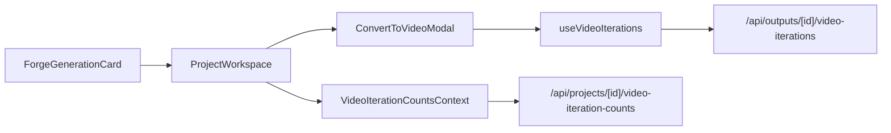

# Still-to-Video Modal Polish

## Scope

- Polish the still-to-video popup in [C:\Users\buyss\Manifold Delta\Artifacts\05_sigil.thoughtform\components\generation\ConvertToVideoModal.tsx](C:\Users\buyss\Manifold Delta\Artifacts\05_sigil.thoughtform\components\generation\ConvertToVideoModal.tsx) and [C:\Users\buyss\Manifold Delta\Artifacts\05_sigil.thoughtform\components\generation\ConvertToVideoModal.module.css](C:\Users\buyss\Manifold Delta\Artifacts\05_sigil.thoughtform\components\generation\ConvertToVideoModal.module.css) so it sits centered, has more vertical room, and gives live feedback during video generation.
- Keep the processing treatment lightweight and brand-aligned: CSS/HUD-style motion only, not image-derived particles.
- Restore the stacked "this still has videos" affordance by refining Sigil’s existing implementation with geometry learned from Vesper, while swapping Vesper’s `--primary`/green look for Tensor Gold.

## Key Findings

- The popup is currently top-anchored by `.backdrop { align-items: flex-start; padding-top: clamp(24px, 5vh, 56px); }` in [C:\Users\buyss\Manifold Delta\Artifacts\05_sigil.thoughtform\components\generation\ConvertToVideoModal.module.css](C:\Users\buyss\Manifold Delta\Artifacts\05_sigil.thoughtform\components\generation\ConvertToVideoModal.module.css).
- The prompt is explicitly cleared on submit via `setPrompt("")` in [C:\Users\buyss\Manifold Delta\Artifacts\05_sigil.thoughtform\components\generation\ConvertToVideoModal.tsx](C:\Users\buyss\Manifold Delta\Artifacts\05_sigil.thoughtform\components\generation\ConvertToVideoModal.tsx).
- The right rail already has the data needed to show prompt text: `VideoIteration` includes `prompt`, `parameters`, `status`, `createdAt`, and `outputs` in [C:\Users\buyss\Manifold Delta\Artifacts\05_sigil.thoughtform\hooks\useVideoIterations.ts](C:\Users\buyss\Manifold Delta\Artifacts\05_sigil.thoughtform\hooks\useVideoIterations.ts) and [C:\Users\buyss\Manifold Delta\Artifacts\05_sigil.thoughtform\app\api\outputsid]\video-iterations\route.ts](C:\Users\buyss\Manifold Delta\Artifacts\05_sigil.thoughtform\app\api\outputsid]\video-iterations\route.ts).
- The current stack hint already exists in [C:\Users\buyss\Manifold Delta\Artifacts\05_sigil.thoughtform\components\generation\VideoIterationsStackHint.tsx](C:\Users\buyss\Manifold Delta\Artifacts\05_sigil.thoughtform\components\generation\VideoIterationsStackHint.tsx), but its layer geometry is flatter (`left: 0; right: -offset; bottom: vInset`) than the Vesper reference in [C:\Users\buyss\Manifold Delta\Artifacts\07_vesper.loop\Loop-Vesper\src\components\generation\VideoIterationsStackHint.tsx](C:\Users\buyss\Manifold Delta\Artifacts\07_vesper.loop\Loop-Vesper\src\components\generation\VideoIterationsStackHint.tsx), which uses `left: offset; right: -offset; bottom: -verticalOffset; transform: scale(...)` for a more convincing rear-stack silhouette.

## Implementation Plan

1. Rebalance the modal frame.

- Update [C:\Users\buyss\Manifold Delta\Artifacts\05_sigil.thoughtform\components\generation\ConvertToVideoModal.module.css](C:\Users\buyss\Manifold Delta\Artifacts\05_sigil.thoughtform\components\generation\ConvertToVideoModal.module.css) so the overlay centers the panel vertically with symmetric viewport padding instead of hugging the top.
- Increase panel and frame height so the start/end frame area and the right-side iterations rail can breathe, especially for portrait sources.
- Keep the Thoughtform depth/motion rules intact: sharp edges, `surface` layering, fast `opacity`/`border-color`/`transform` transitions only.

1. Make in-progress iterations visibly alive.

- Replace the plain `Processing…` placeholder in [C:\Users\buyss\Manifold Delta\Artifacts\05_sigil.thoughtform\components\generation\ConvertToVideoModal.tsx](C:\Users\buyss\Manifold Delta\Artifacts\05_sigil.thoughtform\components\generation\ConvertToVideoModal.tsx) with a subtle CSS-only loading treatment: framed placeholder, soft gold telemetry sweep/pulse, and restrained bracket/crosshair motion.
- Reuse the existing polling path in `useVideoIterations`; only the visual representation changes.
- Add a reduced-motion/static fallback so the state still reads clearly without animation.

1. Show the prompt beside each generated or processing iteration.

- Expand each iteration row in [C:\Users\buyss\Manifold Delta\Artifacts\05_sigil.thoughtform\components\generation\ConvertToVideoModal.tsx](C:\Users\buyss\Manifold Delta\Artifacts\05_sigil.thoughtform\components\generation\ConvertToVideoModal.tsx) to render the iteration prompt and compact telemetry beneath or beside the media preview.
- Use the already-returned `prompt` and selected metadata from `parameters` to show enough context without turning the right rail into a second full prompt panel.
- Clamp long prompts and preserve layout rhythm so the rail stays scannable.

1. Preserve form state while a video is queued.

- Remove the submit-time prompt reset in [C:\Users\buyss\Manifold Delta\Artifacts\05_sigil.thoughtform\components\generation\ConvertToVideoModal.tsx](C:\Users\buyss\Manifold Delta\Artifacts\05_sigil.thoughtform\components\generation\ConvertToVideoModal.tsx) so the generation settings remain visible after clicking `Generate`.
- Audit `busy` disabling so it prevents duplicate submits without blanking or hiding the user’s inputs.
- Review [C:\Users\buyss\Manifold Delta\Artifacts\05_sigil.thoughtform\components\generation\ProjectWorkspace.tsx](C:\Users\buyss\Manifold Delta\Artifacts\05_sigil.thoughtform\components\generation\ProjectWorkspace.tsx), where `closeConvertModal()` nulls the modal inputs on unmount, and keep this pass scoped to in-modal persistence while the popup remains open.
- Either wire the currently unused `onSuccess` prop or remove it so modal lifecycle behavior is explicit.

1. Restore and sharpen the stacked video affordance.

- Refine [C:\Users\buyss\Manifold Delta\Artifacts\05_sigil.thoughtform\components\generation\VideoIterationsStackHint.tsx](C:\Users\buyss\Manifold Delta\Artifacts\05_sigil.thoughtform\components\generation\VideoIterationsStackHint.tsx) and [C:\Users\buyss\Manifold Delta\Artifacts\05_sigil.thoughtform\components\generation\VideoIterationsStackHint.module.css](C:\Users\buyss\Manifold Delta\Artifacts\05_sigil.thoughtform\components\generation\VideoIterationsStackHint.module.css) rather than re-copying Vesper wholesale.
- Port Vesper’s stronger rear-card geometry from [C:\Users\buyss\Manifold Delta\Artifacts\07_vesper.loop\Loop-Vesper\src\components\generation\VideoIterationsStackHint.tsx](C:\Users\buyss\Manifold Delta\Artifacts\07_vesper.loop\Loop-Vesper\src\components\generation\VideoIterationsStackHint.tsx), but replace rounded/glassy/green styling with sharper gold layers, quieter shadows, and Sigil token usage.
- Verify the effect still mounts cleanly behind the media frame in [C:\Users\buyss\Manifold Delta\Artifacts\05_sigil.thoughtform\components\generation\ForgeGenerationCard.tsx](C:\Users\buyss\Manifold Delta\Artifacts\05_sigil.thoughtform\components\generation\ForgeGenerationCard.tsx) for both `count > 0` and `hasProcessing` states driven by [C:\Users\buyss\Manifold Delta\Artifacts\05_sigil.thoughtform\components\generation\VideoIterationCountsContext.tsx](C:\Users\buyss\Manifold Delta\Artifacts\05_sigil.thoughtform\components\generation\VideoIterationCountsContext.tsx).

## Data Flow

## Validation

- Check landscape and portrait stills to confirm the modal is centered and the taller frame does not clip on shorter viewports.
- Start a video generation and confirm the prompt remains in place, the right rail shows an animated in-progress state immediately, and the finished video swaps into the same slot.
- Confirm each iteration card shows its prompt/readouts and that long prompts do not break the right column.
- Verify image cards with existing or in-flight videos show the restored gold stacked border treatment with no green and no noticeable performance hit.

