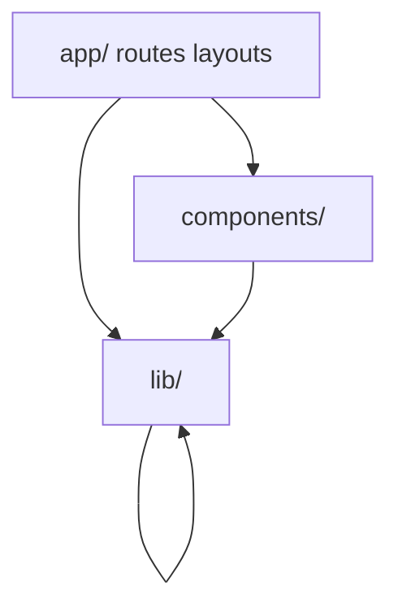

# Reference: layers and contracts

## Dependency direction

`lib/**` must not import `components/**`. Shared types: `lib/types/`.

## Terminology

See `lib/terminology.ts` and root `README.md` (WorkspaceProject → journey, Project → route, Session → waypoint).

## Auth

- **Pages**: gated in `middleware.ts` (session) except public prefixes.
- **API**: not gated at middleware; each handler authenticates. See comment at top of `middleware.ts` and `AGENTS.md`.

## Env and production boot

- `instrumentation.ts` calls `assertServerEnv()` in production Node runtime.
- Secrets: validate via `lib/env.ts`; avoid new raw `process.env` reads for secrets without extending the schema.

## CSP

- Production CSP is set in `next.config.ts` with a hash for the inline theme script in `app/layout.tsx`. If that script changes, recompute the `sha256-*` hash or switch to nonces per Next.js CSP docs.

## Storage

- **`outputs`** bucket is public by design (CDN-friendly URLs). Documented in `lib/supabase/storage.ts`. Use private bucket + signed URLs only if product requires confidentiality.

## Tests

- `npm test` includes API auth coverage and lib import boundary tests under `tests/contracts/`.
